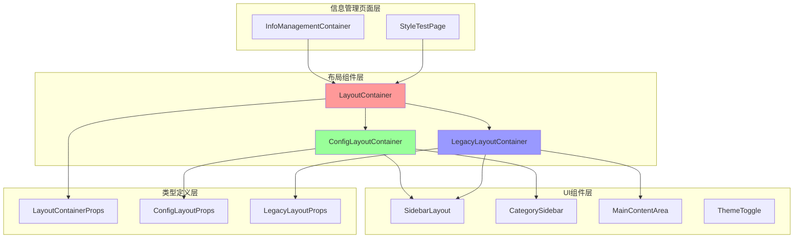
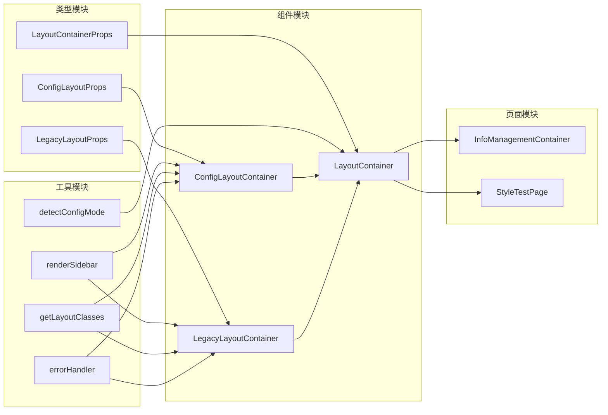
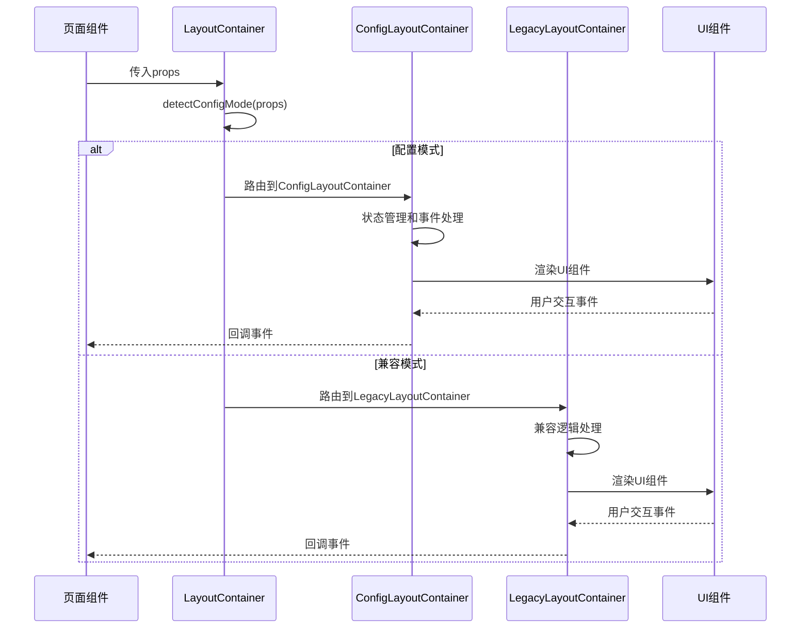
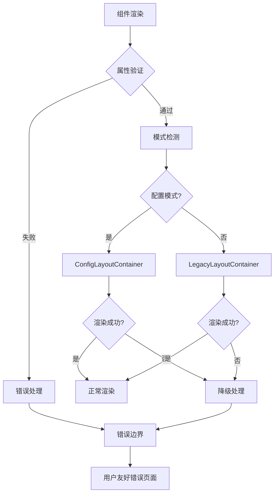
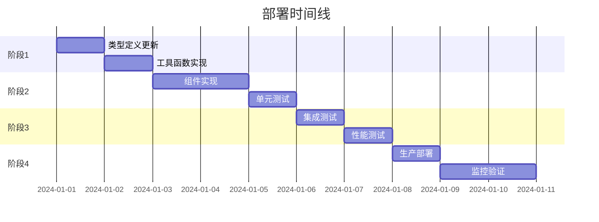

# DESIGN_React元素错误修复

## 整体架构设计

### 系统架构图



### 架构分层说明

#### 1. 页面层 (Page Layer)
- **InfoManagementContainer**: 信息管理主页面容器
- **StyleTestPage**: 样式测试页面
- **职责**: 页面级状态管理、业务逻辑处理、布局配置

#### 2. 布局组件层 (Layout Component Layer)
- **LayoutContainer**: 主布局容器，智能路由到具体实现
- **ConfigLayoutContainer**: 新配置模式布局容器
- **LegacyLayoutContainer**: 向后兼容的布局容器
- **职责**: 布局管理、响应式处理、组件组合

#### 3. UI组件层 (UI Component Layer)
- **SidebarLayout**: 侧边栏组件
- **CategorySidebar**: 分类侧边栏组件
- **MainContentArea**: 主内容区域组件
- **ThemeToggle**: 主题切换组件
- **职责**: 具体UI渲染、用户交互处理

#### 4. 类型定义层 (Type Definition Layer)
- **LayoutContainerProps**: 联合类型定义
- **ConfigLayoutProps**: 配置模式属性定义
- **LegacyLayoutProps**: 兼容模式属性定义
- **职责**: 类型安全、接口约束

## 核心组件设计

### 1. LayoutContainer 主组件

```typescript
/**
 * 主布局容器组件 - 智能路由器
 * 根据传入的属性自动选择合适的布局模式
 */
const LayoutContainer: React.FC<LayoutContainerProps> = (props) => {
  // 智能模式检测逻辑
  const isConfigMode = detectConfigMode(props);
  
  if (isConfigMode) {
    return <ConfigLayoutContainer {...props as ConfigLayoutProps} />;
  } else {
    return <LegacyLayoutContainer {...props as LegacyLayoutProps} />;
  }
};
```

#### 设计原则
- **单一职责**: 仅负责模式检测和路由
- **开放封闭**: 对扩展开放，对修改封闭
- **依赖倒置**: 依赖抽象接口，不依赖具体实现

### 2. ConfigLayoutContainer 新模式组件

```typescript
/**
 * 配置模式布局容器
 * 支持灵活的布局配置和状态管理
 */
const ConfigLayoutContainer: React.FC<ConfigLayoutProps> = ({
  sidebarCollapsed = false,
  onSidebarToggle,
  isMobile = false,
  sidebar,
  categorySidebar,
  children
}) => {
  // 内部状态管理
  const [internalCollapsed, setInternalCollapsed] = useState(sidebarCollapsed);
  
  // 事件处理逻辑
  const handleToggle = useCallback(() => {
    if (onSidebarToggle) {
      onSidebarToggle();
    } else {
      setInternalCollapsed(!internalCollapsed);
    }
  }, [onSidebarToggle, internalCollapsed]);
  
  // 渲染逻辑
  return (
    <div className={getLayoutClasses(internalCollapsed, isMobile)}>
      {renderSidebar(sidebar, internalCollapsed, handleToggle)}
      {renderCategorySidebar(categorySidebar)}
      {renderMainContent(children)}
    </div>
  );
};
```

#### 设计特点
- **状态管理**: 支持受控和非受控两种模式
- **响应式设计**: 根据设备类型调整布局
- **错误处理**: 完善的参数验证和错误处理

### 3. LegacyLayoutContainer 兼容组件

```typescript
/**
 * 向后兼容的布局容器
 * 保持原有的使用方式和行为
 */
const LegacyLayoutContainer: React.FC<LegacyLayoutProps> = ({
  sidebar,
  children,
  initialCollapsed = false,
  onCollapseChange
}) => {
  const [isCollapsed, setIsCollapsed] = useState(initialCollapsed);
  
  const toggleCollapse = useCallback(() => {
    const newCollapsed = !isCollapsed;
    setIsCollapsed(newCollapsed);
    onCollapseChange?.(newCollapsed);
  }, [isCollapsed, onCollapseChange]);
  
  return (
    <div className={getLegacyLayoutClasses(isCollapsed)}>
      {renderLegacySidebar(sidebar, isCollapsed, toggleCollapse)}
      {renderLegacyContent(children)}
    </div>
  );
};
```

#### 设计特点
- **完全兼容**: 保持原有API不变
- **行为一致**: 保持原有的交互行为
- **平滑迁移**: 为未来迁移提供基础

## 模块依赖关系图



## 接口契约定义

### 1. 类型定义契约

```typescript
// 主接口 - 联合类型
type LayoutContainerProps = ConfigLayoutProps | LegacyLayoutProps;

// 配置模式接口
interface ConfigLayoutProps {
  // 布局状态
  sidebarCollapsed?: boolean;
  onSidebarToggle?: () => void;
  isMobile?: boolean;
  
  // 内容组件
  sidebar?: React.ReactNode;
  categorySidebar?: React.ReactNode;
  children: React.ReactNode;
  
  // 可选配置
  className?: string;
  style?: React.CSSProperties;
}

// 兼容模式接口
interface LegacyLayoutProps {
  // 必需属性
  sidebar: React.ReactNode;
  children: React.ReactNode;
  
  // 可选配置
  initialCollapsed?: boolean;
  onCollapseChange?: (collapsed: boolean) => void;
  className?: string;
  style?: React.CSSProperties;
}
```

### 2. 工具函数契约

```typescript
// 模式检测函数
function detectConfigMode(props: LayoutContainerProps): boolean;

// 侧边栏渲染函数
function renderSidebar(
  sidebar: React.ReactNode,
  isCollapsed: boolean,
  onToggle: () => void
): React.ReactNode;

// 样式类生成函数
function getLayoutClasses(
  isCollapsed: boolean,
  isMobile: boolean
): string;

// 错误处理函数
function handleRenderError(
  error: Error,
  componentName: string
): React.ReactNode;
```

### 3. 组件契约

```typescript
// 主组件契约
interface LayoutContainerComponent {
  (props: LayoutContainerProps): React.ReactElement;
  displayName: string;
}

// 配置模式组件契约
interface ConfigLayoutComponent {
  (props: ConfigLayoutProps): React.ReactElement;
  displayName: string;
}

// 兼容模式组件契约
interface LegacyLayoutComponent {
  (props: LegacyLayoutProps): React.ReactElement;
  displayName: string;
}
```

## 数据流向图



## 异常处理策略

### 1. 错误分类

```typescript
enum LayoutErrorType {
  INVALID_PROPS = 'INVALID_PROPS',
  RENDER_ERROR = 'RENDER_ERROR',
  TYPE_MISMATCH = 'TYPE_MISMATCH',
  MISSING_REQUIRED = 'MISSING_REQUIRED'
}
```

### 2. 错误处理流程



### 3. 错误处理实现

```typescript
// 错误边界组件
class LayoutErrorBoundary extends React.Component {
  constructor(props) {
    super(props);
    this.state = { hasError: false, error: null };
  }
  
  static getDerivedStateFromError(error) {
    return { hasError: true, error };
  }
  
  componentDidCatch(error, errorInfo) {
    console.error('LayoutContainer Error:', error, errorInfo);
  }
  
  render() {
    if (this.state.hasError) {
      return <LayoutErrorFallback error={this.state.error} />;
    }
    
    return this.props.children;
  }
}

// 错误降级组件
const LayoutErrorFallback: React.FC<{ error: Error }> = ({ error }) => (
  <div className="layout-error-fallback">
    <h3>布局加载失败</h3>
    <p>请刷新页面重试</p>
    <details>
      <summary>错误详情</summary>
      <pre>{error.message}</pre>
    </details>
  </div>
);
```

## 性能优化设计

### 1. 渲染优化

```typescript
// 使用React.memo优化重渲染
const ConfigLayoutContainer = React.memo<ConfigLayoutProps>(({ ... }) => {
  // 组件实现
}, (prevProps, nextProps) => {
  // 自定义比较逻辑
  return shallowEqual(prevProps, nextProps);
});

// 使用useCallback优化事件处理
const handleToggle = useCallback(() => {
  // 事件处理逻辑
}, [dependencies]);

// 使用useMemo优化计算
const layoutClasses = useMemo(() => {
  return getLayoutClasses(isCollapsed, isMobile);
}, [isCollapsed, isMobile]);
```

### 2. 代码分割

```typescript
// 懒加载非关键组件
const CategorySidebar = React.lazy(() => import('./CategorySidebar'));
const ThemeToggle = React.lazy(() => import('./ThemeToggle'));

// 使用Suspense包装
const LazyComponent: React.FC = () => (
  <Suspense fallback={<div>Loading...</div>}>
    <CategorySidebar />
  </Suspense>
);
```

## 测试策略设计

### 1. 单元测试

```typescript
// 模式检测测试
describe('detectConfigMode', () => {
  it('should detect config mode correctly', () => {
    const configProps = { sidebarCollapsed: true };
    expect(detectConfigMode(configProps)).toBe(true);
  });
  
  it('should detect legacy mode correctly', () => {
    const legacyProps = { sidebar: <div />, children: <div /> };
    expect(detectConfigMode(legacyProps)).toBe(false);
  });
});

// 组件渲染测试
describe('LayoutContainer', () => {
  it('should render ConfigLayoutContainer for config mode', () => {
    const props = { sidebarCollapsed: true, children: <div /> };
    render(<LayoutContainer {...props} />);
    expect(screen.getByTestId('config-layout')).toBeInTheDocument();
  });
});
```

### 2. 集成测试

```typescript
// 页面级集成测试
describe('InfoManagementContainer Integration', () => {
  it('should render without errors', () => {
    render(<InfoManagementContainer />);
    expect(screen.getByRole('main')).toBeInTheDocument();
  });
  
  it('should handle sidebar toggle', () => {
    render(<InfoManagementContainer />);
    const toggleButton = screen.getByRole('button', { name: /toggle sidebar/i });
    fireEvent.click(toggleButton);
    expect(screen.getByTestId('sidebar')).toHaveClass('collapsed');
  });
});
```

## 部署和迁移策略

### 1. 渐进式部署



### 2. 回滚策略

```typescript
// 功能开关控制
const useNewLayoutContainer = () => {
  const featureFlag = process.env.REACT_APP_NEW_LAYOUT_ENABLED;
  return featureFlag === 'true';
};

// 条件渲染
const LayoutContainer: React.FC<LayoutContainerProps> = (props) => {
  const useNewLayout = useNewLayoutContainer();
  
  if (useNewLayout) {
    return <NewLayoutContainer {...props} />;
  } else {
    return <OldLayoutContainer {...props} />;
  }
};
```

## 文档和维护

### 1. API文档结构

```
/docs/components/LayoutContainer/
├── README.md              # 组件概述
├── API.md                 # 接口文档
├── Examples.md            # 使用示例
├── Migration.md           # 迁移指南
├── Troubleshooting.md     # 故障排除
└── Changelog.md           # 变更日志
```

### 2. 维护检查清单

- [ ] 定期检查TypeScript类型定义
- [ ] 监控组件性能指标
- [ ] 更新测试用例覆盖率
- [ ] 检查浏览器兼容性
- [ ] 更新文档和示例
- [ ] 收集用户反馈和问题

---

**设计版本**: 1.0  
**创建时间**: 2024年当前时间  
**设计负责人**: AI助理  
**审核状态**: 待审核