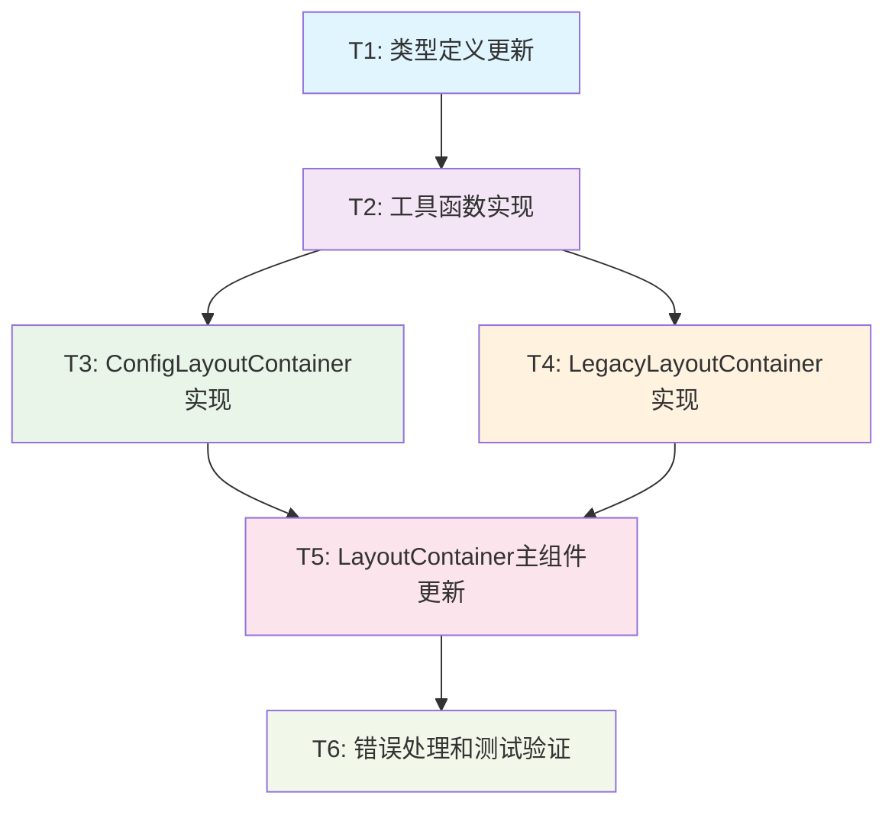

# TASK_React元素错误修复

## 任务拆分概述

基于DESIGN文档的架构设计，将React元素错误修复拆分为6个原子任务，按依赖关系顺序执行。

## 任务依赖关系图



## 原子任务详细定义

### T1: 类型定义更新

#### 任务描述
更新LayoutContainer组件的TypeScript类型定义，支持新旧两种使用模式。

#### 输入契约
- **前置依赖**: 无
- **输入数据**: 现有的LayoutContainerProps类型定义
- **环境依赖**: TypeScript编译环境
- **文件依赖**: 
  - `/frontend/src/components/InfoManagement/Layout/LayoutContainer.tsx`

#### 输出契约
- **输出数据**: 更新后的类型定义文件
- **交付物**: 
  - 新的`LayoutContainerProps`联合类型
  - `ConfigLayoutProps`接口定义
  - `LegacyLayoutProps`接口定义
- **验收标准**: 
  - [ ] TypeScript编译无错误
  - [ ] 类型定义支持两种使用模式
  - [ ] 向后兼容现有类型
  - [ ] 类型注释完整清晰

#### 实现约束
- **技术栈**: TypeScript
- **接口规范**: 遵循React组件Props命名规范
- **质量要求**: 类型安全，无any类型使用

#### 具体实现内容
```typescript
// 联合类型定义
type LayoutContainerProps = ConfigLayoutProps | LegacyLayoutProps;

// 配置模式接口
interface ConfigLayoutProps {
  sidebarCollapsed?: boolean;
  onSidebarToggle?: () => void;
  isMobile?: boolean;
  sidebar?: React.ReactNode;
  categorySidebar?: React.ReactNode;
  children: React.ReactNode;
  className?: string;
  style?: React.CSSProperties;
}

// 兼容模式接口
interface LegacyLayoutProps {
  sidebar: React.ReactNode;
  children: React.ReactNode;
  initialCollapsed?: boolean;
  onCollapseChange?: (collapsed: boolean) => void;
  className?: string;
  style?: React.CSSProperties;
}
```

---

### T2: 工具函数实现

#### 任务描述
实现支持新布局系统的工具函数，包括模式检测、渲染辅助和错误处理函数。

#### 输入契约
- **前置依赖**: T1完成
- **输入数据**: T1的类型定义
- **环境依赖**: React开发环境
- **文件依赖**: 
  - 更新后的类型定义
  - React和相关依赖

#### 输出契约
- **输出数据**: 工具函数集合
- **交付物**: 
  - `detectConfigMode`函数
  - `renderSidebar`函数
  - `getLayoutClasses`函数
  - `handleRenderError`函数
- **验收标准**: 
  - [ ] 模式检测准确率100%
  - [ ] 渲染函数处理各种边界情况
  - [ ] 错误处理机制完善
  - [ ] 函数注释和文档完整

#### 实现约束
- **技术栈**: TypeScript + React
- **接口规范**: 纯函数设计，无副作用
- **质量要求**: 单元测试覆盖率>90%

#### 具体实现内容
```typescript
/**
 * 检测组件使用模式
 */
function detectConfigMode(props: LayoutContainerProps): boolean {
  return 'sidebarCollapsed' in props || 'onSidebarToggle' in props || 'isMobile' in props;
}

/**
 * 安全渲染侧边栏组件
 */
function renderSidebar(
  sidebar: React.ReactNode,
  isCollapsed: boolean,
  onToggle: () => void
): React.ReactNode {
  if (!sidebar) {
    console.warn('LayoutContainer: sidebar is undefined');
    return null;
  }
  
  if (!React.isValidElement(sidebar)) {
    return sidebar;
  }
  
  return React.cloneElement(sidebar as React.ReactElement, {
    isCollapsed,
    onToggleCollapse: onToggle
  });
}

/**
 * 生成布局样式类名
 */
function getLayoutClasses(isCollapsed: boolean, isMobile: boolean): string {
  const baseClasses = 'layout-container';
  const collapsedClass = isCollapsed ? 'sidebar-collapsed' : 'sidebar-expanded';
  const mobileClass = isMobile ? 'mobile-layout' : 'desktop-layout';
  
  return `${baseClasses} ${collapsedClass} ${mobileClass}`;
}

/**
 * 错误处理函数
 */
function handleRenderError(error: Error, componentName: string): React.ReactNode {
  console.error(`${componentName} render error:`, error);
  return (
    <div className="layout-error-fallback">
      <p>布局组件加载失败，请刷新页面重试</p>
    </div>
  );
}
```

---

### T3: ConfigLayoutContainer实现

#### 任务描述
实现新的配置模式布局容器组件，支持灵活的布局配置和状态管理。

#### 输入契约
- **前置依赖**: T1, T2完成
- **输入数据**: 
  - T1的类型定义
  - T2的工具函数
- **环境依赖**: React Hooks环境
- **文件依赖**: 
  - React相关依赖
  - 现有的UI组件

#### 输出契约
- **输出数据**: ConfigLayoutContainer组件
- **交付物**: 
  - 完整的组件实现
  - 状态管理逻辑
  - 事件处理机制
  - 响应式布局支持
- **验收标准**: 
  - [ ] 组件正常渲染
  - [ ] 状态管理正确
  - [ ] 事件处理正常
  - [ ] 响应式布局工作
  - [ ] 性能优化到位

#### 实现约束
- **技术栈**: React Hooks + TypeScript
- **接口规范**: 遵循React组件最佳实践
- **质量要求**: 使用React.memo优化性能

#### 具体实现内容
```typescript
/**
 * 配置模式布局容器组件
 */
const ConfigLayoutContainer: React.FC<ConfigLayoutProps> = React.memo(({
  sidebarCollapsed = false,
  onSidebarToggle,
  isMobile = false,
  sidebar,
  categorySidebar,
  children,
  className = '',
  style = {}
}) => {
  // 内部状态管理
  const [internalCollapsed, setInternalCollapsed] = useState(sidebarCollapsed);
  
  // 计算实际的折叠状态
  const isCollapsed = onSidebarToggle ? sidebarCollapsed : internalCollapsed;
  
  // 事件处理
  const handleToggle = useCallback(() => {
    if (onSidebarToggle) {
      onSidebarToggle();
    } else {
      setInternalCollapsed(!internalCollapsed);
    }
  }, [onSidebarToggle, internalCollapsed]);
  
  // 样式计算
  const layoutClasses = useMemo(() => {
    const baseClass = getLayoutClasses(isCollapsed, isMobile);
    return className ? `${baseClass} ${className}` : baseClass;
  }, [isCollapsed, isMobile, className]);
  
  // 渲染逻辑
  return (
    <div className={layoutClasses} style={style} data-testid="config-layout">
      {sidebar && (
        <div className="sidebar-container">
          {renderSidebar(sidebar, isCollapsed, handleToggle)}
        </div>
      )}
      {categorySidebar && (
        <div className="category-sidebar-container">
          {categorySidebar}
        </div>
      )}
      <div className="main-content-container">
        {children}
      </div>
    </div>
  );
});

ConfigLayoutContainer.displayName = 'ConfigLayoutContainer';
```

---

### T4: LegacyLayoutContainer实现

#### 任务描述
实现向后兼容的布局容器组件，保持原有的使用方式和行为。

#### 输入契约
- **前置依赖**: T1, T2完成
- **输入数据**: 
  - T1的类型定义
  - T2的工具函数
- **环境依赖**: React环境
- **文件依赖**: 
  - 原有的LayoutContainer实现
  - React相关依赖

#### 输出契约
- **输出数据**: LegacyLayoutContainer组件
- **交付物**: 
  - 兼容性组件实现
  - 原有行为保持
  - 平滑迁移支持
- **验收标准**: 
  - [ ] 完全兼容原有API
  - [ ] 行为与原组件一致
  - [ ] 无破坏性变更
  - [ ] 迁移路径清晰

#### 实现约束
- **技术栈**: React + TypeScript
- **接口规范**: 保持原有接口不变
- **质量要求**: 100%向后兼容

#### 具体实现内容
```typescript
/**
 * 向后兼容的布局容器组件
 */
const LegacyLayoutContainer: React.FC<LegacyLayoutProps> = React.memo(({
  sidebar,
  children,
  initialCollapsed = false,
  onCollapseChange,
  className = '',
  style = {}
}) => {
  // 状态管理
  const [isCollapsed, setIsCollapsed] = useState(initialCollapsed);
  
  // 事件处理
  const toggleCollapse = useCallback(() => {
    const newCollapsed = !isCollapsed;
    setIsCollapsed(newCollapsed);
    onCollapseChange?.(newCollapsed);
  }, [isCollapsed, onCollapseChange]);
  
  // 样式计算
  const layoutClasses = useMemo(() => {
    const baseClass = `layout-container ${isCollapsed ? 'collapsed' : 'expanded'}`;
    return className ? `${baseClass} ${className}` : baseClass;
  }, [isCollapsed, className]);
  
  // 渲染逻辑
  return (
    <div className={layoutClasses} style={style} data-testid="legacy-layout">
      <div className="sidebar-container">
        {renderSidebar(sidebar, isCollapsed, toggleCollapse)}
      </div>
      <div className="main-content-container">
        {children}
      </div>
    </div>
  );
});

LegacyLayoutContainer.displayName = 'LegacyLayoutContainer';
```

---

### T5: LayoutContainer主组件更新

#### 任务描述
更新主LayoutContainer组件，实现智能路由到具体的布局实现。

#### 输入契约
- **前置依赖**: T1, T2, T3, T4完成
- **输入数据**: 
  - 所有前置任务的输出
  - 现有的LayoutContainer组件
- **环境依赖**: React环境
- **文件依赖**: 
  - ConfigLayoutContainer组件
  - LegacyLayoutContainer组件
  - 工具函数

#### 输出契约
- **输出数据**: 更新后的LayoutContainer主组件
- **交付物**: 
  - 智能路由逻辑
  - 错误边界处理
  - 性能优化
- **验收标准**: 
  - [ ] 智能模式检测正确
  - [ ] 路由到正确的子组件
  - [ ] 错误处理完善
  - [ ] 性能无明显下降

#### 实现约束
- **技术栈**: React + TypeScript
- **接口规范**: 保持对外接口统一
- **质量要求**: 高可靠性，低耦合

#### 具体实现内容
```typescript
/**
 * 主布局容器组件 - 智能路由器
 */
const LayoutContainer: React.FC<LayoutContainerProps> = (props) => {
  // 模式检测
  const isConfigMode = useMemo(() => {
    return detectConfigMode(props);
  }, [props]);
  
  // 错误边界处理
  const renderLayout = () => {
    try {
      if (isConfigMode) {
        return <ConfigLayoutContainer {...props as ConfigLayoutProps} />;
      } else {
        return <LegacyLayoutContainer {...props as LegacyLayoutProps} />;
      }
    } catch (error) {
      return handleRenderError(error as Error, 'LayoutContainer');
    }
  };
  
  return (
    <ErrorBoundary fallback={<LayoutErrorFallback />}>
      {renderLayout()}
    </ErrorBoundary>
  );
};

LayoutContainer.displayName = 'LayoutContainer';

// 错误边界组件
class ErrorBoundary extends React.Component<
  { children: React.ReactNode; fallback: React.ReactNode },
  { hasError: boolean }
> {
  constructor(props: any) {
    super(props);
    this.state = { hasError: false };
  }
  
  static getDerivedStateFromError() {
    return { hasError: true };
  }
  
  componentDidCatch(error: Error, errorInfo: React.ErrorInfo) {
    console.error('LayoutContainer Error Boundary:', error, errorInfo);
  }
  
  render() {
    if (this.state.hasError) {
      return this.props.fallback;
    }
    
    return this.props.children;
  }
}

// 错误降级组件
const LayoutErrorFallback: React.FC = () => (
  <div className="layout-error-fallback">
    <h3>布局加载失败</h3>
    <p>请刷新页面重试</p>
  </div>
);
```

---

### T6: 错误处理和测试验证

#### 任务描述
完善错误处理机制，进行全面的测试验证，确保修复方案正确有效。

#### 输入契约
- **前置依赖**: T1-T5全部完成
- **输入数据**: 
  - 完整的组件实现
  - 现有的测试环境
- **环境依赖**: 
  - React开发服务器
  - 浏览器测试环境
- **文件依赖**: 
  - InfoManagementContainer页面
  - StyleTestPage页面

#### 输出契约
- **输出数据**: 测试验证报告
- **交付物**: 
  - 错误处理机制完善
  - 功能测试通过
  - 性能测试通过
  - 兼容性测试通过
- **验收标准**: 
  - [ ] 信息管理页面正常加载
  - [ ] StyleTestPage正常工作
  - [ ] 侧边栏交互功能正常
  - [ ] 响应式布局正常
  - [ ] 无控制台错误
  - [ ] TypeScript编译通过
  - [ ] 性能无明显下降

#### 实现约束
- **技术栈**: 现有测试工具
- **接口规范**: 遵循测试最佳实践
- **质量要求**: 全面覆盖关键功能

#### 测试用例清单

##### 功能测试
1. **信息管理页面加载测试**
   - [ ] 页面正常渲染，无React错误
   - [ ] 侧边栏正常显示
   - [ ] 主内容区域正常显示

2. **侧边栏交互测试**
   - [ ] 折叠/展开功能正常
   - [ ] 状态同步正确
   - [ ] 事件回调正常

3. **响应式布局测试**
   - [ ] 桌面端布局正常
   - [ ] 移动端布局正常
   - [ ] 断点切换正常

4. **兼容性测试**
   - [ ] StyleTestPage正常工作
   - [ ] 原有功能无破坏
   - [ ] 新功能正常工作

##### 错误处理测试
1. **边界条件测试**
   - [ ] sidebar为undefined时的处理
   - [ ] children为空时的处理
   - [ ] 无效props时的处理

2. **错误恢复测试**
   - [ ] 组件渲染错误时的降级处理
   - [ ] 错误边界正常工作
   - [ ] 用户友好的错误提示

##### 性能测试
1. **渲染性能测试**
   - [ ] 首次渲染时间
   - [ ] 重渲染优化
   - [ ] 内存使用情况

2. **交互性能测试**
   - [ ] 侧边栏切换响应时间
   - [ ] 状态更新性能
   - [ ] 事件处理性能

#### 测试执行步骤

1. **启动开发服务器**
   ```bash
   npm run dev
   ```

2. **访问信息管理页面**
   - 打开浏览器访问信息管理页面
   - 检查控制台是否有错误
   - 验证页面正常渲染

3. **测试侧边栏功能**
   - 点击侧边栏折叠/展开按钮
   - 验证状态变化正确
   - 检查响应式行为

4. **测试StyleTestPage**
   - 访问StyleTestPage页面
   - 验证所有功能正常
   - 检查兼容性

5. **TypeScript编译检查**
   ```bash
   npm run type-check
   ```

6. **性能监控**
   - 使用浏览器开发者工具
   - 监控渲染性能
   - 检查内存使用

---

## 任务执行计划

### 时间安排

| 任务 | 预计时间 | 依赖关系 | 优先级 |
|------|----------|----------|--------|
| T1: 类型定义更新 | 15分钟 | 无 | P0 |
| T2: 工具函数实现 | 20分钟 | T1 | P0 |
| T3: ConfigLayoutContainer实现 | 25分钟 | T1, T2 | P0 |
| T4: LegacyLayoutContainer实现 | 20分钟 | T1, T2 | P1 |
| T5: LayoutContainer主组件更新 | 15分钟 | T1-T4 | P0 |
| T6: 错误处理和测试验证 | 25分钟 | T1-T5 | P0 |

**总预计时间**: 2小时

### 执行顺序

1. **并行执行**: T3和T4可以在T1、T2完成后并行开发
2. **串行执行**: T5必须等待T3、T4完成
3. **最终验证**: T6在所有开发任务完成后执行

### 里程碑检查点

- **检查点1**: T1、T2完成 - 基础设施就绪
- **检查点2**: T3、T4完成 - 核心组件实现完成
- **检查点3**: T5完成 - 集成完成
- **检查点4**: T6完成 - 全面验证通过

## 风险控制

### 技术风险
- **风险**: TypeScript类型复杂度增加
- **缓解**: 使用联合类型简化设计
- **应急**: 降级到any类型，后续优化

### 兼容性风险
- **风险**: 破坏现有功能
- **缓解**: 保持LegacyLayoutContainer完全兼容
- **应急**: 快速回滚到原有实现

### 性能风险
- **风险**: 组件渲染性能下降
- **缓解**: 使用React.memo和useMemo优化
- **应急**: 移除性能优化，保证功能正常

## 质量保证

### 代码质量
- [ ] TypeScript严格模式编译通过
- [ ] ESLint检查通过
- [ ] 代码注释完整
- [ ] 函数复杂度控制在合理范围

### 测试质量
- [ ] 功能测试覆盖所有用例
- [ ] 错误处理测试完整
- [ ] 性能测试达标
- [ ] 兼容性测试通过

### 文档质量
- [ ] 组件API文档完整
- [ ] 使用示例清晰
- [ ] 迁移指南详细
- [ ] 故障排除指南完善

---

**任务文档版本**: 1.0  
**创建时间**: 2024年当前时间  
**任务负责人**: AI助理  
**预计完成时间**: 2小时  
**状态**: 待执行