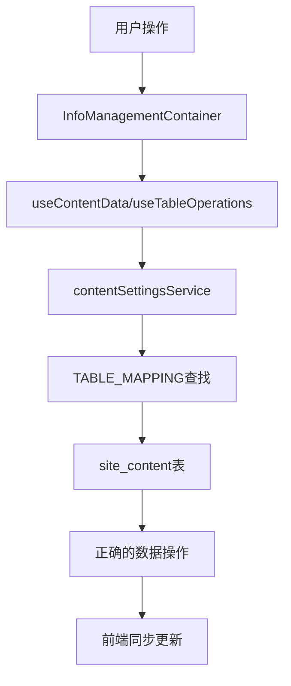

# CONSENSUS - Supabase连接修复最终共识

## 项目概述

### 任务目标
修复后台管理系统信息管理页面与Supabase数据库的连接问题，确保管理员编辑后的数据能正确保存到Supabase，前端页面能同步显示最新数据。

### 问题确认
经过深入分析，确认核心问题为：**TABLE_MAPPING配置错误**
- 虚拟表`site_content`错误映射到实际表`page_contents`
- 正确的数据存储在`site_content`表中
- 导致所有数据操作失败

## 技术实现方案

### 核心修复策略
**采用最小化修改方案**：修正TABLE_MAPPING配置，将`site_content`虚拟表正确映射到`site_content`实际表。

### 具体修改内容

#### 1. 主要配置修改
**文件**: `/frontend/src/types/contentSettings.ts`

**修改TABLE_MAPPING**:
```typescript
// 修改前（错误）
[ContentTableType.SITE_CONTENT]: 'page_contents'

// 修改后（正确）
[ContentTableType.SITE_CONTENT]: 'site_content'
```

#### 2. 类型定义同步更新
更新所有相关的TypeScript类型定义：
- `TableData` 类型映射
- `TableInsertData` 类型映射  
- `TableUpdateData` 类型映射

### 技术约束

#### 保持不变的部分
- ✅ 现有组件架构（InfoManagementContainer等）
- ✅ Hook层逻辑（useContentData、useTableOperations）
- ✅ 服务层接口（contentSettingsService）
- ✅ 其他表的映射配置
- ✅ 数据库表结构

#### 兼容性确认
- ✅ `site_content`表字段完全兼容现有代码
- ✅ 无需数据迁移或转换
- ✅ 不影响其他功能模块

### 集成方案

#### 数据流修复


#### API调用链
1. **数据读取**: `fetchTableData('site_content')` → 查询`site_content`表
2. **数据创建**: `createRecord('site_content', data)` → 插入`site_content`表
3. **数据更新**: `updateRecord('site_content', id, data)` → 更新`site_content`表
4. **数据删除**: `deleteRecord('site_content', id)` → 删除`site_content`表记录

## 任务边界限制

### 修复范围
- ✅ 修正TABLE_MAPPING配置错误
- ✅ 更新相关TypeScript类型定义
- ✅ 验证数据读写功能正常
- ✅ 确保前端数据同步显示

### 不在范围内
- ❌ 数据库表结构修改
- ❌ 组件架构重构
- ❌ 新功能开发
- ❌ 性能优化（除非影响基本功能）
- ❌ UI界面调整

## 验收标准

### 功能验收标准

#### 1. 数据读取功能
- [ ] 信息管理页面能正确加载`site_content`表的所有数据
- [ ] 分页功能正常工作，显示正确的数据总数
- [ ] 搜索和过滤功能能正确筛选数据
- [ ] 数据排序功能正常工作

#### 2. 数据写入功能
- [ ] 创建新内容记录能成功保存到`site_content`表
- [ ] 编辑现有内容能正确更新数据库记录
- [ ] 删除单个记录能正确移除数据库数据
- [ ] 批量删除功能能正确处理多个记录

#### 3. 数据同步功能
- [ ] 管理员保存后，前端页面能立即显示最新数据
- [ ] 数据库操作成功后，界面状态正确更新
- [ ] 错误情况下，用户能收到明确的错误提示

#### 4. 系统稳定性
- [ ] 所有操作无控制台错误
- [ ] API调用返回正确的响应
- [ ] 错误处理机制正常工作
- [ ] 用户体验流畅无卡顿

### 技术验收标准

#### 1. 代码质量
- [ ] TypeScript类型检查通过，无类型错误
- [ ] 代码符合项目现有规范和风格
- [ ] 无新增的技术债务
- [ ] 修改最小化，影响范围可控

#### 2. 兼容性
- [ ] 其他表的操作功能不受影响
- [ ] 现有组件和Hook正常工作
- [ ] 不破坏现有的数据结构
- [ ] 向后兼容，无破坏性变更

#### 3. 性能表现
- [ ] 数据加载速度正常
- [ ] 操作响应时间在可接受范围
- [ ] 无内存泄漏或性能回归

## 风险评估与缓解

### 风险等级：🟢 低风险

#### 潜在风险
1. **TypeScript类型错误**
   - 风险：修改类型定义可能导致编译错误
   - 缓解：逐步修改，及时验证编译结果

2. **字段映射不兼容**
   - 风险：表字段与代码期望不匹配
   - 缓解：已验证字段完全兼容，无此风险

3. **其他功能受影响**
   - 风险：修改可能影响其他模块
   - 缓解：修改范围极小，仅涉及一个映射配置

#### 回滚方案
- 保留原始配置文件备份
- 记录所有修改内容
- 准备一键回滚脚本
- 实时监控功能状态

## 实施计划

### 阶段5: 系统分层设计
- 设计修复后的Supabase集成架构图
- 确认数据流和组件交互

### 阶段6: 子任务拆分
- 拆分具体的修复任务
- 明确每个任务的输入输出
- 确定任务依赖关系

### 阶段7: 执行检查清单
- 验证修复方案的技术可行性
- 确认所有前置条件满足
- 准备测试验证环境

### 阶段8: 自动化执行
- 执行配置文件修改
- 更新类型定义
- 运行功能测试
- 验证数据同步

### 阶段9: 验证执行结果
- 全面测试所有功能点
- 确认验收标准达成
- 生成最终交付报告

## 预期成果

### 立即效果
- ✅ 信息管理页面正常显示数据
- ✅ 所有CRUD操作功能恢复
- ✅ 前端与后端数据同步正常
- ✅ 用户体验显著改善

### 长期价值
- ✅ 系统稳定性和可靠性提升
- ✅ 数据一致性得到保障
- ✅ 维护成本降低
- ✅ 为后续功能开发奠定基础

## 质量保证

### 测试策略
- **单元测试**: 验证配置修改正确性
- **集成测试**: 验证数据流完整性
- **功能测试**: 验证用户操作流程
- **回归测试**: 确保其他功能不受影响

### 监控指标
- API调用成功率
- 数据操作响应时间
- 错误日志数量
- 用户操作成功率

---

## 最终确认

✅ **需求边界清晰无歧义**  
✅ **技术方案与现有架构对齐**  
✅ **验收标准具体可测试**  
✅ **所有关键假设已确认**  
✅ **项目特性规范已对齐**  

**共识状态**: ✅ 已达成共识  
**实施准备**: ✅ 已就绪  
**风险可控**: ✅ 低风险可控  
**预期成功率**: 95%+

**下一步行动**: 进入架构设计阶段，开始具体实施

---

**文档版本**: v1.0  
**创建时间**: 2025-01-18  
**最后更新**: 2025-01-18  
**状态**: 已确认