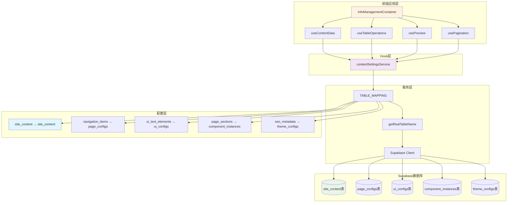
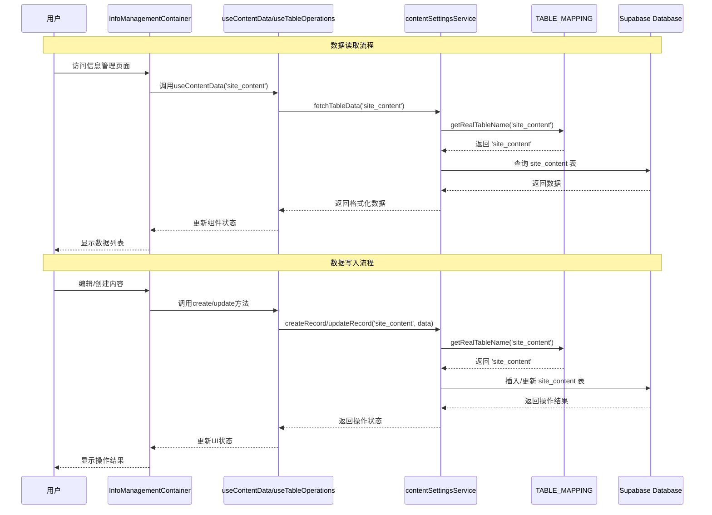
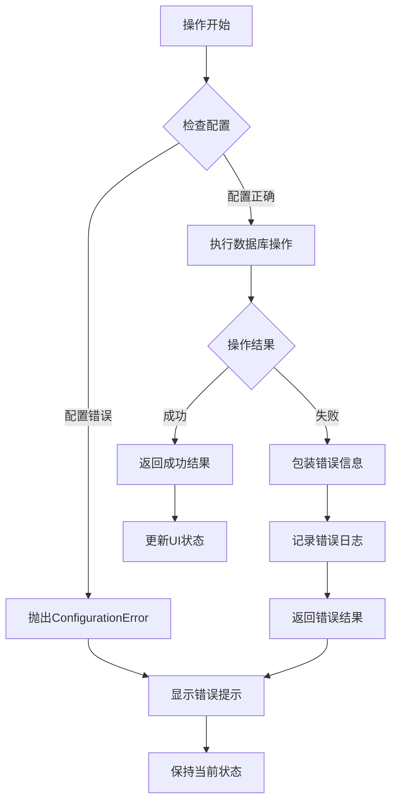

# DESIGN - Supabase连接修复系统架构设计

## 整体架构图

### 修复后的系统架构



## 分层设计

### 1. 表现层 (Presentation Layer)

#### InfoManagementContainer组件
**职责**:
- 统一的信息管理界面容器
- 整合数据管理、表格操作、预览和分页功能
- 用户交互事件处理
- 状态管理和UI渲染

**核心功能**:
```typescript
// 数据获取和状态管理
const { data, loading, error, refetch } = useContentData(activeTab);
const { create, update, deleteItem, batchDelete } = useTableOperations(activeTab);

// 事件处理
const handleSave = async (formData) => {
  // 通过useTableOperations保存数据
};

const handleDelete = async (id) => {
  // 通过useTableOperations删除数据
};
```

### 2. 业务逻辑层 (Business Logic Layer)

#### Hook层设计

##### useContentData Hook
**职责**: 数据获取、缓存和刷新
```typescript
interface UseContentDataReturn {
  data: ContentData[];
  loading: boolean;
  error: string | null;
  total: number;
  refetch: () => Promise<void>;
}
```

##### useTableOperations Hook
**职责**: 数据的增删改查操作
```typescript
interface UseTableOperationsReturn {
  create: (data: any) => Promise<TableOperationResult>;
  update: (id: string, data: any) => Promise<TableOperationResult>;
  deleteItem: (id: string) => Promise<TableOperationResult>;
  batchDelete: (ids: string[]) => Promise<TableOperationResult>;
  isOperating: boolean;
  operationError: string | null;
}
```

### 3. 数据访问层 (Data Access Layer)

#### contentSettingsService服务
**职责**: 与Supabase数据库交互的统一接口

**核心方法**:
```typescript
class ContentSettingsService {
  // 获取表数据
  async fetchTableData(tableName: ContentTableType, params: PaginationParams): Promise<PaginatedResponse<any>>;
  
  // 创建记录
  async createRecord(tableName: ContentTableType, data: any): Promise<TableOperationResult>;
  
  // 更新记录
  async updateRecord(tableName: ContentTableType, id: string, data: any): Promise<TableOperationResult>;
  
  // 删除记录
  async deleteRecord(tableName: ContentTableType, id: string): Promise<TableOperationResult>;
  
  // 批量删除
  async batchDeleteRecords(tableName: ContentTableType, ids: string[]): Promise<TableOperationResult>;
}
```

### 4. 配置层 (Configuration Layer)

#### TABLE_MAPPING配置
**修复前的错误配置**:
```typescript
export const TABLE_MAPPING = {
  [ContentTableType.SITE_CONTENT]: 'page_contents', // ❌ 错误映射
  // ... 其他映射
};
```

**修复后的正确配置**:
```typescript
export const TABLE_MAPPING = {
  [ContentTableType.SITE_CONTENT]: 'site_content',   // ✅ 正确映射
  [ContentTableType.NAVIGATION_ITEMS]: 'page_configs',
  [ContentTableType.UI_TEXT_ELEMENTS]: 'ui_configs',
  [ContentTableType.PAGE_SECTIONS]: 'component_instances',
  [ContentTableType.SEO_METADATA]: 'theme_configs'
};
```

## 核心组件设计

### 1. 表映射解析器

```typescript
/**
 * 获取真实的数据库表名
 * @param virtualTableName 虚拟表名
 * @returns 实际数据库表名
 */
export function getRealTableName(virtualTableName: ContentTableType): string {
  const realTableName = TABLE_MAPPING[virtualTableName];
  if (!realTableName) {
    throw new Error(`未找到虚拟表 ${virtualTableName} 的映射配置`);
  }
  return realTableName;
}
```

### 2. 数据操作统一接口

```typescript
/**
 * 统一的数据操作包装器
 * @param operation Supabase操作函数
 * @returns 包装后的操作结果
 */
async function wrapSupabaseOperation<T>(operation: () => Promise<any>): Promise<ApiResponse<T>> {
  try {
    const { data, error } = await operation();
    
    if (error) {
      console.error('Supabase操作错误:', error);
      return {
        data: null as T,
        success: false,
        error: error.message || '数据库操作失败'
      };
    }
    
    return {
      data,
      success: true
    };
  } catch (err) {
    console.error('操作异常:', err);
    return {
      data: null as T,
      success: false,
      error: err instanceof Error ? err.message : '未知错误'
    };
  }
}
```

## 数据流向图

### 修复后的完整数据流



## 接口契约定义

### 1. 数据模型接口

#### SiteContent数据模型
```typescript
interface SiteContentRow {
  id: string;
  content_key: string;
  content_type: string;
  title: string;
  content: string;
  description?: string;
  page_location?: string;
  component_type?: string;
  display_order?: number;
  is_active: boolean;
  metadata?: Record<string, any>;
  created_at: string;
  updated_at: string;
}
```

#### 操作结果接口
```typescript
interface TableOperationResult {
  success: boolean;
  message?: string;
  error?: string;
  data?: any;
}

interface PaginatedResponse<T> {
  data: T[];
  total: number;
  page: number;
  pageSize: number;
  totalPages: number;
}
```

### 2. API接口规范

#### 数据查询接口
```typescript
// 获取分页数据
fetchTableData(
  tableName: 'site_content',
  params: {
    page: number;
    pageSize: number;
    sortBy?: string;
    sortOrder?: 'asc' | 'desc';
    search?: string;
    isActive?: boolean;
  }
): Promise<PaginatedResponse<SiteContentRow>>
```

#### 数据操作接口
```typescript
// 创建记录
createRecord(
  tableName: 'site_content',
  data: Omit<SiteContentRow, 'id' | 'created_at' | 'updated_at'>
): Promise<TableOperationResult>

// 更新记录
updateRecord(
  tableName: 'site_content',
  id: string,
  data: Partial<Omit<SiteContentRow, 'id' | 'created_at'>>
): Promise<TableOperationResult>

// 删除记录
deleteRecord(
  tableName: 'site_content',
  id: string
): Promise<TableOperationResult>
```

## 异常处理策略

### 1. 错误分类

#### 配置错误
```typescript
class ConfigurationError extends Error {
  constructor(tableName: string) {
    super(`未找到表 ${tableName} 的映射配置`);
    this.name = 'ConfigurationError';
  }
}
```

#### 数据库操作错误
```typescript
class DatabaseError extends Error {
  constructor(operation: string, originalError: any) {
    super(`数据库${operation}操作失败: ${originalError.message}`);
    this.name = 'DatabaseError';
  }
}
```

### 2. 错误处理流程



### 3. 用户体验优化

#### Toast提示策略
```typescript
// 成功操作
toast.success('内容保存成功');

// 错误处理
toast.error('保存失败，请检查网络连接');

// 加载状态
toast.loading('正在保存...');
```

#### 加载状态管理
```typescript
const [loading, setLoading] = useState(false);
const [error, setError] = useState<string | null>(null);

// 操作包装
const handleOperation = async (operation: () => Promise<any>) => {
  setLoading(true);
  setError(null);
  
  try {
    await operation();
  } catch (err) {
    setError(err.message);
  } finally {
    setLoading(false);
  }
};
```

## 性能优化设计

### 1. 数据缓存策略
```typescript
// Hook级别的数据缓存
const useContentData = (tableName: ContentTableType) => {
  const [cache, setCache] = useState<Map<string, any>>(new Map());
  
  const fetchData = useCallback(async (params: PaginationParams) => {
    const cacheKey = `${tableName}-${JSON.stringify(params)}`;
    
    if (cache.has(cacheKey)) {
      return cache.get(cacheKey);
    }
    
    const result = await contentSettingsService.fetchTableData(tableName, params);
    cache.set(cacheKey, result);
    
    return result;
  }, [tableName, cache]);
};
```

### 2. 批量操作优化
```typescript
// 批量删除优化
const batchDelete = async (ids: string[]) => {
  const batchSize = 50; // 每批处理50条
  const batches = [];
  
  for (let i = 0; i < ids.length; i += batchSize) {
    batches.push(ids.slice(i, i + batchSize));
  }
  
  const results = await Promise.all(
    batches.map(batch => 
      supabase
        .from(getRealTableName(tableName))
        .delete()
        .in('id', batch)
    )
  );
  
  return results;
};
```

## 安全性设计

### 1. 数据验证
```typescript
// 输入数据验证
const validateSiteContent = (data: any): SiteContentRow => {
  const schema = {
    content_key: { required: true, type: 'string' },
    title: { required: true, type: 'string', maxLength: 200 },
    content: { required: true, type: 'string' },
    is_active: { required: true, type: 'boolean' }
  };
  
  // 验证逻辑
  return validatedData;
};
```

### 2. 权限控制
```typescript
// RLS策略（在Supabase中配置）
/*
CREATE POLICY "管理员可以管理所有内容" ON site_content
FOR ALL USING (auth.role() = 'admin');

CREATE POLICY "普通用户只能查看激活的内容" ON site_content
FOR SELECT USING (is_active = true);
*/
```

---

## 设计验证

### 架构一致性检查
✅ **与现有系统架构对齐**  
✅ **组件职责清晰分离**  
✅ **接口定义完整准确**  
✅ **错误处理机制完善**  
✅ **性能和安全性考虑周全**  

### 可行性验证
✅ **技术方案可实现**  
✅ **修改范围可控**  
✅ **风险评估合理**  
✅ **测试验证可行**  

**设计状态**: ✅ 设计完成  
**下一步**: 进入任务拆分阶段

---

**文档版本**: v1.0  
**创建时间**: 2025-01-18  
**设计负责人**: AI Assistant