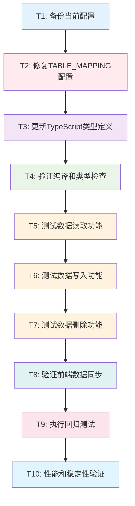

# TASK - Supabase连接修复任务拆分

## 任务概述

将Supabase连接修复工作拆分为可独立执行、验证的原子任务，确保每个任务都有明确的输入输出和验收标准。

## 任务依赖图



## 详细任务定义

### T1: 备份当前配置

#### 输入契约
- **前置依赖**: 无
- **输入数据**: 当前项目文件系统
- **环境依赖**: 文件系统访问权限

#### 输出契约
- **输出数据**: 配置文件备份
- **交付物**: 
  - `contentSettings.ts.backup` - 原始配置文件备份
  - `backup_info.json` - 备份信息记录
- **验收标准**: 
  - 备份文件创建成功
  - 备份文件内容与原文件一致
  - 备份信息记录完整

#### 实现约束
- **技术栈**: Node.js文件系统操作
- **接口规范**: 使用标准文件复制API
- **质量要求**: 确保备份完整性

#### 依赖关系
- **后置任务**: T2
- **并行任务**: 无

---

### T2: 修复TABLE_MAPPING配置

#### 输入契约
- **前置依赖**: T1完成
- **输入数据**: `/frontend/src/types/contentSettings.ts`文件
- **环境依赖**: 文件编辑权限

#### 输出契约
- **输出数据**: 修复后的TABLE_MAPPING配置
- **交付物**: 更新的`contentSettings.ts`文件
- **验收标准**: 
  - `site_content`映射从`page_contents`改为`site_content`
  - 其他映射保持不变
  - 文件语法正确

#### 实现约束
- **技术栈**: TypeScript配置文件编辑
- **接口规范**: 保持现有代码风格
- **质量要求**: 仅修改必要的映射配置

#### 具体修改内容
```typescript
// 修改前
[ContentTableType.SITE_CONTENT]: 'page_contents',

// 修改后  
[ContentTableType.SITE_CONTENT]: 'site_content',
```

#### 依赖关系
- **前置任务**: T1
- **后置任务**: T3
- **并行任务**: 无

---

### T3: 更新TypeScript类型定义

#### 输入契约
- **前置依赖**: T2完成
- **输入数据**: 修复后的TABLE_MAPPING配置
- **环境依赖**: TypeScript编译环境

#### 输出契约
- **输出数据**: 更新的类型定义
- **交付物**: 同步更新的类型映射
- **验收标准**: 
  - `TableData`类型映射更新
  - `TableInsertData`类型映射更新
  - `TableUpdateData`类型映射更新
  - 所有类型引用一致

#### 实现约束
- **技术栈**: TypeScript类型系统
- **接口规范**: 遵循现有类型定义模式
- **质量要求**: 类型安全，无类型错误

#### 具体修改内容
```typescript
// TableData类型映射
[ContentTableType.SITE_CONTENT]: Database['public']['Tables']['site_content']['Row'];

// TableInsertData类型映射
[ContentTableType.SITE_CONTENT]: Database['public']['Tables']['site_content']['Insert'];

// TableUpdateData类型映射
[ContentTableType.SITE_CONTENT]: Database['public']['Tables']['site_content']['Update'];
```

#### 依赖关系
- **前置任务**: T2
- **后置任务**: T4
- **并行任务**: 无

---

### T4: 验证编译和类型检查

#### 输入契约
- **前置依赖**: T3完成
- **输入数据**: 更新后的TypeScript文件
- **环境依赖**: TypeScript编译器、Node.js环境

#### 输出契约
- **输出数据**: 编译结果和类型检查报告
- **交付物**: 
  - 编译成功确认
  - 类型检查通过确认
  - 错误日志（如有）
- **验收标准**: 
  - TypeScript编译无错误
  - 类型检查通过
  - 无新增的类型警告

#### 实现约束
- **技术栈**: TypeScript编译器
- **接口规范**: 使用项目现有的tsconfig.json
- **质量要求**: 零编译错误，零类型错误

#### 验证命令
```bash
# TypeScript类型检查
npx tsc --noEmit

# 项目编译
npm run build
```

#### 依赖关系
- **前置任务**: T3
- **后置任务**: T5
- **并行任务**: 无

---

### T5: 测试数据读取功能

#### 输入契约
- **前置依赖**: T4完成
- **输入数据**: 修复后的配置和类型
- **环境依赖**: 
  - Supabase数据库连接
  - 开发服务器运行
  - `site_content`表包含测试数据

#### 输出契约
- **输出数据**: 数据读取测试结果
- **交付物**: 
  - 数据加载功能验证
  - 分页功能验证
  - 搜索过滤功能验证
- **验收标准**: 
  - 信息管理页面正确显示`site_content`表数据
  - 分页控件显示正确的总数
  - 搜索功能能正确筛选数据
  - 无控制台错误

#### 实现约束
- **技术栈**: React组件测试
- **接口规范**: 使用现有的测试方法
- **质量要求**: 功能完全正常，用户体验良好

#### 测试步骤
1. 启动开发服务器
2. 访问信息管理页面
3. 验证数据加载
4. 测试分页功能
5. 测试搜索过滤
6. 检查控制台日志

#### 依赖关系
- **前置任务**: T4
- **后置任务**: T6
- **并行任务**: 无

---

### T6: 测试数据写入功能

#### 输入契约
- **前置依赖**: T5完成
- **输入数据**: 正常工作的数据读取功能
- **环境依赖**: 
  - Supabase数据库写入权限
  - 信息管理页面正常加载

#### 输出契约
- **输出数据**: 数据写入测试结果
- **交付物**: 
  - 创建功能验证
  - 编辑功能验证
  - 数据持久化验证
- **验收标准**: 
  - 新建内容能成功保存到`site_content`表
  - 编辑现有内容能正确更新数据库
  - 保存后界面立即显示最新数据
  - 操作成功后显示正确的提示信息

#### 实现约束
- **技术栈**: React表单处理和数据提交
- **接口规范**: 使用现有的表单组件和验证
- **质量要求**: 数据完整性保证，用户反馈及时

#### 测试步骤
1. 测试创建新内容记录
2. 测试编辑现有内容记录
3. 验证数据库中的数据变更
4. 检查界面状态更新
5. 验证Toast提示信息

#### 依赖关系
- **前置任务**: T5
- **后置任务**: T7
- **并行任务**: 无

---

### T7: 测试数据删除功能

#### 输入契约
- **前置依赖**: T6完成
- **输入数据**: 正常工作的数据读写功能
- **环境依赖**: 
  - Supabase数据库删除权限
  - 测试数据可用

#### 输出契约
- **输出数据**: 数据删除测试结果
- **交付物**: 
  - 单个删除功能验证
  - 批量删除功能验证
  - 删除确认机制验证
- **验收标准**: 
  - 单个记录删除功能正常
  - 批量删除功能正常
  - 删除确认对话框正常显示
  - 删除后数据从数据库中移除
  - 界面立即更新显示

#### 实现约束
- **技术栈**: React删除操作和确认对话框
- **接口规范**: 使用现有的删除组件
- **质量要求**: 安全删除，防止误操作

#### 测试步骤
1. 测试单个记录删除
2. 测试批量删除功能
3. 验证删除确认机制
4. 检查数据库记录移除
5. 验证界面状态更新

#### 依赖关系
- **前置任务**: T6
- **后置任务**: T8
- **并行任务**: 无

---

### T8: 验证前端数据同步

#### 输入契约
- **前置依赖**: T7完成
- **输入数据**: 完整的CRUD功能
- **环境依赖**: 
  - 前端应用运行
  - 后台管理系统运行
  - Supabase实时连接

#### 输出契约
- **输出数据**: 数据同步验证结果
- **交付物**: 
  - 实时数据同步验证
  - 跨页面数据一致性验证
  - 缓存更新机制验证
- **验收标准**: 
  - 后台修改后前端立即显示最新数据
  - 多个页面间数据保持一致
  - 缓存机制正常工作
  - 网络异常时有适当的错误处理

#### 实现约束
- **技术栈**: React状态管理和数据同步
- **接口规范**: 使用现有的状态管理模式
- **质量要求**: 数据一致性保证，用户体验流畅

#### 测试步骤
1. 在后台管理系统修改数据
2. 验证前端页面数据更新
3. 测试多页面数据一致性
4. 验证缓存刷新机制
5. 测试网络异常处理

#### 依赖关系
- **前置任务**: T7
- **后置任务**: T9
- **并行任务**: 无

---

### T9: 执行回归测试

#### 输入契约
- **前置依赖**: T8完成
- **输入数据**: 完整修复的系统
- **环境依赖**: 
  - 完整的测试环境
  - 其他功能模块可用

#### 输出契约
- **输出数据**: 回归测试报告
- **交付物**: 
  - 其他表操作功能验证
  - 现有功能完整性验证
  - 兼容性测试报告
- **验收标准**: 
  - 其他虚拟表（navigation_items等）功能正常
  - 现有组件和Hook正常工作
  - 无新增的功能缺陷
  - 用户体验无回退

#### 实现约束
- **技术栈**: 全功能测试
- **接口规范**: 覆盖所有现有功能点
- **质量要求**: 零回归，功能完整性保证

#### 测试范围
1. 其他表的CRUD操作
2. 导航和UI组件功能
3. 用户权限和安全性
4. 性能表现
5. 错误处理机制

#### 依赖关系
- **前置任务**: T8
- **后置任务**: T10
- **并行任务**: 无

---

### T10: 性能和稳定性验证

#### 输入契约
- **前置依赖**: T9完成
- **输入数据**: 通过回归测试的系统
- **环境依赖**: 
  - 生产环境模拟
  - 性能监控工具

#### 输出契约
- **输出数据**: 性能和稳定性报告
- **交付物**: 
  - 性能基准测试结果
  - 稳定性测试报告
  - 最终验收确认
- **验收标准**: 
  - 数据加载时间在可接受范围
  - 操作响应时间正常
  - 长时间运行稳定
  - 内存使用正常

#### 实现约束
- **技术栈**: 性能监控和压力测试
- **接口规范**: 使用标准性能测试方法
- **质量要求**: 性能不低于修复前水平

#### 测试内容
1. 页面加载性能测试
2. 数据操作响应时间测试
3. 并发操作稳定性测试
4. 内存泄漏检测
5. 长时间运行稳定性测试

#### 依赖关系
- **前置任务**: T9
- **后置任务**: 无（最终任务）
- **并行任务**: 无

---

## 任务执行策略

### 执行顺序
严格按照依赖关系顺序执行，每个任务完成并验收通过后才能开始下一个任务。

### 质量门控
每个任务都必须满足其验收标准才能标记为完成，如果任务失败，需要：
1. 分析失败原因
2. 修复问题
3. 重新执行验证
4. 更新任务状态

### 风险缓解
- **T1-T4**: 低风险，主要是配置和编译验证
- **T5-T8**: 中等风险，涉及功能测试，需要仔细验证
- **T9-T10**: 低风险，主要是确认和验证

### 回滚策略
如果任何任务失败且无法修复：
1. 使用T1创建的备份文件
2. 恢复原始配置
3. 重新分析问题
4. 调整修复方案

---

## 预期时间安排

| 任务 | 预计时间 | 复杂度 |
|------|----------|--------|
| T1   | 2分钟    | 简单   |
| T2   | 3分钟    | 简单   |
| T3   | 5分钟    | 中等   |
| T4   | 3分钟    | 简单   |
| T5   | 8分钟    | 中等   |
| T6   | 8分钟    | 中等   |
| T7   | 5分钟    | 中等   |
| T8   | 10分钟   | 复杂   |
| T9   | 15分钟   | 复杂   |
| T10  | 8分钟    | 中等   |

**总计**: 约67分钟

---

**任务拆分状态**: ✅ 已完成  
**任务总数**: 10个原子任务  
**依赖关系**: 线性依赖，无循环  
**覆盖完整性**: ✅ 覆盖所有需求  
**可验证性**: ✅ 每个任务都可独立验证  

**下一步**: 进入执行检查清单阶段