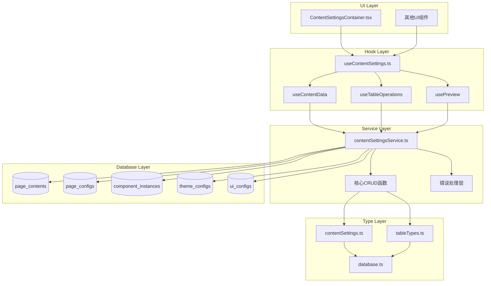
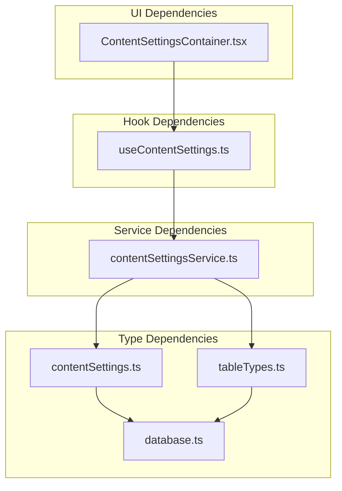
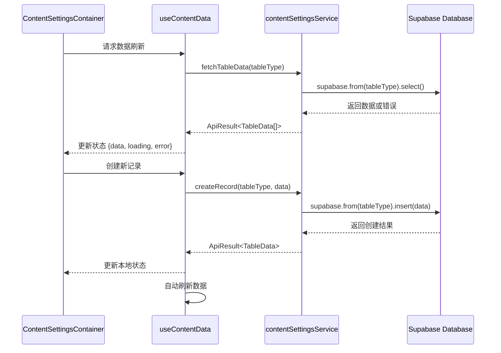

# DESIGN - contentSettingsService.ts 系统架构设计

## 整体架构图



## 分层设计

### 1. 类型定义层 (Type Layer)

#### 1.1 contentSettings.ts 重构设计

```typescript
// 基础类型定义
export type ContentTableType = 
  | 'page_contents'
  | 'page_configs'
  | 'component_instances'
  | 'theme_configs'
  | 'ui_configs';

// 表数据类型映射
export type TableDataMap = {
  page_contents: Database['public']['Tables']['page_contents']['Row'];
  page_configs: Database['public']['Tables']['page_configs']['Row'];
  component_instances: Database['public']['Tables']['component_instances']['Row'];
  theme_configs: Database['public']['Tables']['theme_configs']['Row'];
  ui_configs: Database['public']['Tables']['ui_configs']['Row'];
};

// Insert类型映射
export type TableInsertMap = {
  page_contents: Database['public']['Tables']['page_contents']['Insert'];
  page_configs: Database['public']['Tables']['page_configs']['Insert'];
  component_instances: Database['public']['Tables']['component_instances']['Insert'];
  theme_configs: Database['public']['Tables']['theme_configs']['Insert'];
  ui_configs: Database['public']['Tables']['ui_configs']['Insert'];
};

// Update类型映射
export type TableUpdateMap = {
  page_contents: Database['public']['Tables']['page_contents']['Update'];
  page_configs: Database['public']['Tables']['page_configs']['Update'];
  component_instances: Database['public']['Tables']['component_instances']['Update'];
  theme_configs: Database['public']['Tables']['theme_configs']['Update'];
  ui_configs: Database['public']['Tables']['ui_configs']['Update'];
};

// 通用类型定义
export type TableData<T extends ContentTableType = ContentTableType> = TableDataMap[T];
export type TableInsert<T extends ContentTableType = ContentTableType> = TableInsertMap[T];
export type TableUpdate<T extends ContentTableType = ContentTableType> = TableUpdateMap[T];

// API响应类型
export interface ApiResult<T = any> {
  data: T | null;
  error: string | null;
  success: boolean;
}

// 分页参数
export interface PaginationParams {
  page: number;
  pageSize: number;
  sortBy?: string;
  sortOrder?: 'asc' | 'desc';
}

// Hook返回类型
export interface UseContentDataReturn {
  data: Record<ContentTableType, TableData[]>;
  loading: Record<ContentTableType, boolean>;
  error: Record<ContentTableType, string | null>;
  refreshData: (tableType?: ContentTableType) => Promise<void>;
  refreshAll: () => Promise<void>;
}

export interface UseTableOperationsReturn {
  createRecord: <T extends ContentTableType>(
    tableType: T,
    data: TableInsert<T>
  ) => Promise<ApiResult<TableData<T>>>;
  updateRecord: <T extends ContentTableType>(
    tableType: T,
    id: string,
    data: TableUpdate<T>
  ) => Promise<ApiResult<TableData<T>>>;
  deleteRecord: (tableType: ContentTableType, id: string) => Promise<ApiResult<boolean>>;
  batchDeleteRecords: (tableType: ContentTableType, ids: string[]) => Promise<ApiResult<boolean>>;
}

export interface UsePreviewReturn {
  previewData: Record<ContentTableType, TableData | null>;
  setPreviewData: (tableType: ContentTableType, data: TableData | null) => void;
  clearPreview: (tableType?: ContentTableType) => void;
}

// 工具函数类型
export const isApiSuccess = <T>(result: ApiResult<T>): result is ApiResult<T> & { success: true } => {
  return result.success === true;
};

export const isApiError = <T>(result: ApiResult<T>): result is ApiResult<T> & { success: false } => {
  return result.success === false;
};

// 默认分页配置
export const DEFAULT_PAGINATION: PaginationParams = {
  page: 1,
  pageSize: 10,
  sortBy: 'created_at',
  sortOrder: 'desc'
};
```

#### 1.2 tableTypes.ts 更新设计

```typescript
// 更新表类型常量
export const TABLE_TYPES = {
  PAGE_CONTENTS: 'page_contents',
  PAGE_CONFIGS: 'page_configs',
  COMPONENT_INSTANCES: 'component_instances',
  THEME_CONFIGS: 'theme_configs',
  UI_CONFIGS: 'ui_configs'
} as const;

// 更新ContentTableType
export type ContentTableType = typeof TABLE_TYPES[keyof typeof TABLE_TYPES];

// 更新值数组
export const CONTENT_TABLE_TYPE_VALUES: ContentTableType[] = [
  'page_contents',
  'page_configs',
  'component_instances',
  'theme_configs',
  'ui_configs'
];

// 更新类型守卫
export function isContentTableType(value: string): value is ContentTableType {
  return CONTENT_TABLE_TYPE_VALUES.includes(value as ContentTableType);
}
```

### 2. 服务层 (Service Layer)

#### 2.1 contentSettingsService.ts 架构设计

```typescript
// 核心服务类设计
class ContentSettingsService {
  private supabase: SupabaseClient<Database>;
  
  constructor(supabaseClient: SupabaseClient<Database>) {
    this.supabase = supabaseClient;
  }
  
  // 通用数据获取方法
  async fetchTableData<T extends ContentTableType>(
    tableType: T,
    params?: PaginationParams
  ): Promise<ApiResult<TableData<T>[]>> {
    // 实现细节
  }
  
  // 通用记录创建方法
  async createRecord<T extends ContentTableType>(
    tableType: T,
    data: TableInsert<T>
  ): Promise<ApiResult<TableData<T>>> {
    // 实现细节
  }
  
  // 通用记录更新方法
  async updateRecord<T extends ContentTableType>(
    tableType: T,
    id: string,
    data: TableUpdate<T>
  ): Promise<ApiResult<TableData<T>>> {
    // 实现细节
  }
  
  // 通用记录删除方法
  async deleteRecord(
    tableType: ContentTableType,
    id: string
  ): Promise<ApiResult<boolean>> {
    // 实现细节
  }
  
  // 批量删除方法
  async batchDeleteRecords(
    tableType: ContentTableType,
    ids: string[]
  ): Promise<ApiResult<boolean>> {
    // 实现细节
  }
  
  // 数据订阅方法
  subscribeToTableChanges<T extends ContentTableType>(
    tableType: T,
    callback: (payload: any) => void
  ): RealtimeChannel {
    // 实现细节
  }
}
```

#### 2.2 错误处理层设计

```typescript
// 错误处理包装器
function wrapSupabaseOperation<T>(
  operation: () => Promise<PostgrestResponse<T>>
): Promise<ApiResult<T>> {
  // 统一错误处理逻辑
}

// 表类型验证
function validateTableType(tableType: string): asserts tableType is ContentTableType {
  if (!isContentTableType(tableType)) {
    throw new Error(`Invalid table type: ${tableType}`);
  }
}

// 数据验证
function validateRecordData<T extends ContentTableType>(
  tableType: T,
  data: any
): asserts data is TableInsert<T> | TableUpdate<T> {
  // 数据验证逻辑
}
```

### 3. Hook层 (Hook Layer)

#### 3.1 useContentSettings.ts 重构设计

```typescript
// 主要Hook的状态管理设计
export function useContentData(): UseContentDataReturn {
  // 状态定义 - 使用实际表名
  const [data, setData] = useState<Record<ContentTableType, TableData[]>>({
    page_contents: [],
    page_configs: [],
    component_instances: [],
    theme_configs: [],
    ui_configs: []
  });
  
  const [loading, setLoading] = useState<Record<ContentTableType, boolean>>({
    page_contents: false,
    page_configs: false,
    component_instances: false,
    theme_configs: false,
    ui_configs: false
  });
  
  const [error, setError] = useState<Record<ContentTableType, string | null>>({
    page_contents: null,
    page_configs: null,
    component_instances: null,
    theme_configs: null,
    ui_configs: null
  });
  
  // 数据获取逻辑
  const refreshData = useCallback(async (tableType?: ContentTableType) => {
    // 实现细节
  }, []);
  
  const refreshAll = useCallback(async () => {
    // 实现细节
  }, []);
  
  return {
    data,
    loading,
    error,
    refreshData,
    refreshAll
  };
}
```

### 4. UI层 (UI Layer)

#### 4.1 ContentSettingsContainer.tsx 适配设计

```typescript
// 组件状态管理适配
const ContentSettingsContainer: React.FC = () => {
  // 使用更新后的Hook
  const { data, loading, error, refreshData } = useContentData();
  const { createRecord, updateRecord, deleteRecord } = useTableOperations();
  
  // 表类型选择状态 - 使用实际表名
  const [selectedTable, setSelectedTable] = useState<ContentTableType>('page_contents');
  
  // 组件逻辑适配
  const handleTableChange = (tableType: ContentTableType) => {
    setSelectedTable(tableType);
    refreshData(tableType);
  };
  
  // 渲染逻辑保持不变，但使用新的表名
  return (
    <div className="content-settings-container">
      {/* UI组件 */}
    </div>
  );
};
```

## 核心组件设计

### 1. 类型系统组件

#### 组件职责
- **contentSettings.ts**: 提供完整的类型定义和类型映射
- **tableTypes.ts**: 提供表类型常量和验证函数
- **database.ts**: 提供Supabase数据库类型定义（已存在）

#### 组件接口
```typescript
// contentSettings.ts 导出接口
export {
  ContentTableType,
  TableData,
  TableInsert,
  TableUpdate,
  ApiResult,
  PaginationParams,
  UseContentDataReturn,
  UseTableOperationsReturn,
  UsePreviewReturn,
  isApiSuccess,
  isApiError,
  DEFAULT_PAGINATION
};
```

### 2. 服务层组件

#### 组件职责
- **contentSettingsService.ts**: 提供数据库操作的统一接口
- **错误处理模块**: 统一处理Supabase操作错误
- **数据验证模块**: 验证输入数据的有效性

#### 组件接口
```typescript
// contentSettingsService.ts 导出接口
export {
  contentSettingsService,
  fetchTableData,
  fetchTableCount,
  createRecord,
  updateRecord,
  deleteRecord,
  batchDeleteRecords,
  subscribeToTableChanges,
  DEFAULT_PAGINATION
};
```

### 3. Hook层组件

#### 组件职责
- **useContentData**: 管理所有表的数据状态
- **useTableOperations**: 提供CRUD操作方法
- **usePreview**: 管理预览数据状态
- **useFormManagement**: 表单状态管理
- **usePagination**: 分页状态管理

#### 组件接口
```typescript
// useContentSettings.ts 导出接口
export {
  useContentData,
  useTableOperations,
  usePreview,
  useFormManagement,
  usePagination
};
```

## 模块依赖关系图



## 接口契约定义

### 1. 服务层接口契约

#### fetchTableData 接口
```typescript
interface FetchTableDataContract {
  input: {
    tableType: ContentTableType;
    params?: PaginationParams;
  };
  output: Promise<ApiResult<TableData[]>>;
  errors: [
    'INVALID_TABLE_TYPE',
    'DATABASE_CONNECTION_ERROR',
    'PERMISSION_DENIED'
  ];
}
```

#### createRecord 接口
```typescript
interface CreateRecordContract<T extends ContentTableType> {
  input: {
    tableType: T;
    data: TableInsert<T>;
  };
  output: Promise<ApiResult<TableData<T>>>;
  errors: [
    'VALIDATION_ERROR',
    'DUPLICATE_KEY_ERROR',
    'DATABASE_ERROR'
  ];
}
```

### 2. Hook层接口契约

#### useContentData 接口
```typescript
interface UseContentDataContract {
  output: {
    data: Record<ContentTableType, TableData[]>;
    loading: Record<ContentTableType, boolean>;
    error: Record<ContentTableType, string | null>;
    refreshData: (tableType?: ContentTableType) => Promise<void>;
    refreshAll: () => Promise<void>;
  };
  sideEffects: [
    'AUTOMATIC_DATA_REFRESH',
    'ERROR_STATE_MANAGEMENT',
    'LOADING_STATE_MANAGEMENT'
  ];
}
```

## 数据流向图



## 异常处理策略

### 1. 错误分类

#### 系统级错误
- **数据库连接错误**: 网络问题、服务不可用
- **权限错误**: 认证失败、授权不足
- **配置错误**: 环境变量缺失、配置错误

#### 业务级错误
- **数据验证错误**: 输入数据格式错误、必填字段缺失
- **业务规则错误**: 违反业务约束、数据冲突
- **操作限制错误**: 并发冲突、操作频率限制

### 2. 错误处理机制

#### 服务层错误处理
```typescript
function wrapSupabaseOperation<T>(
  operation: () => Promise<PostgrestResponse<T>>
): Promise<ApiResult<T>> {
  return operation()
    .then(response => {
      if (response.error) {
        return {
          data: null,
          error: response.error.message,
          success: false
        };
      }
      return {
        data: response.data,
        error: null,
        success: true
      };
    })
    .catch(error => ({
      data: null,
      error: error.message || 'Unknown error occurred',
      success: false
    }));
}
```

#### Hook层错误处理
```typescript
const handleError = useCallback((tableType: ContentTableType, error: string) => {
  setError(prev => ({ ...prev, [tableType]: error }));
  toast.error(`操作失败: ${error}`);
}, []);

const clearError = useCallback((tableType: ContentTableType) => {
  setError(prev => ({ ...prev, [tableType]: null }));
}, []);
```

#### UI层错误处理
```typescript
const ErrorBoundary: React.FC<{ children: React.ReactNode }> = ({ children }) => {
  return (
    <ErrorBoundaryComponent
      fallback={<ErrorFallback />}
      onError={(error, errorInfo) => {
        console.error('ContentSettings Error:', error, errorInfo);
        toast.error('系统错误，请刷新页面重试');
      }}
    >
      {children}
    </ErrorBoundaryComponent>
  );
};
```

## 性能优化策略

### 1. 数据获取优化
- **按需加载**: 只加载当前选中表的数据
- **分页加载**: 使用分页减少单次数据传输量
- **缓存策略**: 在Hook层实现数据缓存

### 2. 状态管理优化
- **状态分离**: 不同表的状态独立管理
- **局部更新**: 只更新变化的数据部分
- **防抖处理**: 对频繁操作进行防抖

### 3. 渲染优化
- **组件拆分**: 将大组件拆分为小组件
- **memo优化**: 使用React.memo防止不必要的重渲染
- **虚拟滚动**: 对大列表使用虚拟滚动

## 测试策略

### 1. 单元测试
- **类型验证测试**: 测试类型守卫函数
- **服务函数测试**: 测试CRUD操作函数
- **Hook测试**: 测试Hook的状态管理逻辑

### 2. 集成测试
- **数据库集成测试**: 测试与Supabase的集成
- **组件集成测试**: 测试UI组件与Hook的集成
- **端到端测试**: 测试完整的用户操作流程

### 3. 错误测试
- **网络错误测试**: 模拟网络异常情况
- **数据验证测试**: 测试无效数据的处理
- **边界条件测试**: 测试极限情况的处理

## 部署和监控

### 1. 部署策略
- **渐进式部署**: 分阶段部署修复内容
- **回滚机制**: 准备快速回滚方案
- **环境验证**: 在测试环境充分验证

### 2. 监控指标
- **编译成功率**: 监控TypeScript编译状态
- **功能可用性**: 监控核心功能的可用性
- **错误率**: 监控API调用的错误率
- **性能指标**: 监控页面加载和操作响应时间

---

**文档状态**: 设计完成  
**创建时间**: 2024年12月18日  
**最后更新**: 2024年12月18日  
**版本**: 1.0  
**审批状态**: 待审批