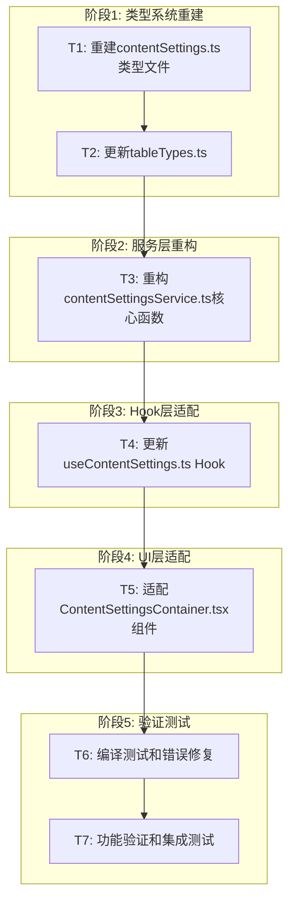

# TASK - contentSettingsService.ts 子任务拆分

## 任务依赖图

## 原子任务详细定义

### T1: 重建contentSettings.ts类型文件

#### 输入契约
- **前置依赖**: 无
- **输入数据**: 
  - `src/types/database.ts` 文件内容
  - DESIGN文档中的类型定义规范
- **环境依赖**: TypeScript编译环境

#### 输出契约
- **输出数据**: 完整的 `src/types/contentSettings.ts` 文件
- **交付物**: 
  - 新的ContentTableType类型定义
  - TableDataMap, TableInsertMap, TableUpdateMap类型映射
  - ApiResult, PaginationParams等通用类型
  - Hook返回类型定义
  - 工具函数和常量
- **验收标准**: 
  - [ ] 文件能够正常编译
  - [ ] 所有类型定义与database.ts保持一致
  - [ ] 导出的类型完整覆盖设计需求
  - [ ] 类型定义支持泛型约束

#### 实现约束
- **技术栈**: TypeScript 5.x
- **接口规范**: 必须与database.ts中的Database类型兼容
- **质量要求**: 
  - 类型定义准确无歧义
  - 支持完整的类型推导
  - 包含适当的JSDoc注释

#### 依赖关系
- **后置任务**: T2, T3
- **并行任务**: 无

#### 具体实施步骤
1. 分析database.ts中的表结构定义
2. 定义新的ContentTableType枚举
3. 创建类型映射接口
4. 定义API响应和分页类型
5. 创建Hook返回类型接口
6. 添加工具函数和常量
7. 编写类型测试用例

---

### T2: 更新tableTypes.ts

#### 输入契约
- **前置依赖**: T1完成
- **输入数据**: 
  - 新的contentSettings.ts类型定义
  - 现有tableTypes.ts文件
- **环境依赖**: TypeScript编译环境

#### 输出契约
- **输出数据**: 更新后的 `src/types/tableTypes.ts` 文件
- **交付物**: 
  - 更新的TABLE_TYPES常量
  - 新的ContentTableType类型导入
  - 更新的CONTENT_TABLE_TYPE_VALUES数组
  - 更新的isContentTableType类型守卫
- **验收标准**: 
  - [ ] 与contentSettings.ts类型定义一致
  - [ ] 类型守卫函数正常工作
  - [ ] 常量值与实际表名匹配
  - [ ] 文件正常编译无错误

#### 实现约束
- **技术栈**: TypeScript 5.x
- **接口规范**: 必须与contentSettings.ts保持同步
- **质量要求**: 
  - 类型安全的常量定义
  - 准确的类型守卫实现
  - 完整的导出接口

#### 依赖关系
- **前置任务**: T1
- **后置任务**: T3
- **并行任务**: 无

#### 具体实施步骤
1. 导入新的ContentTableType类型
2. 更新TABLE_TYPES常量对象
3. 更新CONTENT_TABLE_TYPE_VALUES数组
4. 修改isContentTableType类型守卫函数
5. 验证类型一致性
6. 测试类型守卫功能

---

### T3: 重构contentSettingsService.ts核心函数

#### 输入契约
- **前置依赖**: T1, T2完成
- **输入数据**: 
  - 新的类型定义文件
  - 现有contentSettingsService.ts文件
  - Supabase客户端实例
- **环境依赖**: 
  - TypeScript编译环境
  - Supabase客户端库
  - React开发环境

#### 输出契约
- **输出数据**: 完全重构的 `src/services/contentSettingsService.ts` 文件
- **交付物**: 
  - 类型安全的CRUD函数
  - 统一的错误处理机制
  - 数据验证函数
  - 订阅功能实现
  - 导出的服务对象
- **验收标准**: 
  - [ ] 所有TypeScript类型错误消除
  - [ ] 函数签名与类型定义匹配
  - [ ] 错误处理机制完善
  - [ ] 支持所有定义的表类型
  - [ ] API接口保持向后兼容

#### 实现约束
- **技术栈**: TypeScript, Supabase客户端
- **接口规范**: 
  - 必须使用新的类型定义
  - 保持现有API接口不变
  - 遵循Supabase最佳实践
- **质量要求**: 
  - 完整的错误处理
  - 类型安全的数据操作
  - 适当的性能优化
  - 清晰的函数注释

#### 依赖关系
- **前置任务**: T1, T2
- **后置任务**: T4
- **并行任务**: 无

#### 具体实施步骤
1. 导入新的类型定义
2. 重构fetchTableData函数
3. 重构createRecord函数
4. 重构updateRecord函数
5. 重构deleteRecord函数
6. 实现batchDeleteRecords函数
7. 重构subscribeToTableChanges函数
8. 实现错误处理包装器
9. 添加数据验证函数
10. 更新导出接口
11. 编写函数级注释

---

### T4: 更新useContentSettings.ts Hook

#### 输入契约
- **前置依赖**: T3完成
- **输入数据**: 
  - 重构后的contentSettingsService
  - 新的类型定义
  - 现有useContentSettings.ts文件
- **环境依赖**: 
  - React开发环境
  - TypeScript编译环境

#### 输出契约
- **输出数据**: 更新后的 `src/hooks/useContentSettings.ts` 文件
- **交付物**: 
  - 更新的useContentData Hook
  - 更新的useTableOperations Hook
  - 更新的usePreview Hook
  - 适配的状态管理逻辑
  - 更新的错误处理
- **验收标准**: 
  - [ ] Hook接口保持向后兼容
  - [ ] 状态管理使用新的表名
  - [ ] 类型定义完全匹配
  - [ ] 错误处理机制完善
  - [ ] 性能优化保持有效

#### 实现约束
- **技术栈**: React Hooks, TypeScript
- **接口规范**: 
  - 保持Hook的公共API不变
  - 使用新的类型定义
  - 遵循React Hooks最佳实践
- **质量要求**: 
  - 状态管理逻辑清晰
  - 适当的性能优化
  - 完整的错误处理
  - 清晰的Hook注释

#### 依赖关系
- **前置任务**: T3
- **后置任务**: T5
- **并行任务**: 无

#### 具体实施步骤
1. 导入新的类型定义和服务
2. 更新useContentData状态定义
3. 修改数据获取逻辑
4. 更新useTableOperations实现
5. 适配usePreview功能
6. 更新错误处理逻辑
7. 优化性能相关代码
8. 更新Hook注释和文档
9. 验证Hook功能完整性

---

### T5: 适配ContentSettingsContainer.tsx组件

#### 输入契约
- **前置依赖**: T4完成
- **输入数据**: 
  - 更新后的useContentSettings Hook
  - 新的类型定义
  - 现有ContentSettingsContainer.tsx文件
- **环境依赖**: 
  - React开发环境
  - TypeScript编译环境
  - UI组件库

#### 输出契约
- **输出数据**: 适配后的 `src/components/ContentSettings/ContentSettingsContainer.tsx` 文件
- **交付物**: 
  - 更新的组件状态管理
  - 适配的表名引用
  - 更新的事件处理函数
  - 保持的UI界面设计
- **验收标准**: 
  - [ ] 组件正常渲染
  - [ ] 所有功能按钮正常工作
  - [ ] 数据显示正确
  - [ ] 错误处理用户友好
  - [ ] 无TypeScript编译错误

#### 实现约束
- **技术栈**: React, TypeScript, UI组件库
- **接口规范**: 
  - 保持组件的公共API
  - 使用更新后的Hook
  - 遵循React组件最佳实践
- **质量要求**: 
  - 用户体验保持一致
  - 错误处理友好
  - 代码结构清晰
  - 适当的组件注释

#### 依赖关系
- **前置任务**: T4
- **后置任务**: T6
- **并行任务**: 无

#### 具体实施步骤
1. 导入更新后的Hook和类型
2. 更新组件状态定义
3. 修改表名引用
4. 更新事件处理函数
5. 适配数据绑定逻辑
6. 更新错误显示逻辑
7. 验证UI功能完整性
8. 优化组件性能
9. 更新组件注释

---

### T6: 编译测试和错误修复

#### 输入契约
- **前置依赖**: T1-T5全部完成
- **输入数据**: 
  - 所有修改后的文件
  - 项目配置文件
- **环境依赖**: 
  - 完整的开发环境
  - TypeScript编译器
  - 开发服务器

#### 输出契约
- **输出数据**: 无编译错误的项目代码
- **交付物**: 
  - 编译成功的项目
  - 错误修复报告
  - 性能测试结果
- **验收标准**: 
  - [ ] `npm run build` 成功执行
  - [ ] `npm run dev` 正常启动
  - [ ] 无TypeScript类型错误
  - [ ] 无运行时错误
  - [ ] 开发服务器稳定运行

#### 实现约束
- **技术栈**: 项目完整技术栈
- **接口规范**: 遵循项目构建配置
- **质量要求**: 
  - 零编译错误
  - 零运行时错误
  - 性能无明显回归

#### 依赖关系
- **前置任务**: T1-T5
- **后置任务**: T7
- **并行任务**: 无

#### 具体实施步骤
1. 执行TypeScript类型检查
2. 运行项目构建命令
3. 启动开发服务器
4. 检查控制台错误
5. 修复发现的编译错误
6. 验证所有导入导出
7. 测试基本功能可用性
8. 记录修复过程和结果

---

### T7: 功能验证和集成测试

#### 输入契约
- **前置依赖**: T6完成
- **输入数据**: 
  - 编译成功的项目
  - 功能测试用例
- **环境依赖**: 
  - 运行中的开发服务器
  - 测试数据库连接
  - 浏览器测试环境

#### 输出契约
- **输出数据**: 功能验证报告
- **交付物**: 
  - 完整的功能测试结果
  - 性能测试报告
  - 用户体验验证报告
  - 最终交付确认
- **验收标准**: 
  - [ ] 所有CRUD操作正常工作
  - [ ] 数据显示准确
  - [ ] 错误处理机制有效
  - [ ] 用户界面响应正常
  - [ ] 性能指标达标

#### 实现约束
- **技术栈**: 完整的测试技术栈
- **接口规范**: 遵循测试最佳实践
- **质量要求**: 
  - 全面的功能覆盖
  - 真实的用户场景
  - 详细的测试报告

#### 依赖关系
- **前置任务**: T6
- **后置任务**: 无
- **并行任务**: 无

#### 具体实施步骤
1. 准备测试环境和数据
2. 测试数据获取功能
3. 测试数据创建功能
4. 测试数据更新功能
5. 测试数据删除功能
6. 测试批量操作功能
7. 测试错误处理机制
8. 测试用户界面交互
9. 进行性能测试
10. 生成测试报告
11. 确认所有验收标准

## 任务复杂度评估

### 高复杂度任务
- **T3: 重构contentSettingsService.ts**: 涉及复杂的类型系统和数据库操作
- **T4: 更新useContentSettings.ts**: 需要处理复杂的状态管理逻辑

### 中复杂度任务
- **T1: 重建contentSettings.ts**: 需要设计完整的类型系统
- **T5: 适配ContentSettingsContainer.tsx**: 需要处理UI组件的复杂交互
- **T7: 功能验证和集成测试**: 需要全面的测试覆盖

### 低复杂度任务
- **T2: 更新tableTypes.ts**: 相对简单的类型更新
- **T6: 编译测试和错误修复**: 主要是验证和修复工作

## 风险评估

### 高风险任务
- **T3**: 服务层重构可能引入新的bug
- **T4**: Hook层修改可能影响性能

### 中风险任务
- **T1**: 类型定义错误可能影响整个系统
- **T5**: UI组件适配可能影响用户体验

### 低风险任务
- **T2**: 类型更新相对安全
- **T6**: 主要是验证工作
- **T7**: 测试阶段，风险可控

## 时间估算

### 总体时间估算
- **阶段1 (T1-T2)**: 2-3小时
- **阶段2 (T3)**: 3-4小时
- **阶段3 (T4)**: 2-3小时
- **阶段4 (T5)**: 1-2小时
- **阶段5 (T6-T7)**: 1-2小时

**总计**: 9-14小时

### 关键路径
T1 → T2 → T3 → T4 → T5 → T6 → T7

## 质量保证措施

### 每个任务的质量检查点
1. **代码审查**: 每个任务完成后进行代码审查
2. **类型检查**: 确保TypeScript类型正确
3. **功能测试**: 验证功能正常工作
4. **性能检查**: 确保无性能回归
5. **文档更新**: 及时更新相关文档

### 整体质量标准
- **零编译错误**: 所有TypeScript错误必须解决
- **功能完整性**: 所有原有功能必须保持
- **性能标准**: 不能有明显的性能回归
- **代码质量**: 代码结构清晰，注释完整

## 应急预案

### 任务失败处理
1. **立即停止**: 发现严重问题立即停止当前任务
2. **问题分析**: 详细分析失败原因
3. **回滚机制**: 必要时回滚到上一个稳定状态
4. **重新规划**: 调整任务计划和实施策略

### 风险缓解措施
1. **备份策略**: 每个阶段完成后创建代码备份
2. **分支管理**: 使用Git分支管理不同阶段的代码
3. **增量验证**: 每个任务完成后立即验证
4. **文档记录**: 详细记录每个步骤和决策

---

**文档状态**: 任务拆分完成  
**创建时间**: 2024年12月18日  
**最后更新**: 2024年12月18日  
**版本**: 1.0  
**审批状态**: 待审批