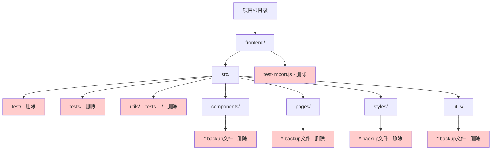
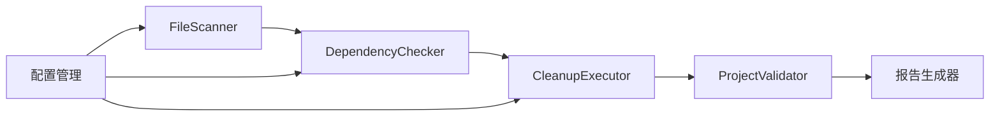
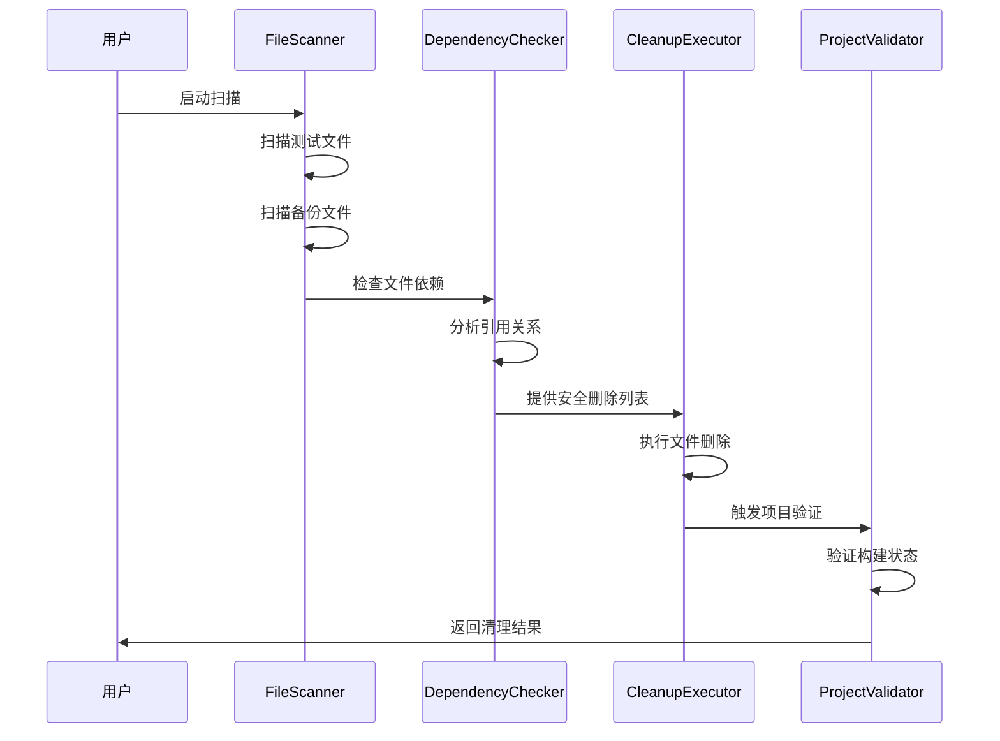

# 代码清理架构设计文档

## 整体架构图



## 分层设计

### 第一层：测试文件清理
- **目标**: 删除所有测试相关的文件和目录
- **范围**: `src/test/`, `src/tests/`, `src/utils/__tests__/`, `test-import.js`
- **风险**: 低 - 这些文件不影响生产功能

### 第二层：备份文件清理
- **目标**: 删除所有 `.backup` 后缀的文件
- **范围**: 遍历整个 `src/` 目录查找备份文件
- **风险**: 低 - 备份文件不参与构建过程

### 第三层：重复文件清理
- **目标**: 删除重复的组件文件
- **范围**: 检查同名文件和目录的情况
- **风险**: 中 - 需要确认哪个版本在使用

## 核心组件

### 文件扫描器
```typescript
interface FileScanner {
  scanTestFiles(): string[];
  scanBackupFiles(): string[];
  scanDuplicateFiles(): DuplicateFile[];
  scanEmptyDirectories(): string[];
}
```

### 依赖检查器
```typescript
interface DependencyChecker {
  checkFileReferences(filePath: string): boolean;
  findImportStatements(filePath: string): string[];
  validateSafeToDelete(filePath: string): boolean;
}
```

### 清理执行器
```typescript
interface CleanupExecutor {
  deleteFile(filePath: string): void;
  deleteDirectory(dirPath: string): void;
  verifyProjectIntegrity(): boolean;
}
```

## 模块依赖关系图



## 接口契约定义

### 清理任务接口
```typescript
interface CleanupTask {
  id: string;
  name: string;
  description: string;
  targetFiles: string[];
  riskLevel: 'low' | 'medium' | 'high';
  execute(): Promise<CleanupResult>;
  rollback(): Promise<void>;
}

interface CleanupResult {
  success: boolean;
  deletedFiles: string[];
  errors: string[];
  warnings: string[];
}
```

### 验证接口
```typescript
interface ProjectValidator {
  validateBuild(): Promise<boolean>;
  validateImports(): Promise<ValidationResult>;
  validateRuntime(): Promise<boolean>;
}

interface ValidationResult {
  valid: boolean;
  brokenImports: string[];
  missingFiles: string[];
}
```

## 数据流向图



## 异常处理策略

### 错误分类
1. **文件系统错误**: 权限不足、文件被占用
2. **依赖关系错误**: 删除了被引用的文件
3. **构建错误**: 删除后项目无法构建
4. **运行时错误**: 删除后功能异常

### 处理策略
```typescript
class CleanupErrorHandler {
  handleFileSystemError(error: FileSystemError): void {
    // 记录错误，跳过该文件，继续处理其他文件
  }
  
  handleDependencyError(error: DependencyError): void {
    // 停止删除，恢复已删除的文件
  }
  
  handleBuildError(error: BuildError): void {
    // 立即停止，提供回滚选项
  }
}
```

## 安全保障机制

### 预检查清单
- [ ] 文件引用关系分析
- [ ] 构建依赖检查
- [ ] 运行时依赖验证
- [ ] 备份重要文件

### 回滚机制
- 记录所有删除操作
- 提供一键恢复功能
- 保留删除前的项目状态快照

### 验证检查点
1. **删除前验证**: 确认文件可以安全删除
2. **删除后验证**: 确认项目仍然正常
3. **最终验证**: 完整的功能测试

## 性能优化

### 批量操作
- 按类型分组删除文件
- 减少文件系统调用次数
- 并行处理独立的清理任务

### 增量清理
- 支持部分清理和暂停/恢复
- 记录清理进度
- 允许选择性清理特定类型的文件