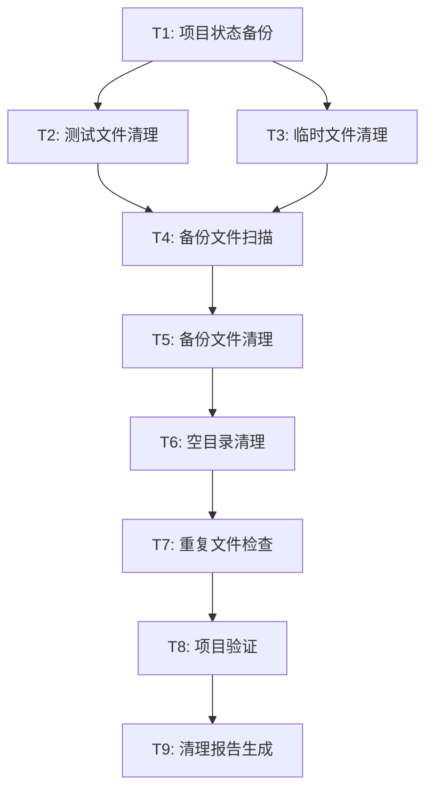

# 代码清理原子化任务文档

## 任务依赖图



## 原子任务详细定义

### T1: 项目状态备份

**输入契约**
- 前置依赖: 无
- 输入数据: 当前项目状态
- 环境依赖: 文件系统读写权限

**输出契约**
- 输出数据: 项目当前状态记录
- 交付物: 状态快照文件
- 验收标准: 记录当前所有文件列表和项目运行状态

**实现约束**
- 技术栈: Node.js文件系统API
- 接口规范: 生成JSON格式的状态文件
- 质量要求: 完整记录，便于回滚

**依赖关系**
- 后置任务: T2, T3
- 并行任务: 无

---

### T2: 测试文件清理

**输入契约**
- 前置依赖: T1完成
- 输入数据: 测试目录路径列表
- 环境依赖: 文件删除权限

**输出契约**
- 输出数据: 已删除的测试文件列表
- 交付物: 清理后的项目结构
- 验收标准: 
  - `src/test/` 目录完全删除
  - `src/tests/` 空目录删除
  - `src/utils/__tests__/` 空目录删除
  - 项目仍能正常编译

**实现约束**
- 技术栈: 文件系统操作
- 接口规范: 递归删除目录
- 质量要求: 确保不误删非测试文件

**依赖关系**
- 后置任务: T4
- 并行任务: T3

**目标文件列表**
```
/Users/changhao/Desktop/网站测试/frontend/src/test/
/Users/changhao/Desktop/网站测试/frontend/src/tests/
/Users/changhao/Desktop/网站测试/frontend/src/utils/__tests__/
```

---

### T3: 临时文件清理

**输入契约**
- 前置依赖: T1完成
- 输入数据: 临时文件路径
- 环境依赖: 文件删除权限

**输出契约**
- 输出数据: 已删除的临时文件列表
- 交付物: 清理后的项目根目录
- 验收标准: `test-import.js` 文件被删除

**实现约束**
- 技术栈: 文件系统操作
- 接口规范: 单文件删除
- 质量要求: 确认文件不被其他模块引用

**依赖关系**
- 后置任务: T4
- 并行任务: T2

**目标文件列表**
```
/Users/changhao/Desktop/网站测试/frontend/test-import.js
```

---

### T4: 备份文件扫描

**输入契约**
- 前置依赖: T2, T3完成
- 输入数据: 项目源码目录
- 环境依赖: 文件系统读取权限

**输出契约**
- 输出数据: 所有 `.backup` 文件的完整路径列表
- 交付物: 备份文件清单
- 验收标准: 找到所有 `.backup` 后缀的文件

**实现约束**
- 技术栈: 递归文件搜索
- 接口规范: 返回文件路径数组
- 质量要求: 不遗漏任何备份文件

**依赖关系**
- 后置任务: T5
- 并行任务: 无

**扫描范围**
```
/Users/changhao/Desktop/网站测试/frontend/src/
```

---

### T5: 备份文件清理

**输入契约**
- 前置依赖: T4完成
- 输入数据: 备份文件路径列表
- 环境依赖: 文件删除权限

**输出契约**
- 输出数据: 已删除的备份文件列表
- 交付物: 清理后的源码目录
- 验收标准: 所有 `.backup` 文件被删除，项目正常运行

**实现约束**
- 技术栈: 批量文件删除
- 接口规范: 逐个删除文件
- 质量要求: 删除前确认文件类型

**依赖关系**
- 后置任务: T6
- 并行任务: 无

**预期删除文件**
```
- Footer.tsx.backup
- ContactPage.tsx.backup
- HomePage.tsx.backup
- TeachersPage.tsx.backup
- components.css.backup
- routes.ts.backup
```

---

### T6: 空目录清理

**输入契约**
- 前置依赖: T5完成
- 输入数据: 项目目录结构
- 环境依赖: 目录删除权限

**输出契约**
- 输出数据: 已删除的空目录列表
- 交付物: 优化后的目录结构
- 验收标准: 所有空目录被删除

**实现约束**
- 技术栈: 目录遍历和删除
- 接口规范: 递归检查空目录
- 质量要求: 只删除真正为空的目录

**依赖关系**
- 后置任务: T7
- 并行任务: 无

---

### T7: 重复文件检查

**输入契约**
- 前置依赖: T6完成
- 输入数据: 组件文件列表
- 环境依赖: 文件读取权限

**输出契约**
- 输出数据: 重复文件分析报告
- 交付物: 重复文件处理建议
- 验收标准: 识别所有潜在的重复文件

**实现约束**
- 技术栈: 文件内容比较
- 接口规范: 生成比较报告
- 质量要求: 准确识别真正的重复

**依赖关系**
- 后置任务: T8
- 并行任务: 无

**检查范围**
- 同名文件和目录的情况
- 功能相似的组件
- 内容相同的文件

---

### T8: 项目验证

**输入契约**
- 前置依赖: T7完成
- 输入数据: 清理后的项目
- 环境依赖: Node.js运行环境

**输出契约**
- 输出数据: 验证结果报告
- 交付物: 项目健康状态确认
- 验收标准: 
  - 项目能够正常编译
  - 开发服务器能够启动
  - 所有页面能够正常访问
  - 没有导入错误

**实现约束**
- 技术栈: npm/yarn构建工具
- 接口规范: 运行构建和测试命令
- 质量要求: 全面验证项目完整性

**依赖关系**
- 后置任务: T9
- 并行任务: 无

**验证步骤**
1. 运行 `npm run build`
2. 检查开发服务器状态
3. 验证关键页面访问
4. 检查控制台错误

---

### T9: 清理报告生成

**输入契约**
- 前置依赖: T8完成
- 输入数据: 所有任务的执行结果
- 环境依赖: 文件写入权限

**输出契约**
- 输出数据: 完整的清理报告
- 交付物: 
  - `ACCEPTANCE_代码清理.md`
  - `FINAL_代码清理.md`
  - `TODO_代码清理.md`
- 验收标准: 报告包含所有清理细节和结果

**实现约束**
- 技术栈: Markdown文档生成
- 接口规范: 结构化报告格式
- 质量要求: 详细、准确、易读

**依赖关系**
- 后置任务: 无
- 并行任务: 无

**报告内容**
- 删除的文件统计
- 清理前后对比
- 项目状态验证结果
- 遗留问题和建议

## 任务执行顺序

1. **准备阶段**: T1 (项目状态备份)
2. **并行清理阶段**: T2 (测试文件) + T3 (临时文件)
3. **扫描阶段**: T4 (备份文件扫描)
4. **深度清理阶段**: T5 (备份文件) → T6 (空目录) → T7 (重复文件)
5. **验证阶段**: T8 (项目验证)
6. **报告阶段**: T9 (清理报告)

## 风险评估

- **T1-T3**: 低风险 - 删除明确的测试和临时文件
- **T4-T5**: 低风险 - 删除备份文件
- **T6**: 低风险 - 删除空目录
- **T7**: 中风险 - 需要仔细分析重复文件
- **T8**: 关键 - 验证项目完整性
- **T9**: 低风险 - 生成报告