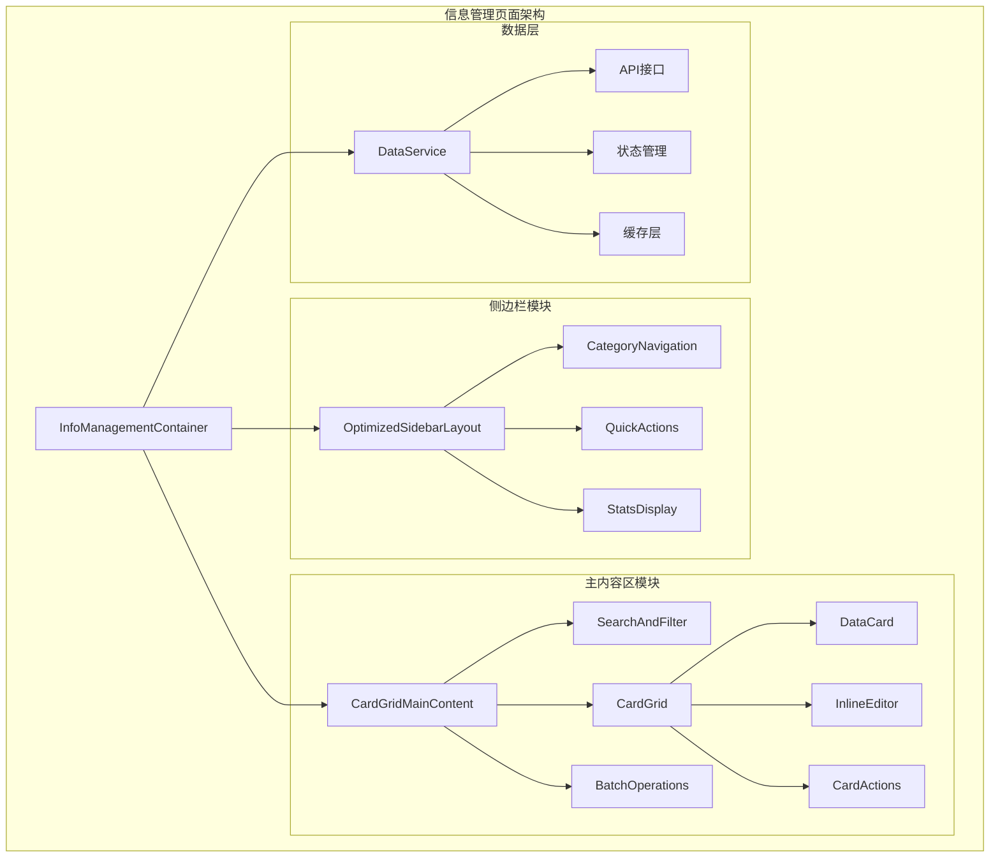
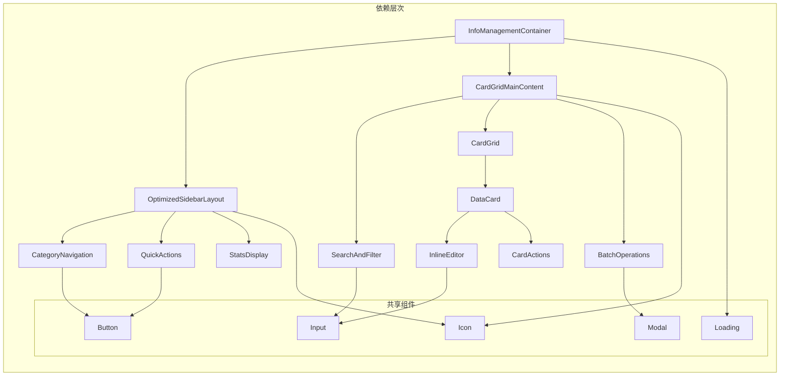
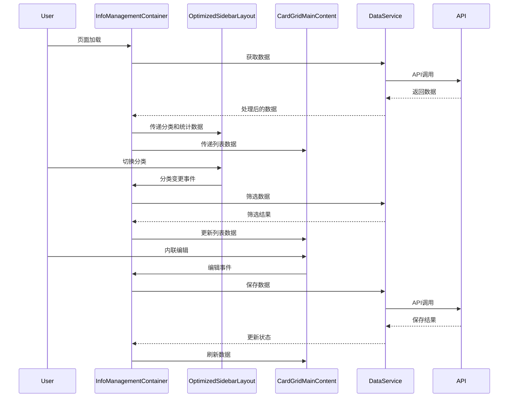

# DESIGN - 信息管理布局优化架构设计

## 整体架构设计

### 系统架构图



### 分层设计

#### 1. 容器层 (Container Layer)
- **InfoManagementContainer**: 主容器组件，负责整体状态管理和数据协调
- **职责**: 数据获取、状态管理、事件处理、子组件协调

#### 2. 布局层 (Layout Layer)
- **OptimizedSidebarLayout**: 优化后的侧边栏布局组件
- **CardGridMainContent**: 卡片网格主内容区组件
- **职责**: 页面布局、响应式设计、视觉层次

#### 3. 功能层 (Feature Layer)
- **CategoryNavigation**: 分类导航组件
- **QuickActions**: 快速操作组件
- **StatsDisplay**: 统计信息显示组件
- **SearchAndFilter**: 搜索和筛选组件
- **CardGrid**: 卡片网格组件
- **BatchOperations**: 批量操作组件

#### 4. 组件层 (Component Layer)
- **DataCard**: 数据卡片组件
- **InlineEditor**: 内联编辑器组件
- **CardActions**: 卡片操作组件

#### 5. 数据层 (Data Layer)
- **DataService**: 数据服务层
- **API接口**: 后端接口调用
- **状态管理**: React状态和Context
- **缓存层**: 数据缓存和优化

## 核心组件设计

### 1. InfoManagementContainer 重构

```typescript
interface InfoManagementContainerProps {
  // 保持现有接口，简化内部实现
}

interface InfoManagementState {
  // 移除 useNewLayout 相关状态
  activeCategory: string;
  searchQuery: string;
  selectedItems: string[];
  editingItem: string | null;
  // ... 其他必要状态
}
```

**设计原则**:
- 移除双模式布局逻辑
- 简化状态管理
- 统一使用优化后的布局
- 保持现有API兼容性

### 2. OptimizedSidebarLayout 设计

```typescript
interface OptimizedSidebarLayoutProps {
  categories: CategoryItem[];
  activeCategory: string;
  stats: StatsData;
  quickActions: QuickAction[];
  onCategoryChange: (category: string) => void;
  onQuickAction: (action: string) => void;
}
```

**优化重点**:
- 增强统计信息的可视化
- 优化快速操作的布局
- 改进分类导航的交互
- 添加更多有用的侧边栏信息

### 3. CardGridMainContent 设计

```typescript
interface CardGridMainContentProps {
  data: DataItem[];
  searchQuery: string;
  selectedItems: string[];
  editingItem: string | null;
  onSearch: (query: string) => void;
  onSelect: (items: string[]) => void;
  onEdit: (item: string) => void;
  onSave: (item: DataItem) => void;
  onDelete: (items: string[]) => void;
}
```

**核心特性**:
- 响应式卡片网格布局
- 内联编辑功能
- 批量选择和操作
- 搜索和筛选集成

## 模块依赖关系图



## 接口契约定义

### 1. 数据接口

```typescript
// 数据项接口
interface DataItem {
  id: string;
  title: string;
  description?: string;
  category: string;
  status: string;
  createdAt: Date;
  updatedAt: Date;
  metadata?: Record<string, any>;
}

// 分类接口
interface CategoryItem {
  id: string;
  name: string;
  count: number;
  icon?: string;
  color?: string;
}

// 统计数据接口
interface StatsData {
  total: number;
  byCategory: Record<string, number>;
  byStatus: Record<string, number>;
  recent: number;
}

// 快速操作接口
interface QuickAction {
  id: string;
  label: string;
  icon: string;
  action: string;
  disabled?: boolean;
  badge?: number;
}
```

### 2. 事件接口

```typescript
// 搜索事件
interface SearchEvent {
  query: string;
  filters: Record<string, any>;
}

// 编辑事件
interface EditEvent {
  item: DataItem;
  field: string;
  value: any;
}

// 批量操作事件
interface BatchOperationEvent {
  operation: 'delete' | 'update' | 'export';
  items: string[];
  data?: Record<string, any>;
}
```

## 数据流向图



## 响应式设计策略

### 断点设计

```css
/* 桌面端优先设计 */
.card-grid {
  /* 大屏幕: 4列 */
  grid-template-columns: repeat(4, 1fr);
}

@media (max-width: 1536px) {
  .card-grid {
    /* 中大屏幕: 3列 */
    grid-template-columns: repeat(3, 1fr);
  }
}

@media (max-width: 1024px) {
  .card-grid {
    /* 中屏幕: 2列 */
    grid-template-columns: repeat(2, 1fr);
  }
  
  .sidebar {
    /* 侧边栏收缩 */
    width: 200px;
  }
}

@media (max-width: 768px) {
  .card-grid {
    /* 小屏幕: 1列 */
    grid-template-columns: 1fr;
  }
  
  .sidebar {
    /* 侧边栏隐藏，改为抽屉式 */
    transform: translateX(-100%);
  }
}
```

### 卡片自适应设计

```typescript
// 卡片尺寸计算
const useCardLayout = () => {
  const [columns, setColumns] = useState(4);
  
  useEffect(() => {
    const updateColumns = () => {
      const width = window.innerWidth;
      if (width >= 1536) setColumns(4);
      else if (width >= 1024) setColumns(3);
      else if (width >= 768) setColumns(2);
      else setColumns(1);
    };
    
    updateColumns();
    window.addEventListener('resize', updateColumns);
    return () => window.removeEventListener('resize', updateColumns);
  }, []);
  
  return { columns };
};
```

## 性能优化策略

### 1. 渲染优化

```typescript
// 虚拟化长列表
const VirtualizedCardGrid = React.memo(({ items, ...props }) => {
  const [visibleItems, setVisibleItems] = useState([]);
  
  // 实现虚拟滚动逻辑
  // ...
  
  return (
    <div className="card-grid">
      {visibleItems.map(item => (
        <DataCard key={item.id} item={item} {...props} />
      ))}
    </div>
  );
});

// 卡片组件优化
const DataCard = React.memo(({ item, onEdit, onSelect }) => {
  const handleEdit = useCallback(() => {
    onEdit(item.id);
  }, [item.id, onEdit]);
  
  const handleSelect = useCallback(() => {
    onSelect(item.id);
  }, [item.id, onSelect]);
  
  return (
    <div className="data-card">
      {/* 卡片内容 */}
    </div>
  );
});
```

### 2. 数据优化

```typescript
// 数据缓存策略
const useDataCache = () => {
  const cache = useRef(new Map());
  
  const getCachedData = useCallback((key: string) => {
    return cache.current.get(key);
  }, []);
  
  const setCachedData = useCallback((key: string, data: any) => {
    cache.current.set(key, data);
  }, []);
  
  return { getCachedData, setCachedData };
};

// 防抖搜索
const useDebounceSearch = (delay = 300) => {
  const [searchQuery, setSearchQuery] = useState('');
  const [debouncedQuery, setDebouncedQuery] = useState('');
  
  useEffect(() => {
    const timer = setTimeout(() => {
      setDebouncedQuery(searchQuery);
    }, delay);
    
    return () => clearTimeout(timer);
  }, [searchQuery, delay]);
  
  return { searchQuery, setSearchQuery, debouncedQuery };
};
```

## 异常处理策略

### 1. 错误边界

```typescript
class InfoManagementErrorBoundary extends React.Component {
  constructor(props) {
    super(props);
    this.state = { hasError: false, error: null };
  }
  
  static getDerivedStateFromError(error) {
    return { hasError: true, error };
  }
  
  componentDidCatch(error, errorInfo) {
    console.error('信息管理页面错误:', error, errorInfo);
    // 发送错误报告
  }
  
  render() {
    if (this.state.hasError) {
      return (
        <div className="error-fallback">
          <h2>页面加载出错</h2>
          <p>请刷新页面重试</p>
          <button onClick={() => window.location.reload()}>
            刷新页面
          </button>
        </div>
      );
    }
    
    return this.props.children;
  }
}
```

### 2. 加载状态处理

```typescript
const useAsyncState = <T>(asyncFn: () => Promise<T>) => {
  const [state, setState] = useState<{
    data: T | null;
    loading: boolean;
    error: Error | null;
  }>({ data: null, loading: true, error: null });
  
  useEffect(() => {
    let cancelled = false;
    
    asyncFn()
      .then(data => {
        if (!cancelled) {
          setState({ data, loading: false, error: null });
        }
      })
      .catch(error => {
        if (!cancelled) {
          setState({ data: null, loading: false, error });
        }
      });
    
    return () => {
      cancelled = true;
    };
  }, []);
  
  return state;
};
```

## 测试策略

### 1. 单元测试

```typescript
// 组件测试示例
describe('DataCard', () => {
  it('应该正确渲染数据项', () => {
    const mockItem = {
      id: '1',
      title: '测试标题',
      description: '测试描述',
      category: 'test',
      status: 'active'
    };
    
    render(<DataCard item={mockItem} />);
    
    expect(screen.getByText('测试标题')).toBeInTheDocument();
    expect(screen.getByText('测试描述')).toBeInTheDocument();
  });
  
  it('应该支持内联编辑', () => {
    const mockOnEdit = jest.fn();
    const mockItem = { /* ... */ };
    
    render(<DataCard item={mockItem} onEdit={mockOnEdit} />);
    
    fireEvent.click(screen.getByTestId('edit-button'));
    expect(mockOnEdit).toHaveBeenCalledWith(mockItem.id);
  });
});
```

### 2. 集成测试

```typescript
// 页面集成测试
describe('InfoManagementContainer', () => {
  it('应该正确加载和显示数据', async () => {
    const mockData = [/* 模拟数据 */];
    jest.spyOn(api, 'fetchData').mockResolvedValue(mockData);
    
    render(<InfoManagementContainer />);
    
    await waitFor(() => {
      expect(screen.getByTestId('card-grid')).toBeInTheDocument();
    });
    
    expect(screen.getAllByTestId('data-card')).toHaveLength(mockData.length);
  });
});
```

## 迁移策略

### 阶段1: 组件重构
1. 创建新的优化组件
2. 保持现有组件并行存在
3. 逐步替换组件引用

### 阶段2: 布局统一
1. 移除双模式布局逻辑
2. 统一使用新布局组件
3. 清理废弃代码

### 阶段3: 功能优化
1. 实现内联编辑功能
2. 优化交互体验
3. 性能调优

### 阶段4: 测试验证
1. 功能回归测试
2. 性能基准测试
3. 用户体验验证

---

**设计版本**: 1.0  
**创建时间**: 2024年12月  
**设计状态**: 已完成，可进入任务拆分阶段