# TASK - 信息管理布局优化任务拆分

## 任务概述

基于DESIGN文档，将信息管理布局优化工作拆分为8个原子任务，按依赖关系分4个阶段执行。每个任务都有明确的输入契约、输出契约和验收标准。

## 任务依赖关系图

```mermaid
graph TD
    subgraph "阶段1: 基础组件创建"
        T1[T1: 创建DataCard组件]
        T2[T2: 创建InlineEditor组件]
    end
    
    subgraph "阶段2: 布局组件重构"
        T3[T3: 重构CardGridMainContent]
        T4[T4: 优化OptimizedSidebarLayout]
    end
    
    subgraph "阶段3: 容器层简化"
        T5[T5: 简化InfoManagementContainer]
    end
    
    subgraph "阶段4: 集成测试和优化"
        T6[T6: 性能优化和错误处理]
        T7[T7: 响应式布局优化]
        T8[T8: 功能测试和验证]
    end
    
    T1 --> T3
    T2 --> T3
    T3 --> T5
    T4 --> T5
    T5 --> T6
    T5 --> T7
    T6 --> T8
    T7 --> T8
```

## 详细任务定义

### T1: 创建DataCard组件

**任务描述**: 创建新的数据卡片组件，支持数据展示和基础交互

**输入契约**:
- 前置依赖: 无
- 输入数据: DataItem接口定义
- 环境依赖: React + TypeScript + Tailwind CSS

**输出契约**:
- 输出数据: DataCard组件
- 交付物: 
  - `/src/components/InfoManagement/Card/DataCard.tsx`
  - `/src/components/InfoManagement/Card/DataCard.types.ts`
  - `/src/components/InfoManagement/Card/index.ts`
- 验收标准:
  - ✅ 组件正确渲染数据项信息
  - ✅ 支持选择状态切换
  - ✅ 支持编辑模式切换
  - ✅ 响应式设计，适配不同屏幕尺寸
  - ✅ TypeScript类型检查通过
  - ✅ 样式符合设计规范

**实现约束**:
- 技术栈: React Functional Component + Hooks
- 接口规范: 遵循现有组件接口模式
- 质量要求: 代码覆盖率 > 80%

**依赖关系**:
- 后置任务: T3
- 并行任务: T2

---

### T2: 创建InlineEditor组件

**任务描述**: 创建内联编辑器组件，支持字段级别的内联编辑

**输入契约**:
- 前置依赖: 无
- 输入数据: 编辑字段类型定义
- 环境依赖: React + TypeScript + Tailwind CSS

**输出契约**:
- 输出数据: InlineEditor组件
- 交付物:
  - `/src/components/InfoManagement/Editor/InlineEditor.tsx`
  - `/src/components/InfoManagement/Editor/InlineEditor.types.ts`
  - `/src/components/InfoManagement/Editor/FieldEditor.tsx`
  - `/src/components/InfoManagement/Editor/index.ts`
- 验收标准:
  - ✅ 支持文本、数字、选择等字段类型编辑
  - ✅ 支持实时保存和取消操作
  - ✅ 提供编辑状态的视觉反馈
  - ✅ 支持键盘快捷键（Enter保存，Esc取消）
  - ✅ 错误处理和验证提示
  - ✅ 无障碍访问支持

**实现约束**:
- 技术栈: React Functional Component + Hooks
- 接口规范: 支持受控和非受控模式
- 质量要求: 支持防抖输入，性能优化

**依赖关系**:
- 后置任务: T3
- 并行任务: T1

---

### T3: 重构CardGridMainContent

**任务描述**: 创建新的卡片网格主内容区组件，集成DataCard和InlineEditor

**输入契约**:
- 前置依赖: T1 (DataCard), T2 (InlineEditor)
- 输入数据: 数据列表、搜索状态、选择状态
- 环境依赖: 完成的DataCard和InlineEditor组件

**输出契约**:
- 输出数据: CardGridMainContent组件
- 交付物:
  - `/src/components/InfoManagement/Layout/CardGridMainContent.tsx`
  - `/src/components/InfoManagement/Layout/CardGridMainContent.types.ts`
  - `/src/components/InfoManagement/Layout/SearchAndFilter.tsx`
  - `/src/components/InfoManagement/Layout/BatchOperations.tsx`
- 验收标准:
  - ✅ 响应式卡片网格布局
  - ✅ 集成搜索和筛选功能
  - ✅ 支持批量选择和操作
  - ✅ 内联编辑功能正常工作
  - ✅ 虚拟滚动支持（大数据量）
  - ✅ 加载状态和空状态处理

**实现约束**:
- 技术栈: React + CSS Grid + Flexbox
- 接口规范: 与现有MainContentArea接口兼容
- 质量要求: 支持1000+数据项的流畅渲染

**依赖关系**:
- 后置任务: T5
- 并行任务: T4

---

### T4: 优化OptimizedSidebarLayout

**任务描述**: 优化现有侧边栏布局，增强统计信息和快速操作

**输入契约**:
- 前置依赖: 无
- 输入数据: 现有SidebarLayout组件
- 环境依赖: 现有侧边栏相关组件

**输出契约**:
- 输出数据: OptimizedSidebarLayout组件
- 交付物:
  - `/src/components/InfoManagement/Layout/OptimizedSidebarLayout.tsx`
  - `/src/components/InfoManagement/Sidebar/EnhancedStatsDisplay.tsx`
  - `/src/components/InfoManagement/Sidebar/ImprovedQuickActions.tsx`
- 验收标准:
  - ✅ 增强的统计信息可视化
  - ✅ 优化的快速操作布局
  - ✅ 改进的分类导航交互
  - ✅ 更好的空间利用率
  - ✅ 保持现有功能完整性
  - ✅ 响应式侧边栏设计

**实现约束**:
- 技术栈: 基于现有SidebarLayout重构
- 接口规范: 保持现有接口兼容性
- 质量要求: 不破坏现有功能

**依赖关系**:
- 后置任务: T5
- 并行任务: T3

---

### T5: 简化InfoManagementContainer

**任务描述**: 简化主容器组件，移除双模式布局逻辑，统一使用新布局

**输入契约**:
- 前置依赖: T3 (CardGridMainContent), T4 (OptimizedSidebarLayout)
- 输入数据: 现有InfoManagementContainer组件
- 环境依赖: 完成的新布局组件

**输出契约**:
- 输出数据: 简化的InfoManagementContainer
- 交付物:
  - 更新 `/src/components/InfoManagement/InfoManagementContainer.tsx`
  - 移除 `/src/components/InfoManagement/Layout/LayoutContainer.tsx` 的智能检测逻辑
  - 更新相关类型定义
- 验收标准:
  - ✅ 移除useNewLayout状态和相关逻辑
  - ✅ 统一使用新的布局组件
  - ✅ 保持所有现有功能正常工作
  - ✅ 简化的状态管理逻辑
  - ✅ 代码复杂度显著降低
  - ✅ 所有现有测试通过

**实现约束**:
- 技术栈: 保持现有技术栈
- 接口规范: 保持对外接口不变
- 质量要求: 不引入回归问题

**依赖关系**:
- 后置任务: T6, T7
- 并行任务: 无

---

### T6: 性能优化和错误处理

**任务描述**: 实现性能优化策略和完善的错误处理机制

**输入契约**:
- 前置依赖: T5 (简化的InfoManagementContainer)
- 输入数据: 完整的新布局系统
- 环境依赖: 完成的组件重构

**输出契约**:
- 输出数据: 性能优化的组件系统
- 交付物:
  - `/src/components/InfoManagement/hooks/useVirtualization.ts`
  - `/src/components/InfoManagement/hooks/useDebounceSearch.ts`
  - `/src/components/InfoManagement/hooks/useDataCache.ts`
  - `/src/components/InfoManagement/ErrorBoundary/InfoManagementErrorBoundary.tsx`
- 验收标准:
  - ✅ 虚拟滚动实现，支持大数据量
  - ✅ 搜索防抖优化
  - ✅ 数据缓存机制
  - ✅ 错误边界和异常处理
  - ✅ 内存泄漏检查通过
  - ✅ 性能基准测试达标

**实现约束**:
- 技术栈: React Hooks + 性能优化技术
- 接口规范: 不影响现有组件接口
- 质量要求: 页面加载时间 < 2s，编辑响应 < 500ms

**依赖关系**:
- 后置任务: T8
- 并行任务: T7

---

### T7: 响应式布局优化

**任务描述**: 优化响应式设计，确保在不同屏幕尺寸下的良好体验

**输入契约**:
- 前置依赖: T5 (简化的InfoManagementContainer)
- 输入数据: 完整的新布局系统
- 环境依赖: 完成的组件重构

**输出契约**:
- 输出数据: 响应式优化的布局系统
- 交付物:
  - `/src/components/InfoManagement/styles/responsive.css`
  - `/src/components/InfoManagement/hooks/useResponsiveLayout.ts`
  - 更新所有组件的响应式样式
- 验收标准:
  - ✅ 桌面端（1920px+）4列卡片布局
  - ✅ 中大屏（1536px）3列卡片布局
  - ✅ 中屏（1024px）2列卡片布局 + 收缩侧边栏
  - ✅ 小屏（768px）1列卡片布局 + 抽屉式侧边栏
  - ✅ 触摸设备交互优化
  - ✅ 所有断点下功能完整

**实现约束**:
- 技术栈: CSS Grid + Flexbox + Tailwind CSS
- 接口规范: 响应式Hook接口
- 质量要求: 所有主流设备和浏览器兼容

**依赖关系**:
- 后置任务: T8
- 并行任务: T6

---

### T8: 功能测试和验证

**任务描述**: 进行全面的功能测试、性能测试和用户体验验证

**输入契约**:
- 前置依赖: T6 (性能优化), T7 (响应式优化)
- 输入数据: 完整的优化后系统
- 环境依赖: 完成的所有组件和优化

**输出契约**:
- 输出数据: 验证通过的生产就绪系统
- 交付物:
  - `/src/components/InfoManagement/__tests__/` 目录下的所有测试文件
  - `/docs/信息管理布局优化/ACCEPTANCE_信息管理布局优化.md`
  - 性能测试报告
  - 用户体验验证报告
- 验收标准:
  - ✅ 所有单元测试通过（覆盖率 > 80%）
  - ✅ 所有集成测试通过
  - ✅ 性能基准测试达标
  - ✅ 功能回归测试通过
  - ✅ 响应式测试通过
  - ✅ 无障碍访问测试通过
  - ✅ 浏览器兼容性测试通过

**实现约束**:
- 技术栈: Jest + React Testing Library + Cypress
- 接口规范: 测试覆盖所有公开接口
- 质量要求: 零回归问题，性能指标达标

**依赖关系**:
- 后置任务: 无（最终任务）
- 并行任务: 无

## 任务执行计划

### 阶段1: 基础组件创建（预计2-3小时）
- **并行执行**: T1 和 T2
- **关键路径**: 组件接口设计和基础功能实现
- **风险点**: 组件接口设计需要考虑后续集成

### 阶段2: 布局组件重构（预计3-4小时）
- **并行执行**: T3 和 T4
- **关键路径**: 数据流和事件处理集成
- **风险点**: 与现有组件的兼容性

### 阶段3: 容器层简化（预计2-3小时）
- **串行执行**: T5
- **关键路径**: 状态管理逻辑简化
- **风险点**: 可能影响现有功能

### 阶段4: 集成测试和优化（预计3-4小时）
- **并行执行**: T6 和 T7，然后执行 T8
- **关键路径**: 性能优化和全面测试
- **风险点**: 性能指标达标和回归测试

## 质量保证策略

### 代码质量
- 每个任务完成后立即进行代码审查
- TypeScript类型检查必须通过
- ESLint检查无警告
- 代码覆盖率 > 80%

### 功能质量
- 每个任务完成后进行功能验证
- 集成测试确保组件间协作正常
- 回归测试确保现有功能不受影响

### 性能质量
- 关键路径性能监控
- 内存泄漏检测
- 大数据量压力测试

## 风险缓解措施

### 技术风险
1. **组件集成复杂度**: 通过明确的接口契约和渐进式集成降低风险
2. **性能回归**: 通过性能基准测试和监控及时发现问题
3. **状态管理复杂性**: 保持现有状态管理模式，只修改UI层

### 进度风险
1. **任务依赖阻塞**: 通过并行任务设计减少关键路径
2. **测试时间不足**: 预留充足的测试时间，必要时调整功能范围
3. **集成问题**: 每个阶段完成后立即进行集成验证

## 成功指标

### 技术指标
- 代码复杂度降低 > 30%（移除双模式逻辑）
- 页面加载时间 < 2秒
- 编辑操作响应时间 < 500ms
- 测试覆盖率 > 80%

### 用户体验指标
- 编辑操作步骤减少 > 50%
- 界面信息密度提升 > 40%
- 用户操作错误率降低 > 30%

### 维护性指标
- 组件数量减少（合并重复组件）
- 代码行数减少（移除冗余逻辑）
- 文档完整性 100%

---

**任务版本**: 1.0  
**创建时间**: 2024年12月  
**任务状态**: 已拆分，可进入执行阶段