# 信息管理重构 - 系统设计文档

## 整体架构设计

### 系统架构图

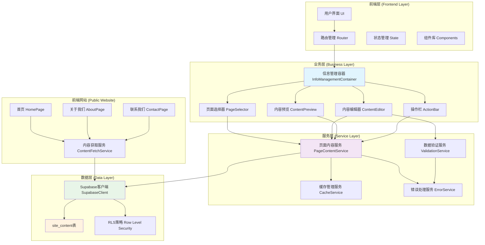

### 分层设计说明

#### 1. 前端层 (Frontend Layer)
- **用户界面**: 基于React组件的响应式界面
- **路由管理**: 使用React Router进行页面导航
- **状态管理**: 使用React Hooks管理组件状态
- **组件库**: 复用现有Tailwind CSS组件

#### 2. 业务层 (Business Layer)
- **信息管理容器**: 主要的业务逻辑协调器
- **页面选择器**: 处理页面切换逻辑
- **内容编辑器**: 管理表单编辑和验证
- **内容预览**: 实时预览编辑效果
- **操作栏**: 处理保存、重置等操作

#### 3. 服务层 (Service Layer)
- **页面内容服务**: 核心数据操作服务
- **数据验证服务**: 输入验证和数据清理
- **缓存管理服务**: 优化数据加载性能
- **错误处理服务**: 统一错误处理和用户反馈

#### 4. 数据层 (Data Layer)
- **Supabase客户端**: 数据库连接和操作
- **site_content表**: 核心数据存储
- **RLS策略**: 数据安全和权限控制

## 核心组件设计

### 1. 信息管理容器 (InfoManagementContainer)

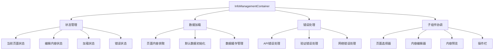

#### 组件接口设计

```typescript
interface InfoManagementContainerProps {
  // 继承现有容器组件属性
}

interface InfoManagementState {
  currentPage: PageLocation;
  content: Record<PageLocation, PageContentData>;
  editingContent: PageContentData;
  isLoading: boolean;
  isSaving: boolean;
  error: string | null;
  hasUnsavedChanges: boolean;
  previewMode: boolean;
}

interface InfoManagementActions {
  setCurrentPage: (page: PageLocation) => void;
  updateContent: (updates: Partial<PageContentData>) => void;
  saveContent: () => Promise<void>;
  resetContent: () => void;
  togglePreview: () => void;
  clearError: () => void;
}
```

### 2. 页面选择器 (PageSelector)

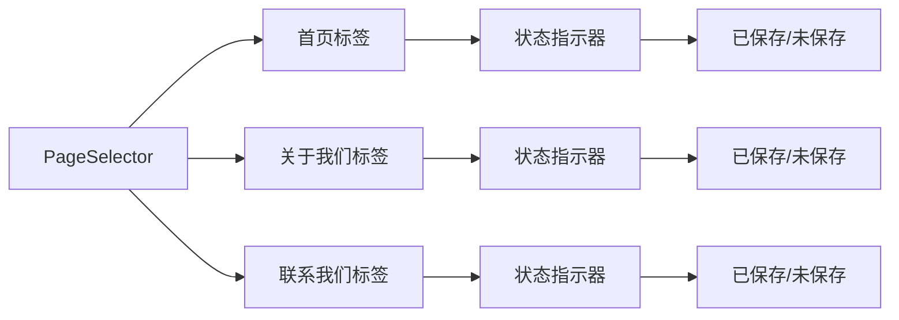

#### 组件接口设计

```typescript
interface PageSelectorProps {
  currentPage: PageLocation;
  onPageChange: (page: PageLocation) => void;
  pageStates: Record<PageLocation, PageState>;
  disabled?: boolean;
}

interface PageState {
  hasUnsavedChanges: boolean;
  isLoading: boolean;
  hasError: boolean;
  lastSaved?: Date;
}

enum PageLocation {
  HOME = 'home',
  ABOUT = 'about',
  CONTACT = 'contact'
}
```

### 3. 内容编辑器 (ContentEditor)

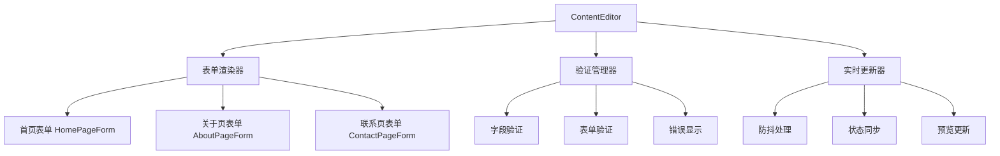

#### 表单组件设计

```typescript
// 首页编辑表单
interface HomePageFormProps {
  content: HomePageContent;
  onChange: (updates: Partial<HomePageContent>) => void;
  errors: ValidationErrors;
  isLoading: boolean;
}

// 关于我们编辑表单
interface AboutPageFormProps {
  content: AboutPageContent;
  onChange: (updates: Partial<AboutPageContent>) => void;
  errors: ValidationErrors;
  isLoading: boolean;
}

// 联系我们编辑表单
interface ContactPageFormProps {
  content: ContactPageContent;
  onChange: (updates: Partial<ContactPageContent>) => void;
  errors: ValidationErrors;
  isLoading: boolean;
}
```

### 4. 内容预览 (ContentPreview)

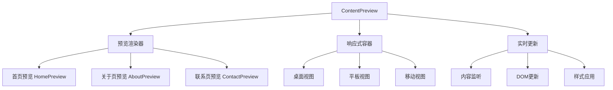

## 数据流向设计

### 1. 数据获取流程

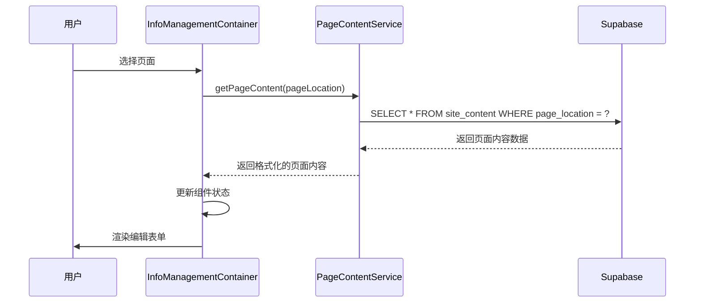

### 2. 数据保存流程

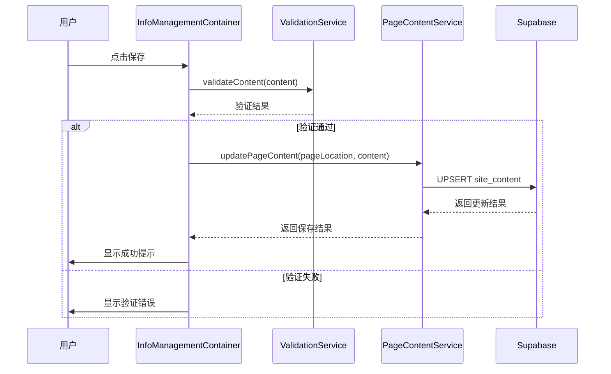

### 3. 前端同步流程

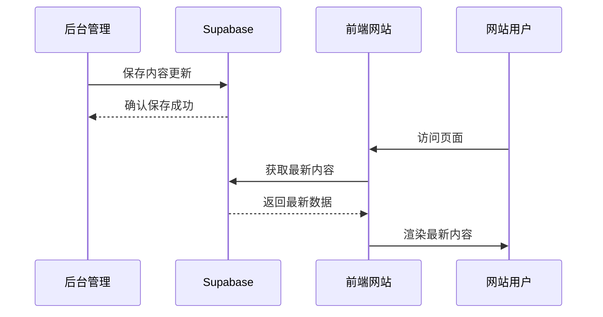

## 模块依赖关系

### 依赖关系图

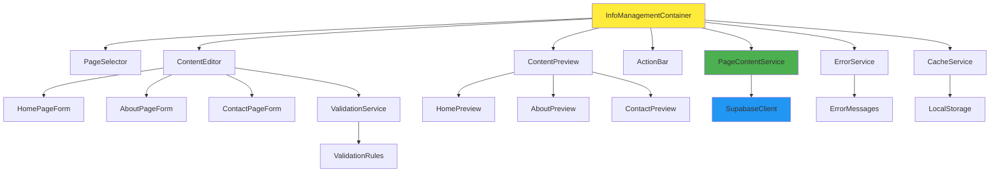

### 依赖层次说明

#### 第一层：容器组件
- `InfoManagementContainer`: 顶层容器，协调所有子组件

#### 第二层：功能组件
- `PageSelector`: 页面选择功能
- `ContentEditor`: 内容编辑功能
- `ContentPreview`: 内容预览功能
- `ActionBar`: 操作按钮功能

#### 第三层：专用组件
- 各页面的专用表单组件
- 各页面的专用预览组件

#### 第四层：服务层
- `PageContentService`: 数据操作服务
- `ValidationService`: 验证服务
- `ErrorService`: 错误处理服务
- `CacheService`: 缓存服务

#### 第五层：基础设施
- `SupabaseClient`: 数据库客户端
- `ValidationRules`: 验证规则
- `ErrorMessages`: 错误消息
- `LocalStorage`: 本地存储

## 接口契约定义

### 1. 页面内容数据接口

```typescript
// 基础内容项接口
interface ContentItem {
  id: string;
  content: string;
  title?: string;
  description?: string;
  updated_at: string;
}

// 页面内容数据接口
type PageContentData = Record<string, ContentItem>;

// 首页内容接口
interface HomePageContent {
  hero_title: ContentItem;
  hero_description: ContentItem;
  hero_button_text: ContentItem;
  courses_title: ContentItem;
  courses_description: ContentItem;
  teachers_title: ContentItem;
  teachers_description: ContentItem;
  cases_title: ContentItem;
  cases_description: ContentItem;
  articles_title: ContentItem;
  articles_description: ContentItem;
}

// 关于我们内容接口
interface AboutPageContent {
  page_title: ContentItem;
  page_description: ContentItem;
  intro_title: ContentItem;
  intro_content: ContentItem;
  mission_title: ContentItem;
  mission_content: ContentItem;
  vision_title: ContentItem;
  vision_content: ContentItem;
  values_title: ContentItem;
  values_content: ContentItem;
}

// 联系我们内容接口
interface ContactPageContent {
  page_title: ContentItem;
  page_description: ContentItem;
  contact_title: ContentItem;
  contact_subtitle: ContentItem;
  address_title: ContentItem;
  address_content: ContentItem;
  phone_title: ContentItem;
  phone_content: ContentItem;
  email_title: ContentItem;
  email_content: ContentItem;
  form_title: ContentItem;
  form_description: ContentItem;
}
```

### 2. API响应接口

```typescript
// 基础API响应接口
interface ApiResponse<T = any> {
  success: boolean;
  data?: T;
  error?: string;
  message?: string;
}

// 获取页面内容响应
interface GetPageContentResponse extends ApiResponse<PageContentData> {}

// 更新页面内容响应
interface UpdatePageContentResponse extends ApiResponse<{
  updated_count: number;
  updated_items: string[];
  failed_items?: Array<{
    content_key: string;
    error: string;
  }>;
}> {}

// 批量操作响应
interface BatchOperationResponse extends ApiResponse<{
  total_count: number;
  success_count: number;
  failed_count: number;
  results: Array<{
    content_key: string;
    status: 'success' | 'failed';
    error?: string;
  }>;
}> {}
```

### 3. 验证接口

```typescript
// 验证错误接口
interface ValidationError {
  field: string;
  message: string;
  code: string;
}

// 验证结果接口
interface ValidationResult {
  isValid: boolean;
  errors: ValidationError[];
  warnings?: ValidationError[];
}

// 验证规则接口
interface ValidationRule {
  field: string;
  required?: boolean;
  minLength?: number;
  maxLength?: number;
  pattern?: RegExp;
  custom?: (value: any) => boolean | string;
}
```

## 异常处理策略

### 异常处理流程

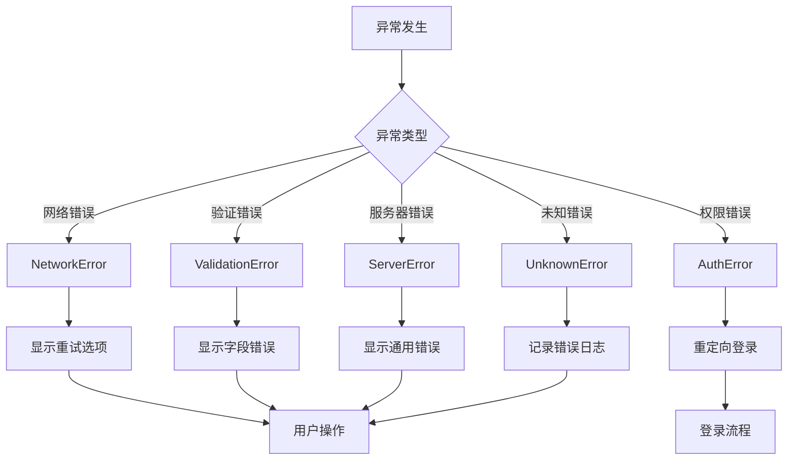

### 错误处理实现

```typescript
// 错误类型枚举
enum ErrorType {
  NETWORK_ERROR = 'NETWORK_ERROR',
  VALIDATION_ERROR = 'VALIDATION_ERROR',
  AUTH_ERROR = 'AUTH_ERROR',
  SERVER_ERROR = 'SERVER_ERROR',
  UNKNOWN_ERROR = 'UNKNOWN_ERROR'
}

// 错误处理服务
class ErrorService {
  /**
   * 处理API错误
   */
  handleApiError(error: any): ProcessedError {
    if (error.code === 'NETWORK_ERROR') {
      return {
        type: ErrorType.NETWORK_ERROR,
        message: '网络连接失败，请检查网络后重试',
        action: 'retry'
      };
    }
    
    if (error.code === 'VALIDATION_ERROR') {
      return {
        type: ErrorType.VALIDATION_ERROR,
        message: '数据验证失败',
        details: error.details,
        action: 'fix_validation'
      };
    }
    
    // 其他错误类型处理...
  }
  
  /**
   * 显示错误消息
   */
  showError(error: ProcessedError): void {
    switch (error.type) {
      case ErrorType.NETWORK_ERROR:
        this.showNetworkErrorDialog(error);
        break;
      case ErrorType.VALIDATION_ERROR:
        this.showValidationErrors(error);
        break;
      // 其他错误显示处理...
    }
  }
}
```

## 性能优化设计

### 1. 数据加载优化

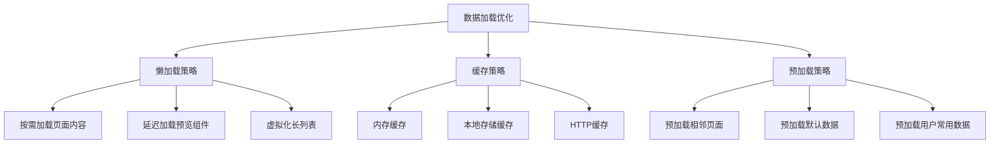

### 2. 渲染性能优化

```typescript
// 使用React.memo优化组件渲染
const ContentEditor = React.memo<ContentEditorProps>(({ 
  pageLocation, 
  content, 
  onChange, 
  isLoading 
}) => {
  // 组件实现
}, (prevProps, nextProps) => {
  // 自定义比较函数
  return (
    prevProps.pageLocation === nextProps.pageLocation &&
    prevProps.isLoading === nextProps.isLoading &&
    JSON.stringify(prevProps.content) === JSON.stringify(nextProps.content)
  );
});

// 使用useMemo优化计算
const processedContent = useMemo(() => {
  return processContentForDisplay(content);
}, [content]);

// 使用useCallback优化函数引用
const handleContentChange = useCallback((updates: Partial<PageContentData>) => {
  setContent(prev => ({ ...prev, ...updates }));
}, []);
```

### 3. 网络请求优化

```typescript
// 防抖处理用户输入
const debouncedSave = useMemo(
  () => debounce(async (content: PageContentData) => {
    try {
      await pageContentService.updatePageContent(currentPage, content);
      setHasUnsavedChanges(false);
    } catch (error) {
      errorService.handleError(error);
    }
  }, 1000),
  [currentPage]
);

// 批量请求优化
class PageContentService {
  private requestQueue: RequestItem[] = [];
  private batchTimer: NodeJS.Timeout | null = null;
  
  /**
   * 批量处理更新请求
   */
  private processBatchUpdates = async () => {
    if (this.requestQueue.length === 0) return;
    
    const batch = [...this.requestQueue];
    this.requestQueue = [];
    
    try {
      await this.batchUpdateContent(batch);
    } catch (error) {
      // 错误处理
    }
  };
}
```

---

**文档版本**: 1.0  
**创建时间**: 2025-01-17  
**最后更新**: 2025-01-17  
**状态**: 设计完成