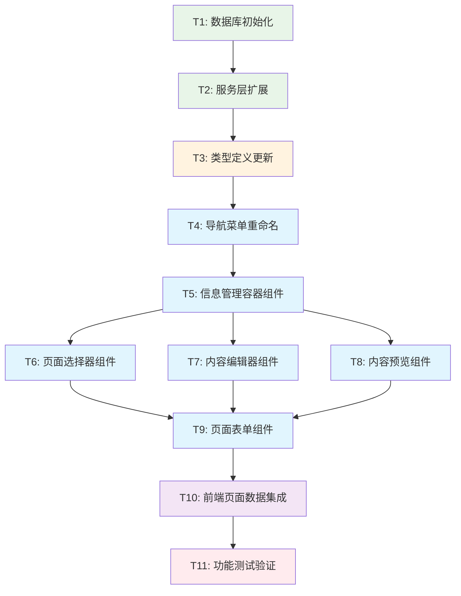

# 信息管理重构 - 任务拆分文档

## 任务依赖关系图

## 任务详细定义

### T1: 数据库初始化和默认数据

#### 输入契约
- **前置依赖**: 无
- **输入数据**: 现有site_content表结构
- **环境依赖**: Supabase数据库连接

#### 输出契约
- **输出数据**: 初始化的页面内容数据
- **交付物**: 
  - 数据库初始化脚本
  - 默认内容数据
  - 数据验证脚本
- **验收标准**:
  - [ ] site_content表包含三个页面的默认内容
  - [ ] 每个页面的content_key完整且正确
  - [ ] 数据格式符合设计规范
  - [ ] 所有必需字段都有默认值

#### 实现约束
- **技术栈**: Supabase SQL
- **接口规范**: 使用现有site_content表结构
- **质量要求**: 数据完整性和一致性

#### 依赖关系
- **后置任务**: T2 (服务层扩展)
- **并行任务**: 无

---

### T2: 服务层扩展 (PageContentService)

#### 输入契约
- **前置依赖**: T1 (数据库初始化)
- **输入数据**: 现有contentSettingsService.ts
- **环境依赖**: Supabase客户端配置

#### 输出契约
- **输出数据**: 扩展的页面内容服务
- **交付物**:
  - `PageContentService.ts` 文件
  - 服务方法的单元测试
  - API接口文档
- **验收标准**:
  - [ ] getPageContent方法正常工作
  - [ ] updatePageContent方法正常工作
  - [ ] batchUpdateContent方法正常工作
  - [ ] 错误处理完善
  - [ ] 类型安全

#### 实现约束
- **技术栈**: TypeScript + Supabase
- **接口规范**: 符合设计文档的API接口
- **质量要求**: 100%类型覆盖，完整错误处理

#### 依赖关系
- **后置任务**: T3 (类型定义更新)
- **并行任务**: 无

---

### T3: 类型定义更新

#### 输入契约
- **前置依赖**: T2 (服务层扩展)
- **输入数据**: 现有类型定义文件
- **环境依赖**: TypeScript编译环境

#### 输出契约
- **输出数据**: 完整的类型定义系统
- **交付物**:
  - 更新的类型定义文件
  - 接口文档
  - 类型测试用例
- **验收标准**:
  - [ ] 所有页面内容接口定义完整
  - [ ] API响应接口定义完整
  - [ ] 验证接口定义完整
  - [ ] 类型编译无错误
  - [ ] 类型导入导出正确

#### 实现约束
- **技术栈**: TypeScript
- **接口规范**: 符合现有项目类型规范
- **质量要求**: 严格类型检查，完整类型覆盖

#### 依赖关系
- **后置任务**: T4 (导航菜单重命名)
- **并行任务**: 无

---

### T4: 导航菜单重命名

#### 输入契约
- **前置依赖**: T3 (类型定义更新)
- **输入数据**: 
  - `AdminSidebar.tsx`
  - `routes.ts`
- **环境依赖**: React开发环境

#### 输出契约
- **输出数据**: 更新的导航配置
- **交付物**:
  - 更新的AdminSidebar.tsx
  - 更新的routes.ts
  - 导航测试用例
- **验收标准**:
  - [ ] 侧边栏显示"信息管理"而非"信息设置管理"
  - [ ] 路由配置正确
  - [ ] 点击导航正确跳转
  - [ ] 面包屑显示正确
  - [ ] 不影响其他导航功能

#### 实现约束
- **技术栈**: React + TypeScript
- **接口规范**: 保持现有路由结构
- **质量要求**: 不破坏现有功能

#### 依赖关系
- **后置任务**: T5 (信息管理容器组件)
- **并行任务**: 无

---

### T5: 信息管理容器组件 (InfoManagementContainer)

#### 输入契约
- **前置依赖**: T4 (导航菜单重命名)
- **输入数据**: 
  - 现有ContentSettingsContainer.tsx
  - PageContentService
  - 类型定义
- **环境依赖**: React开发环境

#### 输出契约
- **输出数据**: 主容器组件
- **交付物**:
  - `InfoManagementContainer.tsx`
  - 容器组件测试
  - 状态管理逻辑
- **验收标准**:
  - [ ] 组件正确渲染
  - [ ] 状态管理正常工作
  - [ ] 数据加载正常
  - [ ] 错误处理完善
  - [ ] 子组件协调正确

#### 实现约束
- **技术栈**: React + TypeScript + Hooks
- **接口规范**: 符合设计文档的组件接口
- **质量要求**: 组件可复用，状态管理清晰

#### 依赖关系
- **后置任务**: T6, T7, T8 (子组件开发)
- **并行任务**: 无

---

### T6: 页面选择器组件 (PageSelector)

#### 输入契约
- **前置依赖**: T5 (信息管理容器组件)
- **输入数据**: 
  - 容器组件接口
  - 页面状态类型
- **环境依赖**: React开发环境

#### 输出契约
- **输出数据**: 页面选择器组件
- **交付物**:
  - `PageSelector.tsx`
  - 组件样式
  - 组件测试
- **验收标准**:
  - [ ] 显示三个页面标签
  - [ ] 页面切换功能正常
  - [ ] 状态指示器正确显示
  - [ ] 未保存更改警告正常
  - [ ] 响应式设计

#### 实现约束
- **技术栈**: React + TypeScript + Tailwind CSS
- **接口规范**: 符合设计文档的组件接口
- **质量要求**: 用户体验友好，视觉效果清晰

#### 依赖关系
- **后置任务**: T9 (页面表单组件)
- **并行任务**: T7, T8

---

### T7: 内容编辑器组件 (ContentEditor)

#### 输入契约
- **前置依赖**: T5 (信息管理容器组件)
- **输入数据**: 
  - 容器组件接口
  - 页面内容类型
  - 验证服务
- **环境依赖**: React开发环境

#### 输出契约
- **输出数据**: 内容编辑器组件
- **交付物**:
  - `ContentEditor.tsx`
  - 表单验证逻辑
  - 编辑器测试
- **验收标准**:
  - [ ] 根据页面类型渲染对应表单
  - [ ] 表单验证正常工作
  - [ ] 实时更新功能正常
  - [ ] 防抖处理正确
  - [ ] 错误显示清晰

#### 实现约束
- **技术栈**: React + TypeScript + 表单库
- **接口规范**: 符合设计文档的组件接口
- **质量要求**: 表单体验流畅，验证准确

#### 依赖关系
- **后置任务**: T9 (页面表单组件)
- **并行任务**: T6, T8

---

### T8: 内容预览组件 (ContentPreview)

#### 输入契约
- **前置依赖**: T5 (信息管理容器组件)
- **输入数据**: 
  - 容器组件接口
  - 页面内容数据
- **环境依赖**: React开发环境

#### 输出契约
- **输出数据**: 内容预览组件
- **交付物**:
  - `ContentPreview.tsx`
  - 预览样式
  - 预览组件测试
- **验收标准**:
  - [ ] 实时预览编辑内容
  - [ ] 响应式预览效果
  - [ ] 预览样式与实际页面一致
  - [ ] 预览更新性能良好
  - [ ] 支持不同设备视图

#### 实现约束
- **技术栈**: React + TypeScript + Tailwind CSS
- **接口规范**: 符合设计文档的组件接口
- **质量要求**: 预览准确，性能优化

#### 依赖关系
- **后置任务**: T9 (页面表单组件)
- **并行任务**: T6, T7

---

### T9: 页面表单组件 (HomePageForm, AboutPageForm, ContactPageForm)

#### 输入契约
- **前置依赖**: T6, T7, T8 (基础组件完成)
- **输入数据**: 
  - 各页面内容接口
  - 表单验证规则
  - 编辑器组件接口
- **环境依赖**: React开发环境

#### 输出契约
- **输出数据**: 三个页面的专用表单组件
- **交付物**:
  - `HomePageForm.tsx`
  - `AboutPageForm.tsx`
  - `ContactPageForm.tsx`
  - 表单组件测试
  - 表单样式
- **验收标准**:
  - [ ] 首页表单包含所有必需字段
  - [ ] 关于页表单包含所有必需字段
  - [ ] 联系页表单包含所有必需字段
  - [ ] 表单验证规则正确
  - [ ] 表单提交逻辑正常
  - [ ] 表单样式统一美观

#### 实现约束
- **技术栈**: React + TypeScript + 表单库
- **接口规范**: 符合设计文档的表单接口
- **质量要求**: 表单易用，验证准确，样式一致

#### 依赖关系
- **后置任务**: T10 (前端页面数据集成)
- **并行任务**: 无

---

### T10: 前端页面数据集成

#### 输入契约
- **前置依赖**: T9 (页面表单组件)
- **输入数据**: 
  - 现有前端页面组件
  - PageContentService
  - 页面内容接口
- **环境依赖**: React开发环境

#### 输出契约
- **输出数据**: 集成数据获取的前端页面
- **交付物**:
  - 更新的HomePage.tsx
  - 更新的AboutPage.tsx
  - 更新的ContactPage.tsx
  - 数据获取Hook
  - 页面集成测试
- **验收标准**:
  - [ ] 首页从Supabase获取最新数据
  - [ ] 关于页从Supabase获取最新数据
  - [ ] 联系页从Supabase获取最新数据
  - [ ] 数据加载状态处理正确
  - [ ] 错误状态处理正确
  - [ ] 页面渲染性能良好

#### 实现约束
- **技术栈**: React + TypeScript + Supabase
- **接口规范**: 保持现有页面组件接口
- **质量要求**: 数据同步准确，用户体验流畅

#### 依赖关系
- **后置任务**: T11 (功能测试验证)
- **并行任务**: 无

---

### T11: 功能测试验证

#### 输入契约
- **前置依赖**: T10 (前端页面数据集成)
- **输入数据**: 
  - 完整的功能实现
  - 测试用例规范
- **环境依赖**: 测试环境

#### 输出契约
- **输出数据**: 验证通过的完整功能
- **交付物**:
  - 完整的测试报告
  - 性能测试结果
  - 用户验收测试结果
  - 问题修复记录
- **验收标准**:
  - [ ] 所有功能测试用例通过
  - [ ] 性能指标达到要求
  - [ ] 用户体验测试通过
  - [ ] 安全测试通过
  - [ ] 兼容性测试通过
  - [ ] 数据同步测试通过

#### 实现约束
- **技术栈**: 测试框架 + 性能监控工具
- **接口规范**: 符合验收标准要求
- **质量要求**: 全面测试覆盖，问题及时修复

#### 依赖关系
- **后置任务**: 无（项目完成）
- **并行任务**: 无

## 任务执行计划

### 第一阶段：基础设施 (T1-T3)
**预计时间**: 1-2天
- T1: 数据库初始化 (0.5天)
- T2: 服务层扩展 (1天)
- T3: 类型定义更新 (0.5天)

### 第二阶段：界面重构 (T4-T5)
**预计时间**: 1天
- T4: 导航菜单重命名 (0.5天)
- T5: 信息管理容器组件 (0.5天)

### 第三阶段：组件开发 (T6-T9)
**预计时间**: 2-3天
- T6: 页面选择器组件 (0.5天)
- T7: 内容编辑器组件 (1天)
- T8: 内容预览组件 (1天)
- T9: 页面表单组件 (0.5天)

### 第四阶段：集成测试 (T10-T11)
**预计时间**: 1-2天
- T10: 前端页面数据集成 (1天)
- T11: 功能测试验证 (1天)

### 总预计时间：5-8天

## 风险评估

### 高风险任务
- **T2 (服务层扩展)**: 涉及核心数据操作逻辑
- **T5 (信息管理容器组件)**: 复杂的状态管理
- **T10 (前端页面数据集成)**: 数据同步的关键环节

### 风险缓解措施
1. **充分测试**: 每个任务完成后立即进行单元测试
2. **渐进式开发**: 先实现核心功能，再添加高级特性
3. **备份方案**: 保留现有功能的回滚能力
4. **代码审查**: 关键任务进行代码审查
5. **性能监控**: 实时监控性能指标

## 质量保证

### 代码质量标准
- TypeScript严格模式
- ESLint规则检查
- Prettier代码格式化
- 单元测试覆盖率 > 80%
- 组件文档完整

### 测试策略
- **单元测试**: 每个组件和服务
- **集成测试**: 组件间交互
- **端到端测试**: 完整用户流程
- **性能测试**: 加载和响应时间
- **兼容性测试**: 不同浏览器和设备

### 文档要求
- 每个组件有完整的JSDoc注释
- API接口有详细文档
- 用户操作有使用说明
- 技术决策有记录说明

---

**文档版本**: 1.0  
**创建时间**: 2025-01-17  
**最后更新**: 2025-01-17  
**状态**: 任务拆分完成