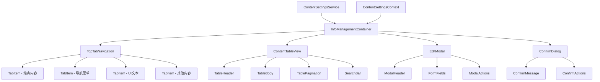
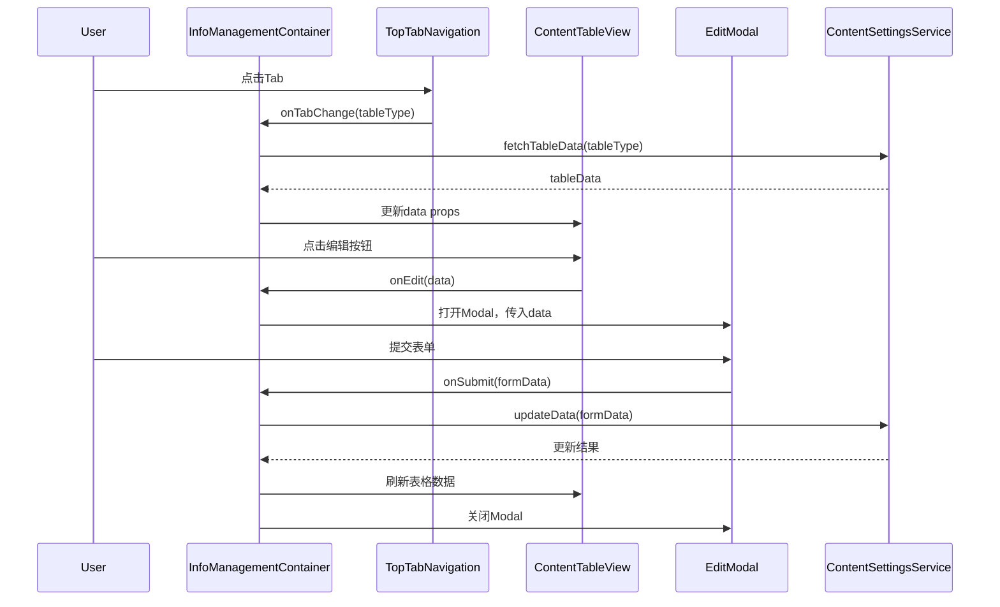
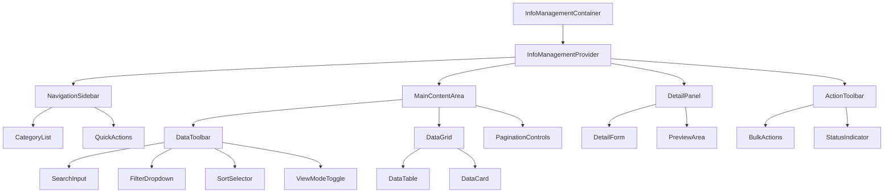
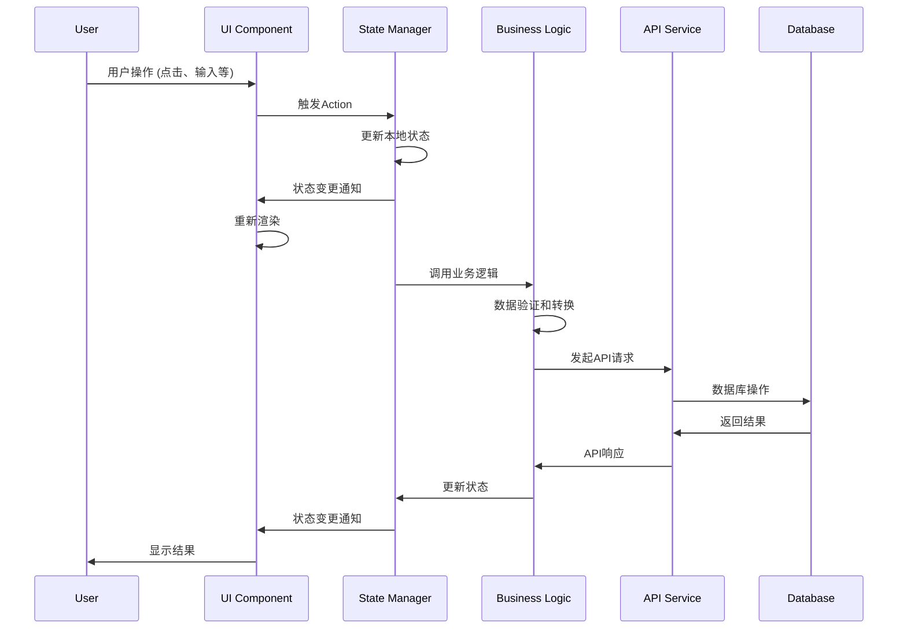

# DESIGN - 信息管理页面重新设计

## 项目信息
- **项目名称**: 网站测试 - 信息管理页面重新设计
- **创建时间**: 2025-01-18
- **基于文档**: CONSENSUS_信息管理页面重新设计.md
- **设计方案**: 顶部导航布局 + 弹窗编辑

## 整体架构设计

### 系统架构图



### 分层设计

#### 1. 容器层 (Container Layer)
- **InfoManagementContainer**: 主容器组件
  - 负责状态管理和数据流控制
  - 协调各子组件间的通信
  - 处理路由和权限验证

#### 2. 导航层 (Navigation Layer)
- **TopTabNavigation**: 顶部Tab导航组件
  - 管理不同内容表的切换
  - 维护当前激活状态
  - 支持键盘导航

#### 3. 展示层 (Display Layer)
- **ContentTableView**: 内容表格展示组件
  - 数据表格渲染
  - 分页和搜索功能
  - 响应式布局适配

#### 4. 交互层 (Interaction Layer)
- **EditModal**: 弹窗编辑组件
  - 表单数据编辑
  - 数据验证和提交
  - 新增/编辑/删除操作

- **ConfirmDialog**: 确认对话框组件
  - 危险操作确认
  - 用户决策反馈

#### 5. 服务层 (Service Layer)
- **ContentSettingsService**: 数据服务
  - API调用封装
  - 数据缓存管理
  - 错误处理
## 核心组件设计

### 1. InfoManagementContainer

#### 组件职责
- 整体状态管理
- 数据获取和更新
- 子组件协调
- 错误边界处理

#### 状态设计
```typescript
interface InfoManagementState {
  // 当前激活的表类型
  activeTable: ContentTableType;
  // 表格数据
  tableData: TableData[];
  // 加载状态
  loading: boolean;
  // 错误状态
  error: string | null;
  // 编辑模态框状态
  editModal: {
    isOpen: boolean;
    mode: 'create' | 'edit';
    data: TableData | null;
  };
  // 确认对话框状态
  confirmDialog: {
    isOpen: boolean;
    message: string;
    onConfirm: () => void;
  };
  // 分页状态
  pagination: {
    page: number;
    pageSize: number;
    total: number;
  };
  // 搜索状态
  search: {
    keyword: string;
    filters: Record<string, any>;
  };
}
```

#### 接口定义
```typescript
interface InfoManagementContainerProps {
  className?: string;
}

interface InfoManagementContainerMethods {
  // 切换表格
  switchTable: (tableType: ContentTableType) => void;
  // 打开编辑模态框
  openEditModal: (mode: 'create' | 'edit', data?: TableData) => void;
  // 关闭编辑模态框
  closeEditModal: () => void;
  // 提交数据
  submitData: (data: TableInsertData | TableUpdateData) => Promise<void>;
  // 删除数据
  deleteData: (id: string) => Promise<void>;
  // 搜索数据
  searchData: (keyword: string, filters?: Record<string, any>) => void;
  // 分页切换
  changePage: (page: number, pageSize?: number) => void;
}
```

### 2. TopTabNavigation

#### 组件职责
- 渲染Tab导航
- 处理Tab切换
- 维护激活状态
- 支持键盘导航

#### 接口定义
```typescript
interface TopTabNavigationProps {
  activeTable: ContentTableType;
  onTabChange: (tableType: ContentTableType) => void;
  className?: string;
}

interface TabItem {
  key: ContentTableType;
  label: string;
  icon?: React.ReactNode;
  disabled?: boolean;
}
```

#### 设计特性
- 响应式设计：移动端可滚动，桌面端固定
- 键盘支持：Arrow键切换，Enter键激活
- 视觉反馈：激活状态、悬停效果、焦点指示

### 3. ContentTableView

#### 组件职责
- 表格数据渲染
- 分页控制
- 搜索功能
- 操作按钮

#### 接口定义
```typescript
interface ContentTableViewProps {
  tableType: ContentTableType;
  data: TableData[];
  loading: boolean;
  pagination: PaginationState;
  onEdit: (data: TableData) => void;
  onDelete: (id: string) => void;
  onCreate: () => void;
  onSearch: (keyword: string) => void;
  onPageChange: (page: number, pageSize?: number) => void;
  className?: string;
}

interface TableColumn {
  key: string;
  title: string;
  dataIndex: string;
  width?: number;
  render?: (value: any, record: TableData) => React.ReactNode;
  sortable?: boolean;
  filterable?: boolean;
}
```

#### 响应式设计
- 桌面端：完整表格显示
- 平板端：隐藏次要列
- 移动端：卡片式布局

### 4. EditModal

#### 组件职责
- 表单渲染和验证
- 数据提交处理
- 模态框状态管理
- 错误提示显示

#### 接口定义
```typescript
interface EditModalProps {
  isOpen: boolean;
  mode: 'create' | 'edit';
  tableType: ContentTableType;
  data?: TableData;
  onSubmit: (data: TableInsertData | TableUpdateData) => Promise<void>;
  onCancel: () => void;
  className?: string;
}

interface FormField {
  name: string;
  label: string;
  type: 'text' | 'textarea' | 'select' | 'number' | 'date';
  required?: boolean;
  validation?: (value: any) => string | null;
  options?: { label: string; value: any }[];
  placeholder?: string;
  disabled?: boolean;
}
```

#### 表单设计
- 动态表单：根据表类型生成不同字段
- 实时验证：输入时即时反馈
- 自动保存：防止数据丢失
- 键盘支持：Tab导航，Enter提交，Esc取消

### 5. ConfirmDialog

#### 组件职责
- 危险操作确认
- 用户决策收集
- 清晰的操作提示

#### 接口定义
```typescript
interface ConfirmDialogProps {
  isOpen: boolean;
  title: string;
  message: string;
  confirmText?: string;
  cancelText?: string;
  danger?: boolean;
  onConfirm: () => void;
  onCancel: () => void;
  className?: string;
}
```

## 数据流设计

### 数据流向图



### 状态管理策略

#### 1. 本地状态 (useState)
- 组件内部UI状态
- 表单输入状态
- 临时交互状态

#### 2. 容器状态 (useReducer)
- 复杂的业务状态
- 多组件共享状态
- 状态变更逻辑

#### 3. 上下文状态 (Context)
- 全局配置信息
- 用户权限信息
- 主题和语言设置

## 接口契约定义

### 1. 组件接口

#### Props接口
- 所有Props必须有明确的TypeScript类型定义
- 可选属性使用`?`标记
- 回调函数必须定义参数和返回值类型

#### 事件接口
```typescript
// 标准事件接口
interface ComponentEvents {
  onChange?: (value: any) => void;
  onSubmit?: (data: any) => Promise<void>;
  onCancel?: () => void;
  onError?: (error: Error) => void;
}

// 表格事件接口
interface TableEvents {
  onEdit?: (record: TableData) => void;
  onDelete?: (id: string) => void;
  onCreate?: () => void;
  onSort?: (field: string, order: 'asc' | 'desc') => void;
  onFilter?: (filters: Record<string, any>) => void;
}
```

### 2. 服务接口

#### API接口
```typescript
interface ContentSettingsAPI {
  // 获取表格数据
  getTableData(params: {
    tableType: ContentTableType;
    page?: number;
    pageSize?: number;
    search?: string;
    filters?: Record<string, any>;
  }): Promise<{
    data: TableData[];
    total: number;
    page: number;
    pageSize: number;
  }>;
  
  // 创建数据
  createData(tableType: ContentTableType, data: TableInsertData): Promise<TableData>;
  
  // 更新数据
  updateData(tableType: ContentTableType, id: string, data: TableUpdateData): Promise<TableData>;
  
  // 删除数据
  deleteData(tableType: ContentTableType, id: string): Promise<void>;
  
  // 批量操作
  batchDelete(tableType: ContentTableType, ids: string[]): Promise<void>;
}
```

## 异常处理策略

### 1. 错误边界
```typescript
class InfoManagementErrorBoundary extends React.Component {
  // 捕获组件树中的JavaScript错误
  // 记录错误日志
  // 显示友好的错误界面
  // 提供错误恢复机制
}
```

### 2. API错误处理
```typescript
interface ErrorHandlingStrategy {
  // 网络错误
  handleNetworkError: (error: Error) => void;
  // 业务错误
  handleBusinessError: (error: { code: string; message: string }) => void;
  // 验证错误
  handleValidationError: (errors: Record<string, string>) => void;
  // 权限错误
  handlePermissionError: (error: Error) => void;
}
```

### 3. 用户反馈
- 加载状态：Skeleton、Spinner
- 错误状态：Toast、Alert、ErrorBoundary
- 成功状态：Toast、状态更新
- 空状态：EmptyState组件

## 性能优化策略

### 1. 组件优化
- **React.memo**: 防止不必要的重渲染
- **useMemo**: 缓存计算结果
- **useCallback**: 缓存回调函数
- **懒加载**: 按需加载Modal组件

### 2. 数据优化
- **虚拟滚动**: 大数据量表格优化
- **分页加载**: 减少初始加载时间
- **数据缓存**: 避免重复请求
- **防抖搜索**: 减少搜索请求频率

### 3. 渲染优化
- **代码分割**: 按路由分割代码
- **预加载**: 预加载可能用到的组件
- **图片优化**: 懒加载和压缩
- **CSS优化**: 避免重排重绘

## 测试策略

### 1. 单元测试
- 组件渲染测试
- 事件处理测试
- 状态变更测试
- 工具函数测试

### 2. 集成测试
- 组件间交互测试
- API集成测试
- 路由导航测试
- 权限验证测试

### 3. E2E测试
- 完整用户流程测试
- 跨浏览器兼容性测试
- 响应式布局测试
- 性能基准测试

## 部署和维护

### 1. 构建优化
- Tree Shaking
- 代码压缩
- 资源优化
- 缓存策略

### 2. 监控和日志
- 错误监控
- 性能监控
- 用户行为分析
- API调用统计

### 3. 版本管理
- 语义化版本
- 变更日志
- 向后兼容
- 渐进式升级

## 设计验证

### 1. 架构一致性
- ✅ 与现有系统架构对齐
- ✅ 遵循React最佳实践
- ✅ TypeScript类型安全
- ✅ 组件职责清晰

### 2. 可扩展性
- ✅ 支持新增表类型
- ✅ 支持自定义字段
- ✅ 支持主题定制
- ✅ 支持国际化

### 3. 可维护性
- ✅ 代码结构清晰
- ✅ 文档完整
- ✅ 测试覆盖充分
- ✅ 错误处理完善

**设计确认**: 本架构设计已完成，可以进入任务拆分阶段。
    
    F --> G
    H --> G
    
    H --> I
    H --> J
    H --> K
    H --> L
    
    I --> M
    J --> M
    L --> O
    
    M --> N
    N --> P
    P --> Q
```

## 分层设计

### 1. 用户界面层 (UI Layer)

#### 职责
- 渲染用户界面组件
- 处理用户交互事件
- 展示数据和状态
- 响应式布局适配

#### 核心组件

##### InfoManagementContainer (主容器)
```typescript
interface InfoManagementContainerProps {
  // 无需外部props，完全自包含
}

interface InfoManagementContainerState {
  isInitialized: boolean;
  error: Error | null;
}
```

##### NavigationSidebar (导航侧边栏)
```typescript
interface NavigationSidebarProps {
  currentCategory: string;
  categories: CategoryItem[];
  onCategoryChange: (category: string) => void;
  isCollapsed?: boolean;
}

interface CategoryItem {
  id: string;
  name: string;
  icon: string;
  count: number;
  description?: string;
}
```

##### MainContentArea (主内容区域)
```typescript
interface MainContentAreaProps {
  data: InfoItem[];
  loading: boolean;
  selectedItems: string[];
  sortConfig: SortConfig;
  filterConfig: FilterConfig;
  onItemSelect: (itemId: string, selected: boolean) => void;
  onSort: (field: string, direction: 'asc' | 'desc') => void;
  onFilter: (filters: FilterConfig) => void;
  onEdit: (item: InfoItem) => void;
}
```

##### DetailPanel (详情面板)
```typescript
interface DetailPanelProps {
  isOpen: boolean;
  item: InfoItem | null;
  mode: 'view' | 'edit' | 'create';
  onClose: () => void;
  onSave: (item: InfoItem) => void;
  onDelete: (itemId: string) => void;
}
```

##### ActionToolbar (操作工具栏)
```typescript
interface ActionToolbarProps {
  selectedCount: number;
  totalCount: number;
  onBulkDelete: () => void;
  onBulkEdit: () => void;
  onExport: () => void;
  onRefresh: () => void;
}
```

### 2. 状态管理层 (State Layer)

#### 职责
- 管理应用状态
- 提供状态访问接口
- 处理状态更新逻辑
- 状态持久化

#### 状态结构设计

```typescript
interface InfoManagementState {
  // 数据状态
  currentCategory: string;
  data: InfoItem[];
  totalCount: number;
  
  // 选择状态
  selectedItems: Set<string>;
  editingItem: InfoItem | null;
  
  // UI状态
  isDetailPanelOpen: boolean;
  detailPanelMode: 'view' | 'edit' | 'create';
  isNavigationCollapsed: boolean;
  
  // 加载状态
  loading: boolean;
  saving: boolean;
  error: Error | null;
  
  // 筛选和排序
  filters: FilterConfig;
  sortConfig: SortConfig;
  searchQuery: string;
  
  // 分页状态
  pagination: {
    page: number;
    pageSize: number;
    hasMore: boolean;
  };
}

type InfoManagementAction = 
  | { type: 'SET_CATEGORY'; payload: string }
  | { type: 'SET_DATA'; payload: InfoItem[] }
  | { type: 'ADD_ITEM'; payload: InfoItem }
  | { type: 'UPDATE_ITEM'; payload: InfoItem }
  | { type: 'DELETE_ITEM'; payload: string }
  | { type: 'SELECT_ITEM'; payload: { id: string; selected: boolean } }
  | { type: 'SELECT_ALL'; payload: boolean }
  | { type: 'CLEAR_SELECTION' }
  | { type: 'SET_LOADING'; payload: boolean }
  | { type: 'SET_ERROR'; payload: Error | null }
  | { type: 'OPEN_DETAIL_PANEL'; payload: { item?: InfoItem; mode: 'view' | 'edit' | 'create' } }
  | { type: 'CLOSE_DETAIL_PANEL' }
  | { type: 'SET_FILTERS'; payload: FilterConfig }
  | { type: 'SET_SORT'; payload: SortConfig }
  | { type: 'SET_SEARCH'; payload: string };
```

#### Context Provider设计

```typescript
interface InfoManagementContextValue {
  state: InfoManagementState;
  dispatch: React.Dispatch<InfoManagementAction>;
  
  // 便捷方法
  actions: {
    loadData: (category: string, options?: LoadOptions) => Promise<void>;
    createItem: (item: Omit<InfoItem, 'id'>) => Promise<void>;
    updateItem: (item: InfoItem) => Promise<void>;
    deleteItem: (id: string) => Promise<void>;
    bulkDelete: (ids: string[]) => Promise<void>;
    selectItem: (id: string, selected: boolean) => void;
    selectAll: (selected: boolean) => void;
    openDetailPanel: (item?: InfoItem, mode?: 'view' | 'edit' | 'create') => void;
    closeDetailPanel: () => void;
    setFilters: (filters: FilterConfig) => void;
    setSort: (field: string, direction: 'asc' | 'desc') => void;
    setSearch: (query: string) => void;
  };
}
```

### 3. 业务逻辑层 (Business Layer)

#### 职责
- 实现业务规则
- 数据转换和验证
- 缓存管理
- 错误处理

#### InfoService (信息服务)

```typescript
class InfoService {
  private httpClient: HttpClient;
  private cacheManager: CacheManager;
  
  constructor(httpClient: HttpClient, cacheManager: CacheManager) {
    this.httpClient = httpClient;
    this.cacheManager = cacheManager;
  }
  
  async getItems(category: string, options: GetItemsOptions): Promise<GetItemsResponse> {
    const cacheKey = this.generateCacheKey(category, options);
    const cached = await this.cacheManager.get(cacheKey);
    
    if (cached && !options.forceRefresh) {
      return cached;
    }
    
    const response = await this.httpClient.get(`/api/info/${category}`, {
      params: options
    });
    
    await this.cacheManager.set(cacheKey, response.data, { ttl: 300000 }); // 5分钟缓存
    return response.data;
  }
  
  async createItem(category: string, item: CreateItemRequest): Promise<InfoItem> {
    const response = await this.httpClient.post(`/api/info/${category}`, item);
    await this.cacheManager.invalidatePattern(`info:${category}:*`);
    return response.data;
  }
  
  async updateItem(category: string, id: string, item: UpdateItemRequest): Promise<InfoItem> {
    const response = await this.httpClient.put(`/api/info/${category}/${id}`, item);
    await this.cacheManager.invalidatePattern(`info:${category}:*`);
    return response.data;
  }
  
  async deleteItem(category: string, id: string): Promise<void> {
    await this.httpClient.delete(`/api/info/${category}/${id}`);
    await this.cacheManager.invalidatePattern(`info:${category}:*`);
  }
  
  async bulkDelete(category: string, ids: string[]): Promise<void> {
    await this.httpClient.post(`/api/info/${category}/bulk-delete`, { ids });
    await this.cacheManager.invalidatePattern(`info:${category}:*`);
  }
}
```

#### DataTransformer (数据转换器)

```typescript
class DataTransformer {
  static transformApiResponse(apiData: any[]): InfoItem[] {
    return apiData.map(item => ({
      id: item.id,
      title: item.title || item.name,
      content: item.content || item.description,
      category: item.category,
      status: item.status || 'active',
      createdAt: new Date(item.created_at),
      updatedAt: new Date(item.updated_at),
      metadata: item.metadata || {}
    }));
  }
  
  static transformToApiRequest(item: InfoItem): any {
    return {
      title: item.title,
      content: item.content,
      category: item.category,
      status: item.status,
      metadata: item.metadata
    };
  }
}
```

#### ValidationService (验证服务)

```typescript
class ValidationService {
  static validateItem(item: Partial<InfoItem>): ValidationResult {
    const errors: ValidationError[] = [];
    
    if (!item.title || item.title.trim().length === 0) {
      errors.push({ field: 'title', message: '标题不能为空' });
    }
    
    if (item.title && item.title.length > 200) {
      errors.push({ field: 'title', message: '标题长度不能超过200个字符' });
    }
    
    if (!item.content || item.content.trim().length === 0) {
      errors.push({ field: 'content', message: '内容不能为空' });
    }
    
    return {
      isValid: errors.length === 0,
      errors
    };
  }
}
```

### 4. 数据访问层 (Data Layer)

#### 职责
- HTTP请求处理
- 本地存储管理
- 网络错误处理
- 请求缓存

#### HTTP Client配置

```typescript
class HttpClient {
  private axiosInstance: AxiosInstance;
  
  constructor() {
    this.axiosInstance = axios.create({
      baseURL: process.env.REACT_APP_API_BASE_URL,
      timeout: 10000,
      headers: {
        'Content-Type': 'application/json'
      }
    });
    
    this.setupInterceptors();
  }
  
  private setupInterceptors() {
    // 请求拦截器
    this.axiosInstance.interceptors.request.use(
      (config) => {
        const token = localStorage.getItem('auth_token');
        if (token) {
          config.headers.Authorization = `Bearer ${token}`;
        }
        return config;
      },
      (error) => Promise.reject(error)
    );
    
    // 响应拦截器
    this.axiosInstance.interceptors.response.use(
      (response) => response,
      (error) => {
        if (error.response?.status === 401) {
          // 处理认证失败
          window.location.href = '/login';
        }
        return Promise.reject(error);
      }
    );
  }
}
```

## 核心组件设计

### 组件层次结构



### 响应式布局设计

#### 桌面端布局 (>1024px)
```css
.info-management-container {
  display: grid;
  grid-template-columns: 280px 1fr 400px;
  grid-template-rows: 1fr auto;
  grid-template-areas:
    "sidebar main detail"
    "toolbar toolbar toolbar";
  height: 100vh;
}

.navigation-sidebar {
  grid-area: sidebar;
}

.main-content-area {
  grid-area: main;
}

.detail-panel {
  grid-area: detail;
}

.action-toolbar {
  grid-area: toolbar;
}
```

#### 平板端布局 (768px-1024px)
```css
@media (max-width: 1024px) {
  .info-management-container {
    grid-template-columns: 240px 1fr;
    grid-template-areas:
      "sidebar main"
      "toolbar toolbar";
  }
  
  .detail-panel {
    position: fixed;
    right: 0;
    top: 0;
    width: 400px;
    height: 100vh;
    transform: translateX(100%);
    transition: transform 0.3s ease;
  }
  
  .detail-panel.open {
    transform: translateX(0);
  }
}
```

#### 移动端布局 (<768px)
```css
@media (max-width: 768px) {
  .info-management-container {
    grid-template-columns: 1fr;
    grid-template-areas:
      "main"
      "toolbar";
  }
  
  .navigation-sidebar {
    position: fixed;
    left: 0;
    top: 0;
    width: 280px;
    height: 100vh;
    transform: translateX(-100%);
    transition: transform 0.3s ease;
    z-index: 1000;
  }
  
  .navigation-sidebar.open {
    transform: translateX(0);
  }
}
```

## 接口契约定义

### API接口规范

#### 获取信息列表
```typescript
// GET /api/info/{category}
interface GetItemsRequest {
  page?: number;
  pageSize?: number;
  search?: string;
  filters?: Record<string, any>;
  sort?: {
    field: string;
    direction: 'asc' | 'desc';
  };
}

interface GetItemsResponse {
  data: InfoItem[];
  total: number;
  page: number;
  pageSize: number;
  hasMore: boolean;
}
```

#### 创建信息项
```typescript
// POST /api/info/{category}
interface CreateItemRequest {
  title: string;
  content: string;
  status?: 'active' | 'inactive' | 'draft';
  metadata?: Record<string, any>;
}

interface CreateItemResponse {
  data: InfoItem;
  message: string;
}
```

#### 更新信息项
```typescript
// PUT /api/info/{category}/{id}
interface UpdateItemRequest {
  title?: string;
  content?: string;
  status?: 'active' | 'inactive' | 'draft';
  metadata?: Record<string, any>;
}

interface UpdateItemResponse {
  data: InfoItem;
  message: string;
}
```

#### 删除信息项
```typescript
// DELETE /api/info/{category}/{id}
interface DeleteItemResponse {
  message: string;
}

// POST /api/info/{category}/bulk-delete
interface BulkDeleteRequest {
  ids: string[];
}

interface BulkDeleteResponse {
  deletedCount: number;
  message: string;
}
```

### 组件接口规范

#### 通用数据类型
```typescript
interface InfoItem {
  id: string;
  title: string;
  content: string;
  category: string;
  status: 'active' | 'inactive' | 'draft';
  createdAt: Date;
  updatedAt: Date;
  metadata: Record<string, any>;
}

interface FilterConfig {
  status?: string[];
  dateRange?: {
    start: Date;
    end: Date;
  };
  customFilters?: Record<string, any>;
}

interface SortConfig {
  field: string;
  direction: 'asc' | 'desc';
}

interface ValidationError {
  field: string;
  message: string;
}

interface ValidationResult {
  isValid: boolean;
  errors: ValidationError[];
}
```

## 数据流向图



### 数据流详细说明

#### 1. 数据加载流程
```
用户选择分类 → 触发loadData → 检查缓存 → API请求 → 数据转换 → 状态更新 → UI渲染
```

#### 2. 数据编辑流程
```
用户编辑 → 实时验证 → 状态更新 → 保存操作 → API请求 → 成功反馈 → 缓存更新 → UI更新
```

#### 3. 批量操作流程
```
选择多项 → 确认操作 → 批量API请求 → 进度反馈 → 结果统计 → 缓存清理 → 数据重新加载
```

## 异常处理策略

### 错误分类和处理

#### 1. 网络错误
```typescript
class NetworkErrorHandler {
  static handle(error: AxiosError): ErrorResponse {
    if (error.code === 'NETWORK_ERROR') {
      return {
        type: 'network',
        message: '网络连接失败，请检查网络设置',
        action: 'retry',
        retryable: true
      };
    }
    
    if (error.code === 'TIMEOUT') {
      return {
        type: 'timeout',
        message: '请求超时，请稍后重试',
        action: 'retry',
        retryable: true
      };
    }
    
    return {
      type: 'unknown',
      message: '未知网络错误',
      action: 'contact_support',
      retryable: false
    };
  }
}
```

#### 2. 业务错误
```typescript
class BusinessErrorHandler {
  static handle(error: ApiError): ErrorResponse {
    switch (error.code) {
      case 'VALIDATION_FAILED':
        return {
          type: 'validation',
          message: '数据验证失败',
          details: error.details,
          action: 'fix_data'
        };
        
      case 'PERMISSION_DENIED':
        return {
          type: 'permission',
          message: '权限不足，无法执行此操作',
          action: 'contact_admin'
        };
        
      case 'RESOURCE_NOT_FOUND':
        return {
          type: 'not_found',
          message: '请求的资源不存在',
          action: 'refresh_data'
        };
        
      default:
        return {
          type: 'business',
          message: error.message || '业务处理失败',
          action: 'retry'
        };
    }
  }
}
```

#### 3. 用户界面错误
```typescript
class UIErrorHandler {
  static handle(error: Error): void {
    // 错误边界捕获的错误
    console.error('UI Error:', error);
    
    // 发送错误报告
    ErrorReporter.report({
      type: 'ui_error',
      message: error.message,
      stack: error.stack,
      timestamp: new Date().toISOString(),
      userAgent: navigator.userAgent,
      url: window.location.href
    });
    
    // 显示友好的错误提示
    NotificationService.error({
      title: '页面出现错误',
      message: '页面遇到了一些问题，请刷新页面重试',
      actions: [
        { label: '刷新页面', action: () => window.location.reload() },
        { label: '返回首页', action: () => window.location.href = '/' }
      ]
    });
  }
}
```

### 错误恢复机制

#### 1. 自动重试
```typescript
class RetryManager {
  private static readonly MAX_RETRIES = 3;
  private static readonly RETRY_DELAYS = [1000, 2000, 4000]; // 指数退避
  
  static async withRetry<T>(
    operation: () => Promise<T>,
    options: RetryOptions = {}
  ): Promise<T> {
    const maxRetries = options.maxRetries || this.MAX_RETRIES;
    
    for (let attempt = 0; attempt <= maxRetries; attempt++) {
      try {
        return await operation();
      } catch (error) {
        if (attempt === maxRetries || !this.isRetryable(error)) {
          throw error;
        }
        
        const delay = this.RETRY_DELAYS[attempt] || 4000;
        await this.delay(delay);
      }
    }
    
    throw new Error('Max retries exceeded');
  }
  
  private static isRetryable(error: any): boolean {
    return error.code === 'NETWORK_ERROR' || 
           error.code === 'TIMEOUT' ||
           (error.response?.status >= 500 && error.response?.status < 600);
  }
  
  private static delay(ms: number): Promise<void> {
    return new Promise(resolve => setTimeout(resolve, ms));
  }
}
```

#### 2. 数据恢复
```typescript
class DataRecoveryManager {
  static async recoverFromError(error: Error, context: RecoveryContext): Promise<void> {
    switch (error.type) {
      case 'data_corruption':
        await this.reloadFromServer(context.category);
        break;
        
      case 'cache_invalid':
        await this.clearCacheAndReload(context.category);
        break;
        
      case 'state_inconsistent':
        await this.resetStateAndReload();
        break;
        
      default:
        await this.fullRefresh();
    }
  }
  
  private static async reloadFromServer(category: string): Promise<void> {
    const infoService = new InfoService();
    const freshData = await infoService.getItems(category, { forceRefresh: true });
    // 更新状态...
  }
}
```

## 性能优化策略

### 1. 渲染优化
- 使用React.memo包装组件
- 实现虚拟滚动处理大量数据
- 使用useMemo和useCallback优化计算
- 实现组件懒加载

### 2. 数据优化
- 实现智能缓存策略
- 使用分页和无限滚动
- 实现数据预加载
- 优化API请求合并

### 3. 网络优化
- 实现请求去重
- 使用HTTP缓存头
- 实现离线支持
- 优化bundle大小

---

**设计状态**: ✅ 架构设计完成  
**文档版本**: 1.0  
**创建时间**: 2024年12月  
**下一步**: 进入子任务拆分阶段 (A6)