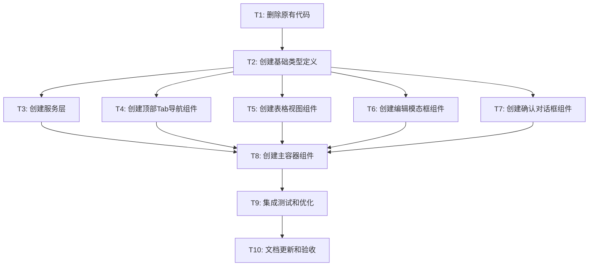

# 信息管理页面重新设计 - 任务拆分文档

## 项目信息
- **项目名称**: 信息管理页面重新设计
- **文档类型**: 任务拆分 (TASK)
- **创建时间**: 2024-01-20
- **最后更新**: 2024-01-20
- **设计方案**: 顶部导航布局 + 弹窗编辑

## 任务拆分概述

基于DESIGN文档的架构设计，将信息管理页面重新设计拆分为以下原子任务。每个任务都有明确的输入输出契约、验收标准和依赖关系。

## 任务依赖图

## 原子任务详细定义

### T1: 删除原有代码

#### 任务描述
删除现有的信息管理页面相关代码，为新设计腾出空间。

#### 输入契约
- **前置依赖**: 无
- **输入数据**: 现有代码文件列表
- **环境依赖**: Git版本控制

#### 输出契约
- **输出数据**: 清理后的代码库
- **交付物**: 
  - 删除的文件列表
  - Git提交记录
- **验收标准**: 
  - 所有相关的旧代码文件已删除
  - 项目仍能正常编译
  - 路由配置已更新
  - 无残留的import引用

#### 实现约束
- **技术栈**: Git, TypeScript
- **接口规范**: 保持现有项目结构
- **质量要求**: 确保删除操作的安全性

#### 依赖关系
- **后置任务**: T2
- **并行任务**: 无

#### 复杂度评估
- **时间估算**: 30分钟
- **风险等级**: 低
- **技能要求**: 基础
  ---

### T2: 创建基础类型定义

#### 任务描述
创建新设计所需的TypeScript类型定义，包括数据模型、组件Props、API接口等。

#### 输入契约
- **前置依赖**: T1完成
- **输入数据**: DESIGN文档中的接口定义
- **环境依赖**: TypeScript环境

#### 输出契约
- **输出数据**: 完整的类型定义文件
- **交付物**: 
  - `src/types/content-management.ts`
  - `src/types/api.ts`
  - `src/types/components.ts`
- **验收标准**: 
  - 所有接口都有完整的TypeScript定义
  - 类型定义与设计文档一致
  - 编译无错误
  - 包含完整的JSDoc注释

#### 实现约束
- **技术栈**: TypeScript
- **接口规范**: 遵循项目现有类型定义规范
- **质量要求**: 类型安全，可扩展

#### 依赖关系
- **后置任务**: T3, T4, T5, T6, T7
- **并行任务**: 无

#### 复杂度评估
- **时间估算**: 45分钟
- **风险等级**: 低
- **技能要求**: 中等

---

### T3: 创建服务层

#### 任务描述
实现数据访问服务，包括API调用、数据缓存、错误处理等功能。

#### 输入契约
- **前置依赖**: T2完成
- **输入数据**: API接口定义、现有服务模式
- **环境依赖**: Supabase客户端

#### 输出契约
- **输出数据**: 完整的服务层实现
- **交付物**: 
  - `src/services/content-settings.service.ts`
  - `src/hooks/useContentSettings.ts`
  - 相关的工具函数
- **验收标准**: 
  - 所有CRUD操作正常工作
  - 错误处理完善
  - 数据缓存机制有效
  - 单元测试通过

#### 实现约束
- **技术栈**: TypeScript, React Hooks, Supabase
- **接口规范**: 遵循现有服务层模式
- **质量要求**: 高可靠性，良好的错误处理

#### 依赖关系
- **后置任务**: T8
- **并行任务**: T4, T5, T6, T7

#### 复杂度评估
- **时间估算**: 90分钟
- **风险等级**: 中等
- **技能要求**: 高

---

### T4: 创建顶部Tab导航组件

#### 任务描述
实现顶部Tab导航组件，支持表格类型切换、响应式设计、键盘导航。

#### 输入契约
- **前置依赖**: T2完成
- **输入数据**: 组件接口定义、设计规范
- **环境依赖**: React, Tailwind CSS

#### 输出契约
- **输出数据**: 可复用的Tab导航组件
- **交付物**: 
  - `src/components/content-management/TopTabNavigation.tsx`
  - 相关的样式文件
  - 组件测试文件
- **验收标准**: 
  - 支持所有表格类型切换
  - 响应式设计正常
  - 键盘导航功能完整
  - 视觉效果符合设计要求
  - 组件测试覆盖率>90%

#### 实现约束
- **技术栈**: React, TypeScript, Tailwind CSS
- **接口规范**: 遵循设计文档的Props定义
- **质量要求**: 高可用性，良好的用户体验

#### 依赖关系
- **后置任务**: T8
- **并行任务**: T3, T5, T6, T7

#### 复杂度评估
- **时间估算**: 60分钟
- **风险等级**: 低
- **技能要求**: 中等

---

### T5: 创建表格视图组件

#### 任务描述
实现数据表格组件，支持分页、搜索、排序、响应式布局等功能。

#### 输入契约
- **前置依赖**: T2完成
- **输入数据**: 表格接口定义、数据结构
- **环境依赖**: React, Tailwind CSS

#### 输出契约
- **输出数据**: 功能完整的表格组件
- **交付物**: 
  - `src/components/content-management/ContentTableView.tsx`
  - `src/components/content-management/TableColumn.tsx`
  - `src/components/content-management/TablePagination.tsx`
  - 组件测试文件
- **验收标准**: 
  - 支持所有表格类型的数据展示
  - 分页功能正常
  - 搜索功能有效
  - 响应式布局适配
  - 操作按钮功能完整
  - 加载和空状态处理

#### 实现约束
- **技术栈**: React, TypeScript, Tailwind CSS
- **接口规范**: 遵循设计文档的Props定义
- **质量要求**: 高性能，良好的用户体验

#### 依赖关系
- **后置任务**: T8
- **并行任务**: T3, T4, T6, T7

#### 复杂度评估
- **时间估算**: 120分钟
- **风险等级**: 中等
- **技能要求**: 高

---

### T6: 创建编辑模态框组件

#### 任务描述
实现编辑模态框组件，支持动态表单、数据验证、自动保存等功能。

#### 输入契约
- **前置依赖**: T2完成
- **输入数据**: 模态框接口定义、表单配置
- **环境依赖**: React, React Hook Form

#### 输出契约
- **输出数据**: 功能完整的编辑模态框
- **交付物**: 
  - `src/components/content-management/EditModal.tsx`
  - `src/components/content-management/DynamicForm.tsx`
  - `src/components/content-management/FormField.tsx`
  - 组件测试文件
- **验收标准**: 
  - 支持创建和编辑模式
  - 动态表单生成正常
  - 数据验证功能完整
  - 键盘导航支持
  - 自动保存机制有效
  - 错误处理完善

#### 实现约束
- **技术栈**: React, TypeScript, React Hook Form, Tailwind CSS
- **接口规范**: 遵循设计文档的Props定义
- **质量要求**: 高可用性，数据安全

#### 依赖关系
- **后置任务**: T8
- **并行任务**: T3, T4, T5, T7

#### 复杂度评估
- **时间估算**: 150分钟
- **风险等级**: 高
- **技能要求**: 高

---

### T7: 创建确认对话框组件

#### 任务描述
实现确认对话框组件，用于危险操作的二次确认。

#### 输入契约
- **前置依赖**: T2完成
- **输入数据**: 对话框接口定义
- **环境依赖**: React, Tailwind CSS

#### 输出契约
- **输出数据**: 可复用的确认对话框
- **交付物**: 
  - `src/components/content-management/ConfirmDialog.tsx`
  - 组件测试文件
- **验收标准**: 
  - 支持自定义标题和消息
  - 危险操作样式区分
  - 键盘导航支持
  - 焦点管理正确
  - 可访问性支持

#### 实现约束
- **技术栈**: React, TypeScript, Tailwind CSS
- **接口规范**: 遵循设计文档的Props定义
- **质量要求**: 高可用性，良好的用户体验

#### 依赖关系
- **后置任务**: T8
- **并行任务**: T3, T4, T5, T6

#### 复杂度评估
- **时间估算**: 45分钟
- **风险等级**: 低
- **技能要求**: 中等

---

### T8: 创建主容器组件

#### 任务描述
实现主容器组件，整合所有子组件，管理全局状态和数据流。

#### 输入契约
- **前置依赖**: T3, T4, T5, T6, T7完成
- **输入数据**: 所有子组件、服务层
- **环境依赖**: React, 状态管理

#### 输出契约
- **输出数据**: 完整的信息管理页面
- **交付物**: 
  - `src/components/content-management/InfoManagementContainer.tsx`
  - `src/pages/ContentManagement.tsx`
  - 路由配置更新
  - 集成测试文件
- **验收标准**: 
  - 所有子组件正确集成
  - 状态管理正常工作
  - 数据流向正确
  - 错误边界处理
  - 性能优化到位
  - 用户体验流畅

#### 实现约束
- **技术栈**: React, TypeScript, React Router
- **接口规范**: 遵循现有页面组件模式
- **质量要求**: 高性能，高可靠性

#### 依赖关系
- **后置任务**: T9
- **并行任务**: 无

#### 复杂度评估
- **时间估算**: 90分钟
- **风险等级**: 高
- **技能要求**: 高

---

### T9: 集成测试和优化

#### 任务描述
进行完整的集成测试，性能优化，bug修复。

#### 输入契约
- **前置依赖**: T8完成
- **输入数据**: 完整的功能实现
- **环境依赖**: 测试环境，性能分析工具

#### 输出契约
- **输出数据**: 优化后的稳定版本
- **交付物**: 
  - 集成测试报告
  - 性能优化报告
  - Bug修复记录
  - 代码质量报告
- **验收标准**: 
  - 所有功能测试通过
  - 性能指标达标
  - 无严重bug
  - 代码质量良好
  - 用户体验流畅

#### 实现约束
- **技术栈**: Jest, React Testing Library, Chrome DevTools
- **接口规范**: 遵循项目测试规范
- **质量要求**: 高质量，生产就绪

#### 依赖关系
- **后置任务**: T10
- **并行任务**: 无

#### 复杂度评估
- **时间估算**: 60分钟
- **风险等级**: 中等
- **技能要求**: 高

---

### T10: 文档更新和验收

#### 任务描述
更新相关文档，进行最终验收确认。

#### 输入契约
- **前置依赖**: T9完成
- **输入数据**: 完整的实现和测试结果
- **环境依赖**: 文档系统

#### 输出契约
- **输出数据**: 完整的项目交付
- **交付物**: 
  - 更新的README文档
  - 组件使用文档
  - API文档
  - 部署指南
  - 验收报告
- **验收标准**: 
  - 所有需求已实现
  - 文档完整准确
  - 验收标准全部满足
  - 项目可以正式发布

#### 实现约束
- **技术栈**: Markdown, JSDoc
- **接口规范**: 遵循项目文档规范
- **质量要求**: 完整，准确，易理解

#### 依赖关系
- **后置任务**: 无
- **并行任务**: 无

#### 复杂度评估
- **时间估算**: 30分钟
- **风险等级**: 低
- **技能要求**: 基础

## 任务执行计划

### 阶段1: 准备阶段 (75分钟)
- T1: 删除原有代码 (30分钟)
- T2: 创建基础类型定义 (45分钟)

### 阶段2: 组件开发阶段 (465分钟)
- T3: 创建服务层 (90分钟) - 并行
- T4: 创建顶部Tab导航组件 (60分钟) - 并行
- T5: 创建表格视图组件 (120分钟) - 并行
- T6: 创建编辑模态框组件 (150分钟) - 并行
- T7: 创建确认对话框组件 (45分钟) - 并行

### 阶段3: 集成阶段 (90分钟)
- T8: 创建主容器组件 (90分钟)

### 阶段4: 验收阶段 (90分钟)
- T9: 集成测试和优化 (60分钟)
- T10: 文档更新和验收 (30分钟)

### 总计时间估算
- **顺序执行**: 720分钟 (约12小时)
- **并行执行**: 330分钟 (约5.5小时)
- **推荐执行**: 并行执行，分3个工作日完成

## 风险评估

### 高风险任务
- **T6: 编辑模态框组件** - 复杂度高，功能要求多
- **T8: 主容器组件** - 集成复杂，状态管理复杂

### 风险缓解措施
1. **技术风险**: 提前验证关键技术点
2. **集成风险**: 分步集成，及时测试
3. **时间风险**: 预留缓冲时间，优先核心功能
4. **质量风险**: 严格的代码审查和测试

## 质量保证

### 代码质量标准
- TypeScript严格模式
- ESLint规则检查
- Prettier代码格式化
- 单元测试覆盖率>80%
- 集成测试覆盖核心流程

### 验收标准
- 功能完整性验证
- 性能基准测试
- 用户体验评估
- 代码质量审查
- 文档完整性检查

**任务拆分确认**: 所有任务已明确定义，可以进入执行检查清单阶段。

#### 实现约束
- **技术栈**: 文件系统操作，TypeScript
- **接口规范**: 保持现有路由和API接口不变
- **质量要求**: 不能影响其他页面功能

#### 依赖关系
- **前置任务**: 无
- **后置任务**: T2, T4
- **并行任务**: 无

---

### T2: 创建基础类型定义

#### 任务描述
创建新的TypeScript类型定义文件，定义信息管理系统的核心数据结构和接口。

#### 输入契约
- **前置依赖**: T1完成
- **输入数据**: 设计文档中的接口规范
- **环境依赖**: TypeScript开发环境

#### 输出契约
- **输出数据**: 完整的类型定义系统
- **交付物**:
  - `types/InfoManagement.ts` - 核心数据类型
  - `types/InfoManagementState.ts` - 状态管理类型
  - `types/InfoManagementAPI.ts` - API接口类型
- **验收标准**:
  - ✅ 所有类型定义完整且准确
  - ✅ TypeScript编译无错误
  - ✅ 类型覆盖率达到100%
  - ✅ 与现有类型系统兼容

#### 实现约束
- **技术栈**: TypeScript
- **接口规范**: 遵循现有项目的类型命名规范
- **质量要求**: 类型定义必须准确且完整

#### 依赖关系
- **前置任务**: T1
- **后置任务**: T3, T5, T6, T7, T8, T9
- **并行任务**: T4

---

### T3: 实现状态管理系统

#### 任务描述
实现基于React Context + useReducer的状态管理系统，包括状态定义、Action定义、Reducer实现和Context Provider。

#### 输入契约
- **前置依赖**: T2完成
- **输入数据**: 类型定义文件
- **环境依赖**: React 18, TypeScript

#### 输出契约
- **输出数据**: 完整的状态管理系统
- **交付物**:
  - `context/InfoManagementContext.tsx` - Context定义
  - `context/InfoManagementProvider.tsx` - Provider组件
  - `hooks/useInfoManagement.ts` - 自定义Hook
  - `reducers/InfoManagementReducer.ts` - Reducer实现
- **验收标准**:
  - ✅ 状态管理系统功能完整
  - ✅ 所有Action都有对应的Reducer处理
  - ✅ Context Provider可以正常工作
  - ✅ 自定义Hook提供便捷的状态访问接口
  - ✅ 单元测试覆盖率 > 80%

#### 实现约束
- **技术栈**: React Context, useReducer, TypeScript
- **接口规范**: 遵循React Hooks最佳实践
- **质量要求**: 状态更新必须是不可变的，性能优化良好

#### 依赖关系
- **前置任务**: T2
- **后置任务**: T5
- **并行任务**: T4

---

### T4: 创建基础样式系统

#### 任务描述
创建基于Tailwind CSS的样式系统，定义组件样式、响应式断点和主题配置。

#### 输入契约
- **前置依赖**: T1完成
- **输入数据**: 设计规范和响应式布局要求
- **环境依赖**: Tailwind CSS, CSS Modules

#### 输出契约
- **输出数据**: 完整的样式系统
- **交付物**:
  - `styles/InfoManagement.module.css` - 主样式文件
  - `styles/components/` - 组件样式目录
  - `styles/responsive.css` - 响应式样式
  - `styles/variables.css` - CSS变量定义
- **验收标准**:
  - ✅ 样式系统完整且一致
  - ✅ 响应式设计在所有断点下正常工作
  - ✅ 与现有设计系统兼容
  - ✅ 支持明暗主题切换
  - ✅ CSS文件大小优化良好

#### 实现约束
- **技术栈**: Tailwind CSS, CSS Modules, PostCSS
- **接口规范**: 遵循现有项目的样式规范
- **质量要求**: 样式必须具有良好的可维护性和扩展性

#### 依赖关系
- **前置任务**: T1
- **后置任务**: T5, T6, T7, T8, T9, T11
- **并行任务**: T2, T3

---

### T5: 实现主容器组件

#### 任务描述
重写InfoManagementContainer主组件，实现新的布局结构和组件集成。

#### 输入契约
- **前置依赖**: T2, T3, T4完成
- **输入数据**: 类型定义、状态管理系统、样式系统
- **环境依赖**: React 18, TypeScript

#### 输出契约
- **输出数据**: 重构后的主容器组件
- **交付物**:
  - `InfoManagementContainer.tsx` - 重写的主组件
  - 基础的三栏布局实现
  - 状态管理集成
- **验收标准**:
  - ✅ 组件可以正常渲染
  - ✅ 状态管理系统正常工作
  - ✅ 基础布局结构正确
  - ✅ 与现有路由系统兼容
  - ✅ 无TypeScript错误

#### 实现约束
- **技术栈**: React 18, TypeScript, CSS Modules
- **接口规范**: 保持现有组件接口兼容
- **质量要求**: 组件必须具有良好的可维护性和扩展性

#### 依赖关系
- **前置任务**: T2, T3, T4
- **后置任务**: T6, T7, T8, T9
- **并行任务**: 无

---

### T6: 实现导航侧边栏

#### 任务描述
实现左侧导航侧边栏组件，包括分类列表、快速操作和折叠功能。

#### 输入契约
- **前置依赖**: T2, T4, T5完成
- **输入数据**: 类型定义、样式系统、主容器组件
- **环境依赖**: React 18, TypeScript

#### 输出契约
- **输出数据**: 完整的导航侧边栏组件
- **交付物**:
  - `components/NavigationSidebar.tsx` - 主侧边栏组件
  - `components/CategoryList.tsx` - 分类列表组件
  - `components/QuickActions.tsx` - 快速操作组件
- **验收标准**:
  - ✅ 分类切换功能正常工作
  - ✅ 快速操作按钮功能完整
  - ✅ 折叠/展开动画流畅
  - ✅ 响应式设计在移动端正常工作
  - ✅ 无障碍访问支持良好

#### 实现约束
- **技术栈**: React 18, TypeScript, CSS Modules
- **接口规范**: 遵循设计文档中的组件接口规范
- **质量要求**: 组件必须具有良好的用户体验和性能

#### 依赖关系
- **前置任务**: T2, T4, T5
- **后置任务**: T10
- **并行任务**: T7, T8, T9

---

### T7: 实现主内容区域

#### 任务描述
实现中间主内容区域组件，包括数据工具栏、数据表格和分页控制。

#### 输入契约
- **前置依赖**: T2, T4, T5完成
- **输入数据**: 类型定义、样式系统、主容器组件
- **环境依赖**: React 18, TypeScript

#### 输出契约
- **输出数据**: 完整的主内容区域组件
- **交付物**:
  - `components/MainContentArea.tsx` - 主内容区域组件
  - `components/DataToolbar.tsx` - 数据工具栏组件
  - `components/DataGrid.tsx` - 数据表格组件
  - `components/PaginationControls.tsx` - 分页控制组件
- **验收标准**:
  - ✅ 数据表格可以正常显示和操作
  - ✅ 搜索、筛选、排序功能正常工作
  - ✅ 分页功能正常工作
  - ✅ 内联编辑功能正常工作
  - ✅ 虚拟滚动处理大量数据

#### 实现约束
- **技术栈**: React 18, TypeScript, CSS Modules
- **接口规范**: 遵循设计文档中的组件接口规范
- **质量要求**: 必须支持大量数据的高性能渲染

#### 依赖关系
- **前置任务**: T2, T4, T5
- **后置任务**: T10
- **并行任务**: T6, T8, T9

---

### T8: 实现详情面板

#### 任务描述
实现右侧详情面板组件，包括详情表单、预览区域和滑出动画。

#### 输入契约
- **前置依赖**: T2, T4, T5完成
- **输入数据**: 类型定义、样式系统、主容器组件
- **环境依赖**: React 18, TypeScript

#### 输出契约
- **输出数据**: 完整的详情面板组件
- **交付物**:
  - `components/DetailPanel.tsx` - 详情面板主组件
  - `components/DetailForm.tsx` - 详情表单组件
  - `components/PreviewArea.tsx` - 预览区域组件
- **验收标准**:
  - ✅ 面板滑出/滑入动画流畅
  - ✅ 表单验证功能正常工作
  - ✅ 实时预览功能正常工作
  - ✅ 保存和取消功能正常工作
  - ✅ 响应式设计在不同设备上正常工作

#### 实现约束
- **技术栈**: React 18, TypeScript, CSS Modules
- **接口规范**: 遵循设计文档中的组件接口规范
- **质量要求**: 动画必须流畅，表单验证必须准确

#### 依赖关系
- **前置任务**: T2, T4, T5
- **后置任务**: T10
- **并行任务**: T6, T7, T9

---

### T9: 实现操作工具栏

#### 任务描述
实现底部操作工具栏组件，包括批量操作、状态指示器和操作反馈。

#### 输入契约
- **前置依赖**: T2, T4, T5完成
- **输入数据**: 类型定义、样式系统、主容器组件
- **环境依赖**: React 18, TypeScript

#### 输出契约
- **输出数据**: 完整的操作工具栏组件
- **交付物**:
  - `components/ActionToolbar.tsx` - 操作工具栏主组件
  - `components/BulkActions.tsx` - 批量操作组件
  - `components/StatusIndicator.tsx` - 状态指示器组件
- **验收标准**:
  - ✅ 批量操作功能正常工作
  - ✅ 状态指示器准确显示当前状态
  - ✅ 操作反馈及时且准确
  - ✅ 确认对话框功能正常工作
  - ✅ 进度指示器功能正常工作

#### 实现约束
- **技术栈**: React 18, TypeScript, CSS Modules
- **接口规范**: 遵循设计文档中的组件接口规范
- **质量要求**: 操作反馈必须及时准确，用户体验良好

#### 依赖关系
- **前置任务**: T2, T4, T5
- **后置任务**: T10
- **并行任务**: T6, T7, T8

---

### T10: 集成数据服务

#### 任务描述
集成现有的数据服务，实现数据加载、保存、删除等功能，确保与后端API的正常交互。

#### 输入契约
- **前置依赖**: T6, T7, T8, T9完成
- **输入数据**: 完整的UI组件系统
- **环境依赖**: 现有的InfoService, HTTP客户端

#### 输出契约
- **输出数据**: 完整的数据集成系统
- **交付物**:
  - 数据服务集成代码
  - API调用实现
  - 错误处理机制
  - 缓存管理实现
- **验收标准**:
  - ✅ 所有CRUD操作正常工作
  - ✅ 数据加载和显示正常
  - ✅ 批量操作功能正常
  - ✅ 错误处理机制完善
  - ✅ 缓存策略有效

#### 实现约束
- **技术栈**: 现有的InfoService, Axios, React
- **接口规范**: 保持现有API接口不变
- **质量要求**: 数据操作必须可靠，错误处理必须完善

#### 依赖关系
- **前置任务**: T6, T7, T8, T9
- **后置任务**: T11
- **并行任务**: 无

---

### T11: 实现响应式设计

#### 任务描述
完善响应式设计，确保在不同设备和屏幕尺寸下的良好体验。

#### 输入契约
- **前置依赖**: T4, T10完成
- **输入数据**: 完整的组件系统和样式系统
- **环境依赖**: CSS媒体查询, Tailwind CSS

#### 输出契约
- **输出数据**: 完善的响应式设计
- **交付物**:
  - 响应式样式优化
  - 移动端交互优化
  - 触摸手势支持
- **验收标准**:
  - ✅ 桌面端（>1024px）三栏布局正常
  - ✅ 平板端（768px-1024px）两栏布局正常
  - ✅ 移动端（<768px）堆叠布局正常
  - ✅ 触摸操作体验良好
  - ✅ 所有功能在移动端可用

#### 实现约束
- **技术栈**: CSS媒体查询, Tailwind CSS, React
- **接口规范**: 遵循响应式设计最佳实践
- **质量要求**: 在所有设备上都必须提供良好的用户体验

#### 依赖关系
- **前置任务**: T4, T10
- **后置任务**: T12
- **并行任务**: 无

---

### T12: 性能优化

#### 任务描述
实施性能优化措施，包括组件优化、渲染优化、内存优化等。

#### 输入契约
- **前置依赖**: T11完成
- **输入数据**: 完整的应用系统
- **环境依赖**: React DevTools, 性能监控工具

#### 输出契约
- **输出数据**: 性能优化后的应用
- **交付物**:
  - React.memo优化
  - useMemo和useCallback优化
  - 虚拟滚动实现
  - 懒加载实现
- **验收标准**:
  - ✅ 页面首次加载时间 < 2秒
  - ✅ 首次内容绘制时间 < 1秒
  - ✅ 大数据量（1000+条）渲染流畅
  - ✅ 内存使用稳定，无泄漏
  - ✅ 交互响应时间 < 100ms

#### 实现约束
- **技术栈**: React优化技术, Web性能API
- **接口规范**: 不能影响现有功能
- **质量要求**: 性能提升必须显著且稳定

#### 依赖关系
- **前置任务**: T11
- **后置任务**: T13
- **并行任务**: 无

---

### T13: 错误处理完善

#### 任务描述
完善错误处理机制，包括网络错误、业务错误、UI错误的处理和恢复。

#### 输入契约
- **前置依赖**: T12完成
- **输入数据**: 完整的应用系统
- **环境依赖**: React Error Boundary, 错误监控工具

#### 输出契约
- **输出数据**: 完善的错误处理系统
- **交付物**:
  - Error Boundary实现
  - 网络错误处理
  - 业务错误处理
  - 用户友好的错误提示
- **验收标准**:
  - ✅ 所有错误都有适当的处理
  - ✅ 错误提示友好且有用
  - ✅ 错误恢复机制有效
  - ✅ 错误不会导致应用崩溃
  - ✅ 错误日志记录完整

#### 实现约束
- **技术栈**: React Error Boundary, 错误处理库
- **接口规范**: 遵循错误处理最佳实践
- **质量要求**: 错误处理必须全面且用户友好

#### 依赖关系
- **前置任务**: T12
- **后置任务**: T14
- **并行任务**: 无

---

### T14: 功能测试验证

#### 任务描述
进行全面的功能测试，验证所有功能正常工作，确保质量标准。

#### 输入契约
- **前置依赖**: T13完成
- **输入数据**: 完整的应用系统
- **环境依赖**: 测试环境, 浏览器测试工具

#### 输出契约
- **输出数据**: 测试验证报告
- **交付物**:
  - 功能测试报告
  - 性能测试报告
  - 兼容性测试报告
  - 用户体验测试报告
- **验收标准**:
  - ✅ 所有功能测试通过
  - ✅ 性能指标达到要求
  - ✅ 兼容性测试通过
  - ✅ 用户体验测试满意
  - ✅ 无严重Bug存在

#### 实现约束
- **技术栈**: 手动测试, 自动化测试工具
- **接口规范**: 遵循测试最佳实践
- **质量要求**: 测试必须全面且准确

#### 依赖关系
- **前置任务**: T13
- **后置任务**: 无
- **并行任务**: 无

## 任务执行计划

### 阶段1: 基础准备 (T1-T4)
**预计时间**: 2-3小时
**并行执行**: T2, T3, T4可以在T1完成后并行执行

### 阶段2: 核心组件 (T5-T9)
**预计时间**: 4-5小时
**并行执行**: T6, T7, T8, T9可以在T5完成后并行执行

### 阶段3: 集成优化 (T10-T13)
**预计时间**: 3-4小时
**串行执行**: 必须按顺序执行

### 阶段4: 测试验证 (T14)
**预计时间**: 1-2小时
**串行执行**: 在所有开发任务完成后执行

## 风险控制措施

### 技术风险
1. **组件集成风险**: 通过明确的接口契约和渐进式集成降低风险
2. **性能风险**: 通过分阶段性能测试及时发现和解决问题
3. **兼容性风险**: 通过保持现有接口不变确保兼容性

### 时间风险
1. **任务复杂度评估**: 每个任务都经过复杂度评估，确保可控
2. **并行执行**: 合理安排并行任务，提高执行效率
3. **优先级管理**: 核心功能优先，高级功能可后续迭代

### 质量风险
1. **验收标准明确**: 每个任务都有明确的验收标准
2. **渐进式验证**: 每完成一个任务立即验证
3. **回滚机制**: 每个阶段都可以回滚到上一个稳定状态

## 成功指标

### 功能指标
- ✅ 所有原有功能正常工作
- ✅ 新的交互体验符合设计要求
- ✅ 响应式设计在所有设备上正常工作

### 性能指标
- ✅ 页面加载时间 < 2秒
- ✅ 首次内容绘制 < 1秒
- ✅ 大数据量渲染流畅

### 质量指标
- ✅ TypeScript类型覆盖率 > 95%
- ✅ 无严重Bug
- ✅ 代码质量良好

---

**任务拆分状态**: ✅ 已完成  
**文档版本**: 1.0  
**创建时间**: 2024年12月  
**下一步**: 进入执行检查清单阶段 (A7)