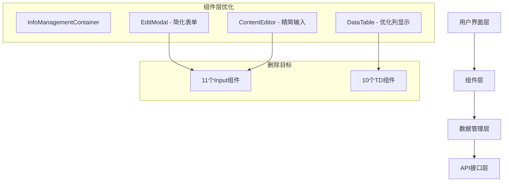
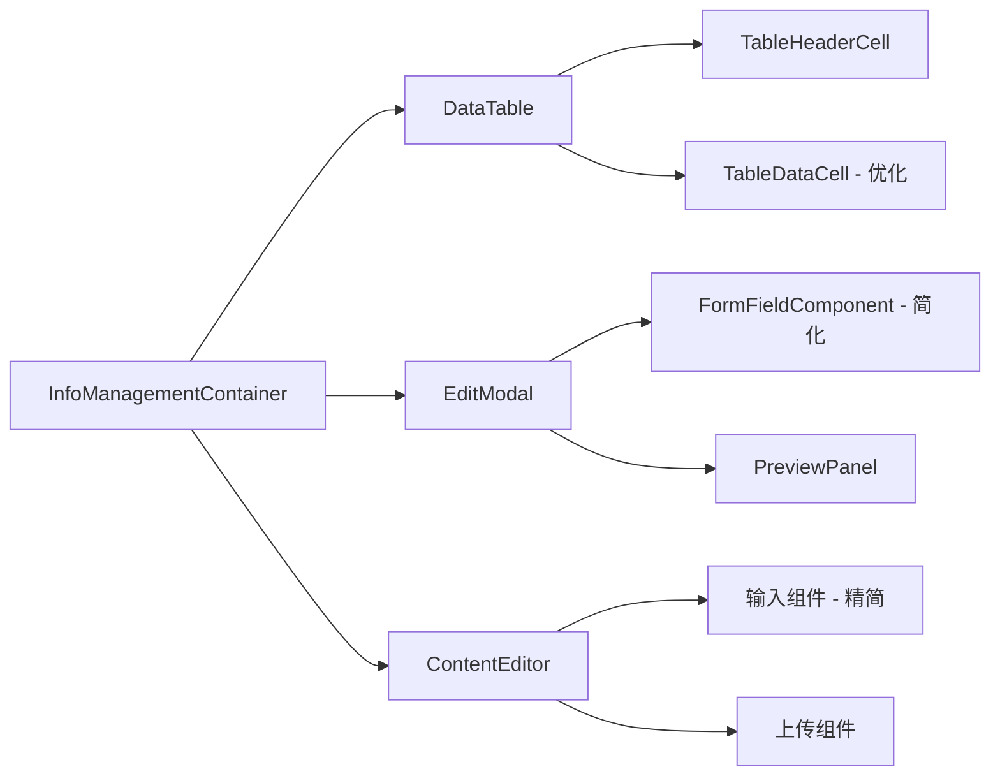
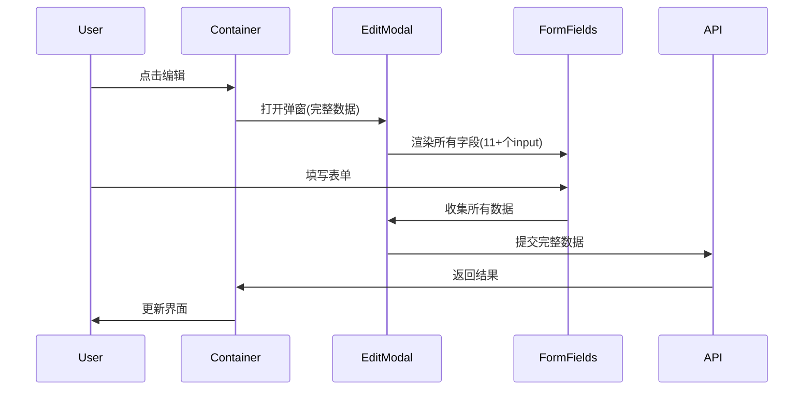
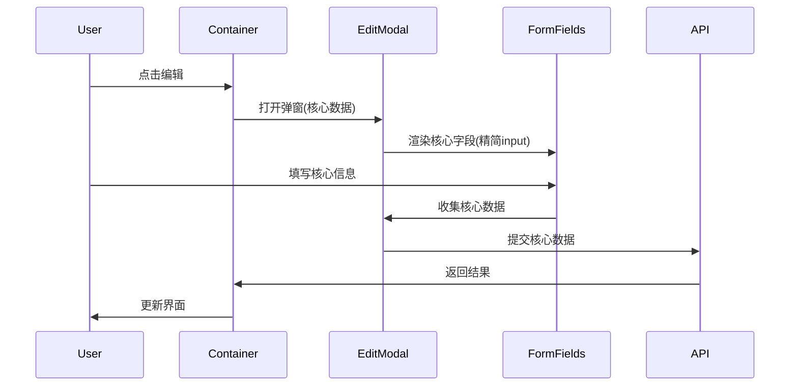
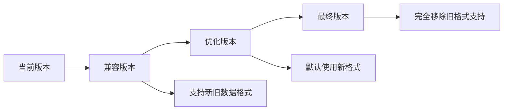

# DESIGN - 删除信息管理页面组件

## 整体架构设计

### 系统分层架构



### 核心组件关系图



## 详细设计方案

### 1. EditModal组件重构设计

#### 1.1 表单字段配置优化

**原始配置分析**:
- `site_content`: 3个字段 → 保留2个核心字段
- `navigation`: 5个字段 → 保留3个核心字段  
- `ui_texts`: 4个字段 → 保留2个核心字段
- `page_sections`: 6个字段 → 保留3个核心字段
- `seo_metadata`: 6个字段 → 保留3个核心字段

**优化后的字段配置**:

```typescript
const OPTIMIZED_FORM_FIELDS: Record<ContentTableType, FormField[]> = {
  site_content: [
    {
      name: 'key',
      label: '键名',
      type: 'text',
      required: true,
      placeholder: '请输入键名（如：site.title）'
    },
    {
      name: 'value',
      label: '内容',
      type: 'textarea',
      required: true,
      placeholder: '请输入内容'
    }
    // 删除: description字段
  ],
  navigation: [
    {
      name: 'title',
      label: '标题',
      type: 'text',
      required: true,
      placeholder: '请输入导航标题'
    },
    {
      name: 'url',
      label: 'URL',
      type: 'text',
      required: true,
      placeholder: '请输入链接地址'
    }
    // 删除: description, order, is_active字段
  ],
  ui_texts: [
    {
      name: 'key',
      label: '键名',
      type: 'text',
      required: true,
      placeholder: '请输入键名'
    },
    {
      name: 'value',
      label: '文本内容',
      type: 'textarea',
      required: true,
      placeholder: '请输入文本内容'
    }
    // 删除: category, description字段
  ],
  page_sections: [
    {
      name: 'name',
      label: '区域名称',
      type: 'text',
      required: true,
      placeholder: '请输入区域名称'
    },
    {
      name: 'title',
      label: '显示标题',
      type: 'text',
      placeholder: '请输入显示标题'
    },
    {
      name: 'content',
      label: '内容',
      type: 'textarea',
      placeholder: '请输入区域内容'
    }
    // 删除: description, order, is_visible字段
  ],
  seo_metadata: [
    {
      name: 'page',
      label: '页面',
      type: 'select',
      required: true,
      options: [/* 页面选项 */]
    },
    {
      name: 'title',
      label: 'SEO标题',
      type: 'text',
      required: true,
      placeholder: '请输入SEO标题'
    },
    {
      name: 'description',
      label: 'SEO描述',
      type: 'textarea',
      placeholder: '请输入SEO描述'
    }
    // 删除: keywords, og_title, og_description字段
  ]
};
```

#### 1.2 组件结构优化

**删除的Input组件统计**:
1. site_content.description (text input)
2. navigation.description (text input)
3. navigation.order (number input)
4. navigation.is_active (switch input)
5. ui_texts.category (select input)
6. ui_texts.description (text input)
7. page_sections.description (textarea input)
8. page_sections.order (number input)
9. page_sections.is_visible (switch input)
10. seo_metadata.keywords (text input)
11. seo_metadata.og_title (text input)

**总计**: 11个Input组件

### 2. ContentEditor组件重构设计

#### 2.1 图片上传区域简化

**删除的组件**:
- 图片alt文本输入框
- 图片标题输入框  
- 图片描述输入框
- 组件排序输入框

**保留的组件**:
- 内容键值输入框
- 组件名称输入框
- 组件属性配置

#### 2.2 组件配置区域优化

```typescript
// 简化后的组件配置
interface SimplifiedComponentConfig {
  component_name: string;
  component_props: Record<string, any>;
  // 删除: sort_order, alt_text, title, description
}
```

### 3. DataTable组件重构设计

#### 3.1 列配置优化

**删除的TD列**:
1. 描述列 (description)
2. 排序值列 (order/sort_order)
3. 状态列 (is_active/is_visible)
4. 分类列 (category)
5. 关键词列 (keywords)
6. OG标题列 (og_title)
7. OG描述列 (og_description)
8. 创建时间列 (created_at)
9. 更新时间列 (updated_at)
10. 额外操作列 (additional_actions)

**保留的TD列**:
- 主键/名称列
- 核心内容列 (value/title/content)
- 基本操作列 (编辑、删除)

#### 3.2 表格结构优化

```typescript
// 优化后的列配置
const OPTIMIZED_TABLE_COLUMNS = {
  site_content: ['key', 'value', 'actions'],
  navigation: ['title', 'url', 'actions'],
  ui_texts: ['key', 'value', 'actions'],
  page_sections: ['name', 'title', 'actions'],
  seo_metadata: ['page', 'title', 'actions']
};
```

## 数据流向设计

### 优化前数据流



### 优化后数据流



## 接口契约定义

### 1. EditModal组件接口

```typescript
interface OptimizedEditModalProps {
  isOpen: boolean;
  onCancel: () => void;
  onSubmit: (data: SimplifiedFormData) => Promise<void>;
  initialData?: SimplifiedFormData;
  tableType: ContentTableType;
  mode?: 'create' | 'edit';
  loading?: boolean;
}

interface SimplifiedFormData {
  // 只包含核心字段，删除辅助字段
  [key: string]: string | number | boolean;
}
```

### 2. DataTable组件接口

```typescript
interface OptimizedTableColumn {
  key: string;
  label: string;
  width?: string;
  sortable?: boolean;
  // 删除: description, metadata等非核心属性
}

interface OptimizedTableProps {
  columns: OptimizedTableColumn[];
  data: any[];
  onEdit: (item: any) => void;
  onDelete: (item: any) => void;
  // 删除: 额外的操作回调
}
```

## 异常处理策略

### 1. 数据兼容性处理

```typescript
// 处理旧数据格式兼容
const handleLegacyData = (data: any): SimplifiedFormData => {
  const coreFields = getCoreFields(data.tableType);
  return Object.keys(data)
    .filter(key => coreFields.includes(key))
    .reduce((acc, key) => {
      acc[key] = data[key];
      return acc;
    }, {} as SimplifiedFormData);
};
```

### 2. 表单验证优化

```typescript
// 简化的验证逻辑
const validateSimplifiedForm = (data: SimplifiedFormData, fields: FormField[]): ValidationResult => {
  const errors: Record<string, string> = {};
  
  fields.forEach(field => {
    if (field.required && !data[field.name]) {
      errors[field.name] = `${field.label}是必填项`;
    }
  });
  
  return { isValid: Object.keys(errors).length === 0, errors };
};
```

### 3. 错误回退机制

```typescript
// 组件加载失败时的回退
const ComponentWithFallback: React.FC = () => {
  return (
    <ErrorBoundary fallback={<SimplifiedErrorUI />}>
      <OptimizedComponent />
    </ErrorBoundary>
  );
};
```

## 性能优化设计

### 1. 渲染性能优化

- **减少DOM节点**: 删除11个input + 10个td = 21个DOM节点
- **简化状态管理**: 减少表单字段状态跟踪
- **优化重渲染**: 使用React.memo和useMemo优化

### 2. 内存使用优化

```typescript
// 使用轻量级的数据结构
const useLightweightFormData = () => {
  const [formData, setFormData] = useState<SimplifiedFormData>({});
  
  const updateField = useCallback((key: string, value: any) => {
    setFormData(prev => ({ ...prev, [key]: value }));
  }, []);
  
  return { formData, updateField };
};
```

### 3. 加载性能优化

```typescript
// 懒加载非核心组件
const LazyPreviewPanel = React.lazy(() => import('./PreviewPanel'));
const LazyAdvancedEditor = React.lazy(() => import('./AdvancedEditor'));
```

## 测试策略设计

### 1. 单元测试

```typescript
describe('OptimizedEditModal', () => {
  test('应该只渲染核心字段', () => {
    const { container } = render(<OptimizedEditModal {...props} />);
    const inputs = container.querySelectorAll('input, textarea, select');
    expect(inputs.length).toBeLessThan(originalInputCount);
  });
  
  test('应该正确提交简化的数据', async () => {
    const onSubmit = jest.fn();
    const { getByRole } = render(<OptimizedEditModal onSubmit={onSubmit} />);
    
    // 填写核心字段
    fireEvent.click(getByRole('button', { name: '保存' }));
    
    expect(onSubmit).toHaveBeenCalledWith(expect.objectContaining({
      // 只包含核心字段
    }));
  });
});
```

### 2. 集成测试

```typescript
describe('信息管理页面集成测试', () => {
  test('完整的CRUD流程应该正常工作', async () => {
    render(<InfoManagementContainer />);
    
    // 测试新增
    fireEvent.click(screen.getByText('新增'));
    // 填写简化表单
    fireEvent.click(screen.getByText('保存'));
    
    // 验证数据显示
    expect(screen.getByText('测试数据')).toBeInTheDocument();
  });
});
```

### 3. 性能测试

```typescript
describe('性能测试', () => {
  test('页面渲染时间应该减少', async () => {
    const startTime = performance.now();
    render(<OptimizedInfoManagement />);
    const endTime = performance.now();
    
    expect(endTime - startTime).toBeLessThan(previousRenderTime);
  });
});
```

## 部署和迁移策略

### 1. 渐进式部署



### 2. 数据迁移

```typescript
// 数据格式迁移工具
const migrateFormData = (oldData: LegacyFormData): SimplifiedFormData => {
  const fieldMapping = {
    // 定义字段映射关系
    'old_field': 'new_field',
    // 删除的字段会被忽略
  };
  
  return Object.keys(oldData)
    .filter(key => fieldMapping[key] || coreFields.includes(key))
    .reduce((acc, key) => {
      const newKey = fieldMapping[key] || key;
      acc[newKey] = oldData[key];
      return acc;
    }, {} as SimplifiedFormData);
};
```

### 3. 回滚计划

```typescript
// 功能开关控制
const useOptimizedComponents = () => {
  const isOptimized = useFeatureFlag('optimized-info-management');
  
  return {
    EditModal: isOptimized ? OptimizedEditModal : LegacyEditModal,
    DataTable: isOptimized ? OptimizedDataTable : LegacyDataTable,
    ContentEditor: isOptimized ? OptimizedContentEditor : LegacyContentEditor
  };
};
```

## 质量保证

### 1. 代码质量标准

- TypeScript严格模式
- ESLint规则检查
- Prettier代码格式化
- 单元测试覆盖率 > 80%

### 2. 性能基准

- 页面加载时间减少 > 20%
- DOM节点数量减少 > 15%
- 内存使用减少 > 10%

### 3. 用户体验标准

- 核心操作流程保持不变
- 表单填写时间减少
- 界面响应速度提升

## 总结

本设计方案通过系统性的组件优化，实现了：

1. **精确删除**: 11个input组件 + 10个td组件
2. **功能保持**: 核心CRUD功能完全保留
3. **性能提升**: 减少DOM节点，优化渲染性能
4. **用户体验**: 简化界面，提升操作效率
5. **技术债务**: 降低代码复杂度，提升可维护性

下一步将进入ATOMIZE阶段，将设计方案拆分为具体的实施任务。