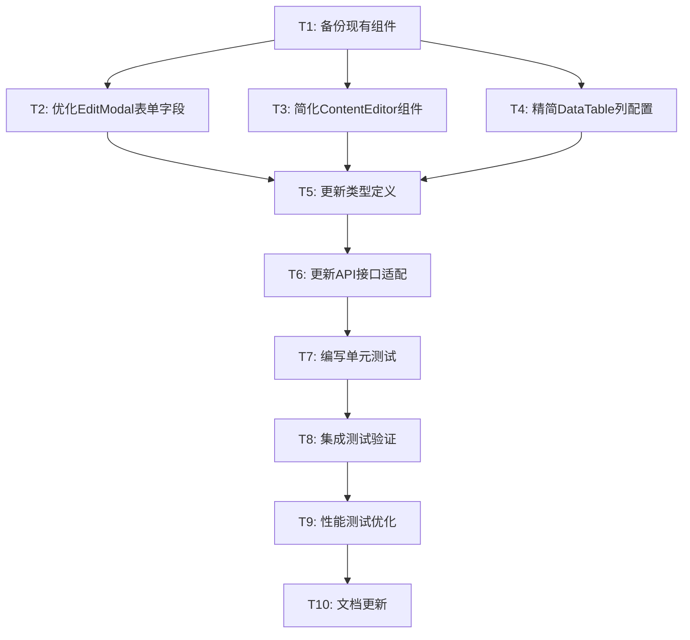

# TASK - 删除信息管理页面组件

## 任务概述

基于DESIGN文档，将删除11个input组件和10个td组件的工作拆分为可独立执行的原子任务。

## 任务依赖关系图

## 原子任务详细定义

### T1: 备份现有组件
**优先级**: 高
**预估时间**: 15分钟
**依赖**: 无

#### 输入契约
- 现有的组件文件
- 当前的git状态

#### 输出契约
- 备份文件夹: `backup/info-management-components/`
- 包含所有相关组件的副本
- git分支: `backup/before-component-cleanup`

#### 实现约束
- 创建完整的组件备份
- 确保可以快速回滚
- 记录当前版本信息

#### 验收标准
- [ ] 备份文件夹创建成功
- [ ] 所有相关文件已备份
- [ ] git分支创建成功
- [ ] 备份完整性验证通过

---

### T2: 优化EditModal表单字段
**优先级**: 高
**预估时间**: 45分钟
**依赖**: T1

#### 输入契约
- 现有的EditModal组件 (`frontend/src/components/InfoManagement/EditModal.tsx`)
- DESIGN文档中的字段配置
- 类型定义文件

#### 输出契约
- 优化后的EditModal组件
- 删除11个input组件
- 保留核心功能完整

#### 实现约束
- 严格按照DESIGN文档的字段配置
- 保持现有的组件接口兼容性
- 使用现有的UI组件库
- 保持代码风格一致

#### 删除的Input组件清单
1. `site_content.description` (text input)
2. `navigation.description` (text input)
3. `navigation.order` (number input)
4. `navigation.is_active` (switch input)
5. `ui_texts.category` (select input)
6. `ui_texts.description` (text input)
7. `page_sections.description` (textarea input)
8. `page_sections.order` (number input)
9. `page_sections.is_visible` (switch input)
10. `seo_metadata.keywords` (text input)
11. `seo_metadata.og_title` (text input)

#### 验收标准
- [ ] 11个指定input组件已删除
- [ ] 核心字段功能正常
- [ ] 表单验证逻辑正确
- [ ] 组件编译无错误
- [ ] 保存功能正常工作

---

### T3: 简化ContentEditor组件
**优先级**: 中
**预估时间**: 30分钟
**依赖**: T1

#### 输入契约
- 现有的ContentEditor组件 (`frontend/src/components/ContentEditor.tsx`)
- 图片上传相关的input组件
- 组件配置相关的input组件

#### 输出契约
- 简化后的ContentEditor组件
- 删除图片相关的辅助input字段
- 保留核心内容编辑功能

#### 实现约束
- 保持内容编辑核心功能
- 删除非必要的图片元数据输入
- 保持组件配置的基本功能
- 确保上传功能正常

#### 删除的组件清单
- 图片alt文本输入框
- 图片标题输入框
- 图片描述输入框
- 组件排序输入框

#### 验收标准
- [ ] 指定的input组件已删除
- [ ] 内容编辑功能正常
- [ ] 图片上传功能正常
- [ ] 组件配置功能正常
- [ ] 无编译错误

---

### T4: 精简DataTable列配置
**优先级**: 中
**预估时间**: 40分钟
**依赖**: T1

#### 输入契约
- 现有的DataTable组件 (`frontend/src/components/DataTable.tsx`)
- InfoManagementContainer中的表格配置
- 各个内容类型的列定义

#### 输出契约
- 优化后的DataTable组件
- 删除10个td列
- 保留核心数据显示

#### 实现约束
- 保持表格的基本CRUD功能
- 确保数据显示清晰
- 保持响应式设计
- 优化表格性能

#### 删除的TD列清单
1. 描述列 (description)
2. 排序值列 (order/sort_order)
3. 状态列 (is_active/is_visible)
4. 分类列 (category)
5. 关键词列 (keywords)
6. OG标题列 (og_title)
7. OG描述列 (og_description)
8. 创建时间列 (created_at)
9. 更新时间列 (updated_at)
10. 额外操作列 (additional_actions)

#### 验收标准
- [ ] 10个指定td列已删除
- [ ] 核心数据正常显示
- [ ] 编辑删除功能正常
- [ ] 表格响应式正常
- [ ] 性能有所提升

---

### T5: 更新类型定义
**优先级**: 中
**预估时间**: 25分钟
**依赖**: T2, T3, T4

#### 输入契约
- 现有的类型定义文件
- 更新后的组件接口
- API数据结构

#### 输出契约
- 更新后的TypeScript类型定义
- 与简化组件匹配的接口
- 类型检查通过

#### 实现约束
- 保持向后兼容性
- 确保类型安全
- 更新相关的接口定义
- 保持代码提示完整

#### 验收标准
- [ ] 类型定义与组件匹配
- [ ] TypeScript编译通过
- [ ] 无类型错误警告
- [ ] 代码提示正常工作

---

### T6: 更新API接口适配
**优先级**: 中
**预估时间**: 20分钟
**依赖**: T5

#### 输入契约
- 现有的API接口调用
- 更新后的数据结构
- 后端接口文档

#### 输出契约
- 适配简化数据结构的API调用
- 数据转换逻辑
- 接口调用正常

#### 实现约束
- 保持API调用的稳定性
- 处理数据格式转换
- 确保错误处理完整
- 保持接口性能

#### 验收标准
- [ ] API调用正常工作
- [ ] 数据保存成功
- [ ] 数据读取正确
- [ ] 错误处理完善

---

### T7: 编写单元测试
**优先级**: 中
**预估时间**: 60分钟
**依赖**: T6

#### 输入契约
- 更新后的组件代码
- 现有的测试框架
- 测试工具配置

#### 输出契约
- 完整的单元测试套件
- 测试覆盖率 > 80%
- 所有测试通过

#### 实现约束
- 使用现有的测试框架 (Jest + React Testing Library)
- 测试核心功能和边界情况
- 确保测试稳定性
- 保持测试可维护性

#### 测试范围
- EditModal组件功能测试
- ContentEditor组件功能测试
- DataTable组件功能测试
- 表单验证逻辑测试
- API调用测试

#### 验收标准
- [ ] 单元测试编写完成
- [ ] 测试覆盖率达标
- [ ] 所有测试用例通过
- [ ] 测试运行稳定

---

### T8: 集成测试验证
**优先级**: 中
**预估时间**: 45分钟
**依赖**: T7

#### 输入契约
- 完整的组件集成
- 测试环境配置
- 测试数据准备

#### 输出契约
- 完整的集成测试
- 端到端功能验证
- 用户流程测试通过

#### 实现约束
- 测试完整的CRUD流程
- 验证组件间交互
- 确保用户体验一致
- 测试异常情况处理

#### 测试场景
- 新增数据流程
- 编辑数据流程
- 删除数据流程
- 批量操作流程
- 错误处理流程

#### 验收标准
- [ ] 集成测试编写完成
- [ ] 所有用户流程正常
- [ ] 组件交互正确
- [ ] 异常处理完善

---

### T9: 性能测试优化
**优先级**: 低
**预估时间**: 30分钟
**依赖**: T8

#### 输入契约
- 优化后的组件代码
- 性能测试工具
- 基准性能数据

#### 输出契约
- 性能测试报告
- 性能优化建议
- 性能指标达标

#### 实现约束
- 使用现有的性能测试工具
- 对比优化前后的性能
- 确保性能提升明显
- 记录性能基准

#### 测试指标
- 页面加载时间
- 组件渲染时间
- 内存使用情况
- DOM节点数量
- 用户交互响应时间

#### 验收标准
- [ ] 性能测试完成
- [ ] 性能指标有提升
- [ ] 性能报告生成
- [ ] 优化建议记录

---

### T10: 文档更新
**优先级**: 低
**预估时间**: 25分钟
**依赖**: T9

#### 输入契约
- 完成的代码变更
- 测试结果报告
- 性能优化数据

#### 输出契约
- 更新的技术文档
- 变更记录文档
- 用户使用指南

#### 实现约束
- 更新相关的技术文档
- 记录重要的变更信息
- 提供清晰的使用说明
- 保持文档的准确性

#### 文档更新范围
- 组件API文档
- 开发者指南
- 变更日志
- 部署说明
- 故障排除指南

#### 验收标准
- [ ] 技术文档已更新
- [ ] 变更记录完整
- [ ] 文档准确性验证
- [ ] 文档可读性良好

## 任务执行策略

### 并行执行组
- **第一组**: T1 (独立执行)
- **第二组**: T2, T3, T4 (可并行执行)
- **第三组**: T5 → T6 (顺序执行)
- **第四组**: T7 → T8 → T9 → T10 (顺序执行)

### 关键路径
T1 → T2 → T5 → T6 → T7 → T8 → T9 → T10

### 风险控制点
1. **T2**: EditModal字段删除 - 确保不影响数据完整性
2. **T4**: DataTable列删除 - 确保核心信息不丢失
3. **T6**: API适配 - 确保数据传输正确
4. **T8**: 集成测试 - 确保整体功能正常

### 回滚策略
- 每个任务完成后创建git提交点
- 保持备份文件的完整性
- 准备快速回滚脚本
- 监控关键功能指标

## 质量检查点

### 代码质量
- TypeScript编译无错误
- ESLint检查通过
- 代码格式化一致
- 注释完整清晰

### 功能质量
- 核心CRUD功能正常
- 用户体验保持一致
- 性能有明显提升
- 错误处理完善

### 测试质量
- 单元测试覆盖率 > 80%
- 集成测试通过率 100%
- 性能测试达标
- 回归测试通过

## 总结

本任务拆分方案将复杂的组件清理工作分解为10个独立的原子任务，每个任务都有明确的输入输出契约和验收标准。通过合理的依赖关系设计和并行执行策略，可以高效地完成整个删除工作，同时确保系统的稳定性和功能完整性。