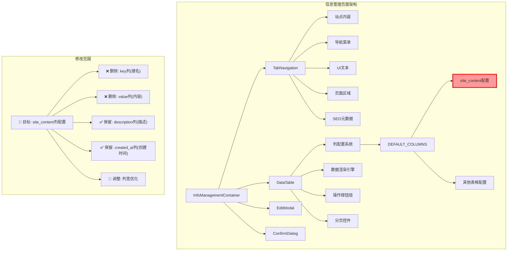
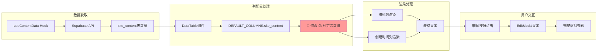
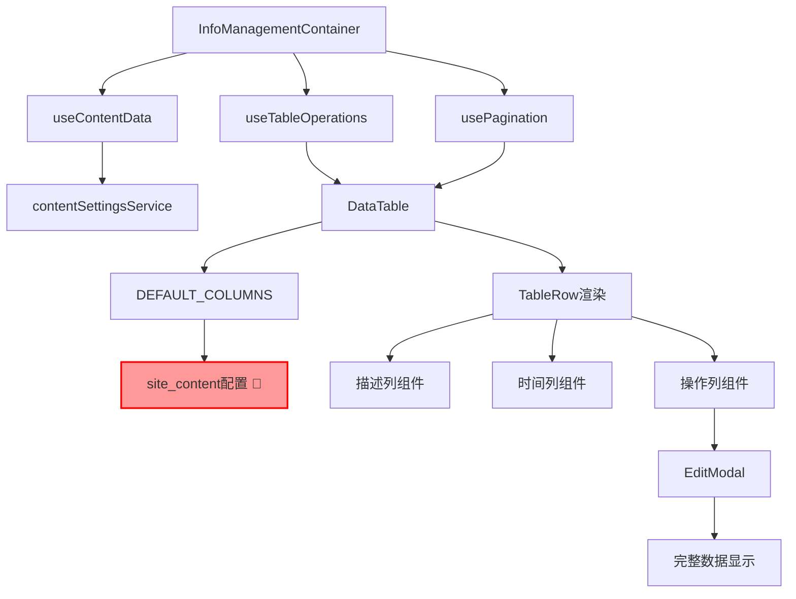

# 删除站点内容列 - 架构设计文档

## 整体架构图



## 分层设计

### 1. 表现层 (Presentation Layer)

#### 组件结构
```
InfoManagementContainer
├── TabNavigation (标签页导航)
│   └── 站点内容标签 (触发site_content表格显示)
├── DataTable (核心表格组件)
│   ├── 列标题显示行 (新增的固定标题)
│   ├── TableHeader (动态列头，支持排序)
│   ├── TableBody (数据行渲染)
│   │   ├── 描述列 (调整后的主要信息列)
│   │   ├── 创建时间列 (保留的时间信息)
│   │   └── 操作列 (编辑/删除按钮)
│   └── Pagination (分页控件)
└── EditModal (编辑模态框，用户查看完整信息的入口)
```

#### 修改影响范围
- **直接影响**: `DataTable.tsx` 中的 `DEFAULT_COLUMNS.site_content` 配置
- **间接影响**: 表格渲染逻辑、搜索功能、列宽布局
- **不受影响**: 其他表格类型、编辑功能、数据获取逻辑

### 2. 业务逻辑层 (Business Logic Layer)

#### 数据流向图


#### 核心组件依赖关系


### 3. 数据访问层 (Data Access Layer)

#### 数据模型保持不变
```typescript
// site_content表结构 (不变)
interface SiteContent {
  id: string;
  key: string;        // 🔴 不再显示，但数据仍存在
  value: string;      // 🔴 不再显示，但数据仍存在
  description: string; // ✅ 继续显示
  created_at: string; // ✅ 继续显示
  updated_at: string;
}
```

## 核心组件设计

### 1. 列配置系统重构

#### 修改前的配置
```typescript
site_content: [
  {
    key: 'key',
    title: '键名',
    width: 200,
    sortable: true,
    searchable: true,
    render: (value) => (
      <code className="px-2 py-1 bg-gray-100 rounded text-sm">
        {value}
      </code>
    )
  },
  {
    key: 'value',
    title: '内容',
    width: 300,
    searchable: true,
    render: (value) => (
      <div className="max-w-xs truncate" title={value}>
        {value}
      </div>
    )
  },
  {
    key: 'description',
    title: '描述',
    width: 200,
    searchable: true,
    render: (value) => value || <span className="text-gray-400">-</span>
  },
  {
    key: 'created_at',
    title: '创建时间',
    width: 150,
    sortable: true,
    render: (value) => new Date(value).toLocaleDateString('zh-CN')
  }
]
```

#### 修改后的配置
```typescript
site_content: [
  {
    key: 'description',
    title: '描述',
    width: 400, // 🔧 增加宽度
    searchable: true,
    render: (value) => value || <span className="text-gray-400">-</span>
  },
  {
    key: 'created_at',
    title: '创建时间',
    width: 200, // 🔧 调整宽度
    sortable: true,
    render: (value) => new Date(value).toLocaleDateString('zh-CN')
  }
]
```

### 2. 响应式布局设计

#### 列宽分配策略
```css
/* 桌面端 (>= 1024px) */
.table-container {
  width: 100%;
}

.description-column {
  width: 400px; /* 固定宽度，主要信息列 */
  min-width: 300px;
}

.created-at-column {
  width: 200px; /* 固定宽度 */
  min-width: 150px;
}

.actions-column {
  width: 120px; /* 操作按钮列 */
  min-width: 100px;
}

/* 平板端 (768px - 1023px) */
@media (max-width: 1023px) {
  .description-column {
    width: 300px;
    min-width: 250px;
  }
  
  .created-at-column {
    width: 150px;
    min-width: 120px;
  }
}

/* 移动端 (< 768px) */
@media (max-width: 767px) {
  .description-column {
    width: 200px;
    min-width: 180px;
  }
  
  .created-at-column {
    width: 120px;
    min-width: 100px;
  }
}
```

### 3. 搜索功能简化

#### 搜索逻辑调整
```typescript
// 修改前：搜索多个字段
const searchableFields = ['key', 'value', 'description'];

// 修改后：只搜索描述字段
const searchableFields = ['description'];

// 搜索函数保持不变，自动适配可搜索字段
const filterData = (data: SiteContent[], searchTerm: string) => {
  if (!searchTerm) return data;
  
  return data.filter(item => 
    searchableFields.some(field => 
      item[field]?.toLowerCase().includes(searchTerm.toLowerCase())
    )
  );
};
```

## 接口契约定义

### 1. 组件接口

#### DataTable组件接口 (保持不变)
```typescript
interface DataTableProps {
  data: any[];
  columns: ColumnConfig[];
  loading?: boolean;
  onEdit?: (item: any) => void;
  onDelete?: (item: any) => void;
  pagination?: PaginationConfig;
}

interface ColumnConfig {
  key: string;
  title: string;
  width?: number;
  sortable?: boolean;
  searchable?: boolean;
  render?: (value: any, record: any) => React.ReactNode;
}
```

#### 修改的列配置接口
```typescript
// 站点内容列配置类型
type SiteContentColumnConfig = ColumnConfig[];

// 修改后的配置实例
const siteContentColumns: SiteContentColumnConfig = [
  // 只包含description和created_at两列
];
```

### 2. 数据接口 (保持不变)

```typescript
// API响应接口
interface ContentDataResponse {
  data: SiteContent[];
  total: number;
  page: number;
  pageSize: number;
}

// Hook接口
interface UseContentDataReturn {
  data: SiteContent[];
  loading: boolean;
  error: string | null;
  refetch: () => void;
}
```

## 异常处理策略

### 1. 渲染异常处理

```typescript
// 列配置错误处理
const getColumnConfig = (tableType: string) => {
  try {
    const config = DEFAULT_COLUMNS[tableType];
    if (!config || !Array.isArray(config)) {
      console.warn(`Invalid column config for table type: ${tableType}`);
      return [];
    }
    return config;
  } catch (error) {
    console.error('Error getting column config:', error);
    return [];
  }
};

// 数据渲染错误处理
const renderCell = (column: ColumnConfig, value: any, record: any) => {
  try {
    if (column.render) {
      return column.render(value, record);
    }
    return value || '-';
  } catch (error) {
    console.error('Error rendering cell:', error);
    return <span className="text-red-500">渲染错误</span>;
  }
};
```

### 2. 数据缺失处理

```typescript
// 描述字段缺失处理
const renderDescription = (value: string) => {
  if (!value || value.trim() === '') {
    return <span className="text-gray-400 italic">暂无描述</span>;
  }
  return <span title={value}>{value}</span>;
};

// 时间字段异常处理
const renderCreatedAt = (value: string) => {
  try {
    const date = new Date(value);
    if (isNaN(date.getTime())) {
      return <span className="text-gray-400">无效日期</span>;
    }
    return date.toLocaleDateString('zh-CN');
  } catch (error) {
    return <span className="text-gray-400">日期错误</span>;
  }
};
```

## 性能优化策略

### 1. 渲染优化

```typescript
// 使用React.memo优化列渲染
const TableCell = React.memo(({ column, value, record }) => {
  return renderCell(column, value, record);
});

// 虚拟化长列表 (如果数据量大)
const VirtualizedTable = ({ data, columns }) => {
  // 实现虚拟滚动逻辑
};
```

### 2. 搜索优化

```typescript
// 防抖搜索
const useDebounceSearch = (searchTerm: string, delay: number = 300) => {
  const [debouncedTerm, setDebouncedTerm] = useState(searchTerm);
  
  useEffect(() => {
    const timer = setTimeout(() => {
      setDebouncedTerm(searchTerm);
    }, delay);
    
    return () => clearTimeout(timer);
  }, [searchTerm, delay]);
  
  return debouncedTerm;
};
```

## 测试策略

### 1. 单元测试

```typescript
// 列配置测试
describe('SiteContent Column Config', () => {
  it('should only include description and created_at columns', () => {
    const config = DEFAULT_COLUMNS.site_content;
    expect(config).toHaveLength(2);
    expect(config.map(col => col.key)).toEqual(['description', 'created_at']);
  });
  
  it('should not include key and value columns', () => {
    const config = DEFAULT_COLUMNS.site_content;
    const columnKeys = config.map(col => col.key);
    expect(columnKeys).not.toContain('key');
    expect(columnKeys).not.toContain('value');
  });
});
```

### 2. 集成测试

```typescript
// 表格渲染测试
describe('DataTable Integration', () => {
  it('should render site_content table with correct columns', () => {
    const mockData = [{
      id: '1',
      key: 'test_key',
      value: 'test_value',
      description: 'Test Description',
      created_at: '2024-01-01'
    }];
    
    render(<DataTable data={mockData} tableType="site_content" />);
    
    expect(screen.getByText('描述')).toBeInTheDocument();
    expect(screen.getByText('创建时间')).toBeInTheDocument();
    expect(screen.queryByText('键名')).not.toBeInTheDocument();
    expect(screen.queryByText('内容')).not.toBeInTheDocument();
  });
});
```

## 部署和监控

### 1. 部署检查清单

- [ ] 代码修改完成
- [ ] TypeScript编译通过
- [ ] 单元测试通过
- [ ] 集成测试通过
- [ ] 响应式布局测试通过
- [ ] 浏览器兼容性测试通过
- [ ] 性能测试通过

### 2. 监控指标

- 表格渲染时间
- 搜索响应时间
- 用户操作成功率
- 错误日志监控

---

**设计确认**: 本架构设计基于共识文档制定，确保了技术方案的可行性和与现有系统的兼容性。可以进入下一阶段的任务原子化。