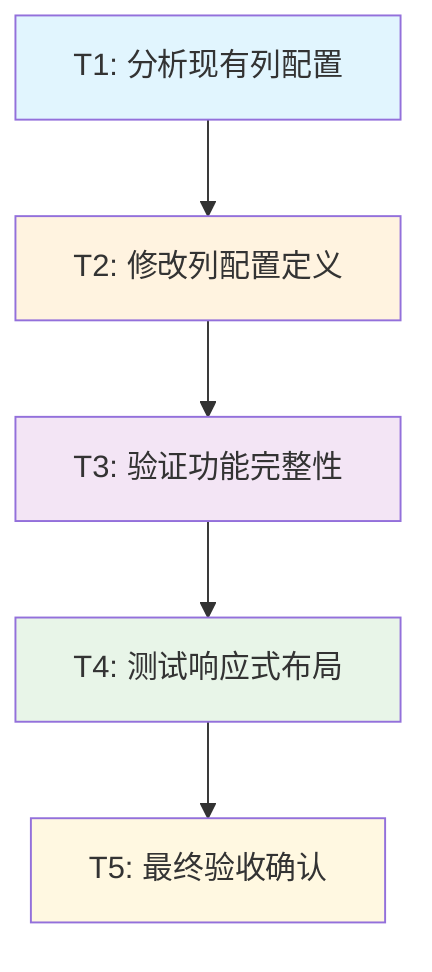

# 删除站点内容列 - 任务拆分文档

## 任务依赖图

## 原子任务列表

### 任务T1: 分析现有列配置

#### 输入契约
- **前置依赖**: 无
- **输入数据**: 
  - 现有项目代码库
  - `DataTable.tsx`文件
  - `DEFAULT_COLUMNS`配置对象
- **环境依赖**: 
  - 开发环境已启动
  - 代码编辑器可用

#### 输出契约
- **输出数据**: 
  - 当前`site_content`列配置的详细分析
  - 需要删除的列标识（key, value）
  - 需要保留的列标识（description, created_at）
- **交付物**: 
  - 现有配置的代码片段
  - 修改计划的明确说明
- **验收标准**: 
  - 准确识别出4个现有列的配置
  - 明确标识出需要删除的2个列
  - 明确标识出需要保留的2个列

#### 实现约束
- **技术栈**: React + TypeScript
- **接口规范**: 保持现有的ColumnConfig接口
- **质量要求**: 代码分析准确，无遗漏

#### 依赖关系
- **后置任务**: T2
- **并行任务**: 无

---

### 任务T2: 修改列配置定义

#### 输入契约
- **前置依赖**: T1完成
- **输入数据**: 
  - T1的分析结果
  - 现有`DEFAULT_COLUMNS.site_content`配置
  - 新的列宽度规范（description: 400px, created_at: 200px）
- **环境依赖**: 
  - TypeScript编译环境
  - 代码编辑工具

#### 输出契约
- **输出数据**: 
  - 修改后的`DEFAULT_COLUMNS.site_content`配置
  - 只包含description和created_at两列
  - 调整后的列宽度设置
- **交付物**: 
  - 更新的`DataTable.tsx`文件
  - 修改的代码符合TypeScript类型要求
- **验收标准**: 
  - `site_content`配置数组只包含2个元素
  - description列宽度为400px，searchable为true
  - created_at列宽度为200px，sortable为true
  - 代码编译无错误
  - 不影响其他表格类型的配置

#### 实现约束
- **技术栈**: TypeScript + React
- **接口规范**: 严格遵循ColumnConfig接口定义
- **质量要求**: 
  - 代码风格与现有项目一致
  - TypeScript类型安全
  - 保持现有的render函数逻辑

#### 依赖关系
- **前置任务**: T1
- **后置任务**: T3
- **并行任务**: 无

---

### 任务T3: 验证功能完整性

#### 输入契约
- **前置依赖**: T2完成
- **输入数据**: 
  - 修改后的DataTable组件
  - 现有的测试数据
  - 信息管理页面的完整功能
- **环境依赖**: 
  - 开发服务器运行中
  - 浏览器开发工具可用
  - Supabase数据库连接正常

#### 输出契约
- **输出数据**: 
  - 功能测试结果报告
  - 表格显示效果确认
  - 操作功能验证结果
- **交付物**: 
  - 站点内容表格正确显示2列
  - 编辑功能正常工作
  - 删除功能正常工作
  - 添加功能正常工作
  - 搜索功能只对描述字段生效
  - 排序功能对创建时间字段正常
- **验收标准**: 
  - 表格加载无错误
  - 只显示"描述"和"创建时间"列
  - 不显示"键名"和"内容"列
  - 所有CRUD操作正常
  - 搜索和排序功能正常
  - 其他表格类型不受影响

#### 实现约束
- **技术栈**: 浏览器测试 + 开发工具
- **接口规范**: 验证现有API接口正常工作
- **质量要求**: 
  - 全面的功能覆盖测试
  - 详细的问题记录
  - 准确的结果报告

#### 依赖关系
- **前置任务**: T2
- **后置任务**: T4
- **并行任务**: 无

---

### 任务T4: 测试响应式布局

#### 输入契约
- **前置依赖**: T3完成
- **输入数据**: 
  - 功能验证通过的表格组件
  - 不同屏幕尺寸的测试环境
  - 响应式设计规范
- **环境依赖**: 
  - 浏览器开发工具
  - 设备模拟器
  - 多种屏幕尺寸测试环境

#### 输出契约
- **输出数据**: 
  - 响应式布局测试报告
  - 不同屏幕尺寸下的显示效果
  - 列宽调整效果验证
- **交付物**: 
  - 桌面端（>=1024px）显示正常
  - 平板端（768px-1023px）显示正常
  - 移动端（<768px）显示正常
  - 列宽在各尺寸下合理分配
  - 文字不会溢出或截断异常
- **验收标准**: 
  - 所有屏幕尺寸下表格布局美观
  - 列宽自适应效果良好
  - 文字显示完整可读
  - 操作按钮在各尺寸下可正常点击
  - 无水平滚动条异常

#### 实现约束
- **技术栈**: CSS + Tailwind + 响应式设计
- **接口规范**: 遵循现有的响应式设计模式
- **质量要求**: 
  - 全面的设备兼容性测试
  - 详细的视觉效果验证
  - 用户体验友好性确认

#### 依赖关系
- **前置任务**: T3
- **后置任务**: T5
- **并行任务**: 无

---

### 任务T5: 最终验收确认

#### 输入契约
- **前置依赖**: T4完成
- **输入数据**: 
  - 所有前置任务的完成结果
  - 完整的功能测试报告
  - 响应式布局测试报告
- **环境依赖**: 
  - 生产环境模拟
  - 完整的用户操作流程

#### 输出契约
- **输出数据**: 
  - 最终验收报告
  - 完整的功能确认清单
  - 用户体验评估结果
- **交付物**: 
  - 符合所有验收标准的站点内容表格
  - 完整的文档更新
  - 无遗留问题的代码实现
- **验收标准**: 
  - 所有共识文档中的验收标准全部满足
  - 用户可以正常使用所有功能
  - 代码质量符合项目规范
  - 性能无明显下降
  - 无TypeScript错误或运行时警告

#### 实现约束
- **技术栈**: 全栈验证
- **接口规范**: 符合所有现有接口规范
- **质量要求**: 
  - 生产级别的代码质量
  - 完整的功能覆盖
  - 优秀的用户体验

#### 依赖关系
- **前置任务**: T4
- **后置任务**: 无
- **并行任务**: 无

## 任务复杂度评估

### 复杂度分析

| 任务 | 技术复杂度 | 业务复杂度 | 风险等级 | 预估时间 |
|------|------------|------------|----------|----------|
| T1   | 低         | 低         | 低       | 5分钟    |
| T2   | 中         | 低         | 低       | 15分钟   |
| T3   | 中         | 中         | 中       | 15分钟   |
| T4   | 中         | 低         | 低       | 10分钟   |
| T5   | 低         | 中         | 低       | 5分钟    |

### 总体评估
- **总预估时间**: 50分钟
- **整体复杂度**: 中等
- **主要风险点**: 
  - T3中的功能验证可能发现意外问题
  - T4中的响应式布局可能需要微调
- **成功率预估**: 95%

## 质量保证策略

### 每个任务的质量门控

#### T1质量门控
- [ ] 准确识别所有现有列配置
- [ ] 明确标识修改范围
- [ ] 理解现有代码结构

#### T2质量门控
- [ ] TypeScript编译无错误
- [ ] 列配置语法正确
- [ ] 不影响其他表格类型
- [ ] 代码风格一致

#### T3质量门控
- [ ] 表格显示正确
- [ ] 所有操作功能正常
- [ ] 搜索排序功能正确
- [ ] 无JavaScript错误

#### T4质量门控
- [ ] 桌面端显示正常
- [ ] 平板端显示正常
- [ ] 移动端显示正常
- [ ] 列宽分配合理

#### T5质量门控
- [ ] 所有验收标准满足
- [ ] 用户体验良好
- [ ] 代码质量达标
- [ ] 无遗留问题

### 回滚策略

如果任何任务失败，可以通过以下方式回滚：

1. **代码回滚**: 恢复`DataTable.tsx`文件的原始版本
2. **配置回滚**: 恢复`DEFAULT_COLUMNS.site_content`的原始配置
3. **测试验证**: 确保回滚后系统正常工作

### 风险缓解

1. **备份策略**: 在开始修改前备份原始文件
2. **增量测试**: 每个任务完成后立即测试
3. **问题记录**: 详细记录遇到的问题和解决方案
4. **用户确认**: 关键节点寻求用户确认

---

**任务拆分确认**: 本文档将复杂需求拆分为5个原子任务，每个任务都有明确的输入输出契约和验收标准，可以进入下一阶段的审批确认。