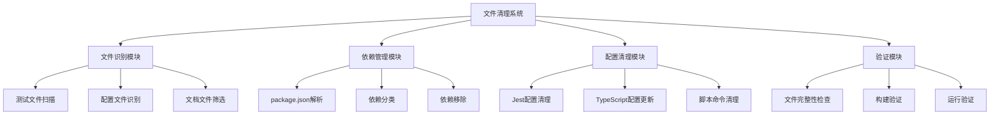
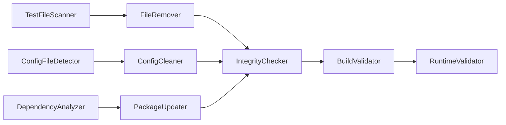
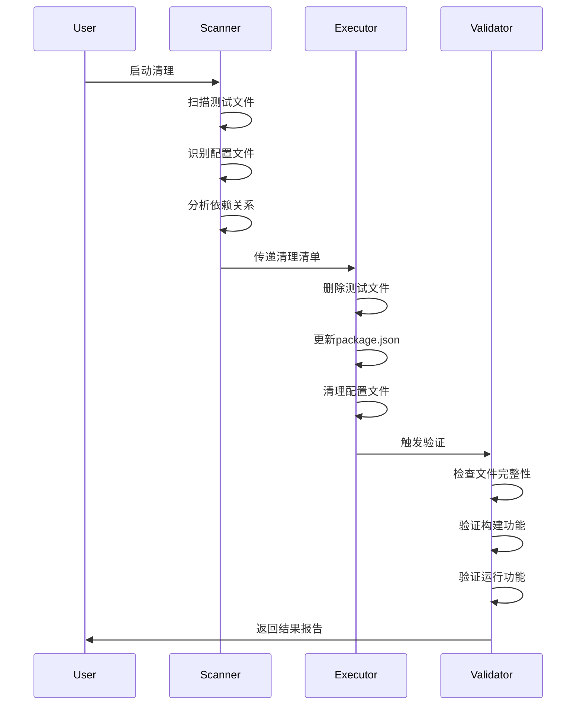

# DESIGN_文件清理.md

## 系统架构设计

### 整体架构图


### 分层设计

#### 1. 识别层 (Identification Layer)
**职责**: 准确识别需要清理的文件和配置

**核心组件**:
- **TestFileScanner**: 扫描.test.tsx/.spec.tsx文件
- **ConfigFileDetector**: 识别测试配置文件
- **DependencyAnalyzer**: 分析测试相关依赖

**输入**: 项目根目录路径
**输出**: 清理目标清单

#### 2. 执行层 (Execution Layer)
**职责**: 安全执行文件删除和配置更新操作

**核心组件**:
- **FileRemover**: 安全删除文件
- **PackageUpdater**: 更新package.json
- **ConfigCleaner**: 清理配置引用

**输入**: 清理目标清单
**输出**: 执行结果报告

#### 3. 验证层 (Validation Layer)
**职责**: 确保清理后项目完整性和功能正常

**核心组件**:
- **IntegrityChecker**: 检查文件完整性
- **BuildValidator**: 验证构建功能
- **RuntimeValidator**: 验证运行功能

**输入**: 清理后的项目状态
**输出**: 验证结果报告

### 模块依赖关系图


### 接口契约定义

#### IFileScanner
```typescript
interface IFileScanner {
  scanTestFiles(rootPath: string): Promise<string[]>;
  scanConfigFiles(rootPath: string): Promise<string[]>;
}
```

#### IPackageManager
```typescript
interface IPackageManager {
  removeTestDependencies(packagePath: string): Promise<void>;
  removeTestScripts(packagePath: string): Promise<void>;
}
```

#### IValidator
```typescript
interface IValidator {
  validateIntegrity(projectPath: string): Promise<ValidationResult>;
  validateBuild(projectPath: string): Promise<boolean>;
  validateRuntime(projectPath: string): Promise<boolean>;
}
```

### 数据流向图


### 异常处理策略

#### 1. 文件操作异常
- **权限不足**: 提示用户检查文件权限
- **文件被占用**: 等待或提示关闭相关进程
- **路径不存在**: 跳过并记录警告

#### 2. 配置更新异常
- **JSON格式错误**: 备份原文件，尝试修复
- **依赖冲突**: 记录冲突信息，手动处理
- **脚本引用错误**: 清理相关引用

#### 3. 验证失败异常
- **构建失败**: 回滚关键配置更改
- **运行异常**: 提供详细错误信息
- **完整性检查失败**: 中止操作，生成报告

### 安全保障机制

#### 1. 备份策略
```typescript
interface BackupStrategy {
  backupPackageJson(): Promise<string>;
  backupConfigFiles(): Promise<string[]>;
  restoreFromBackup(backupId: string): Promise<void>;
}
```

#### 2. 回滚机制
- **操作前快照**: 记录关键文件状态
- **分步回滚**: 支持部分操作回滚
- **完整回滚**: 恢复到清理前状态

#### 3. 验证检查点
- **预清理检查**: 确认目标文件存在
- **中间检查**: 每步操作后验证
- **后清理检查**: 全面功能验证

### 性能优化设计

#### 1. 并行处理
- 文件删除操作并行执行
- 独立模块并行验证
- 异步I/O操作优化

#### 2. 缓存机制
- 文件扫描结果缓存
- 依赖分析结果缓存
- 验证结果缓存

#### 3. 增量处理
- 仅处理变更文件
- 跳过已验证的模块
- 智能依赖更新

### 监控和日志

#### 1. 操作日志
```typescript
interface OperationLog {
  timestamp: Date;
  operation: string;
  target: string;
  result: 'success' | 'failure' | 'warning';
  details?: string;
}
```

#### 2. 进度跟踪
- 实时进度显示
- 操作状态更新
- 错误信息收集

#### 3. 结果报告
- 清理统计信息
- 错误和警告汇总
- 建议和后续操作

### 扩展性设计

#### 1. 插件架构
- 支持自定义文件识别规则
- 支持自定义清理策略
- 支持自定义验证规则

#### 2. 配置驱动
- 外部配置文件支持
- 规则模板化
- 策略可配置

#### 3. 集成接口
- CLI工具集成
- IDE插件集成
- CI/CD流水线集成