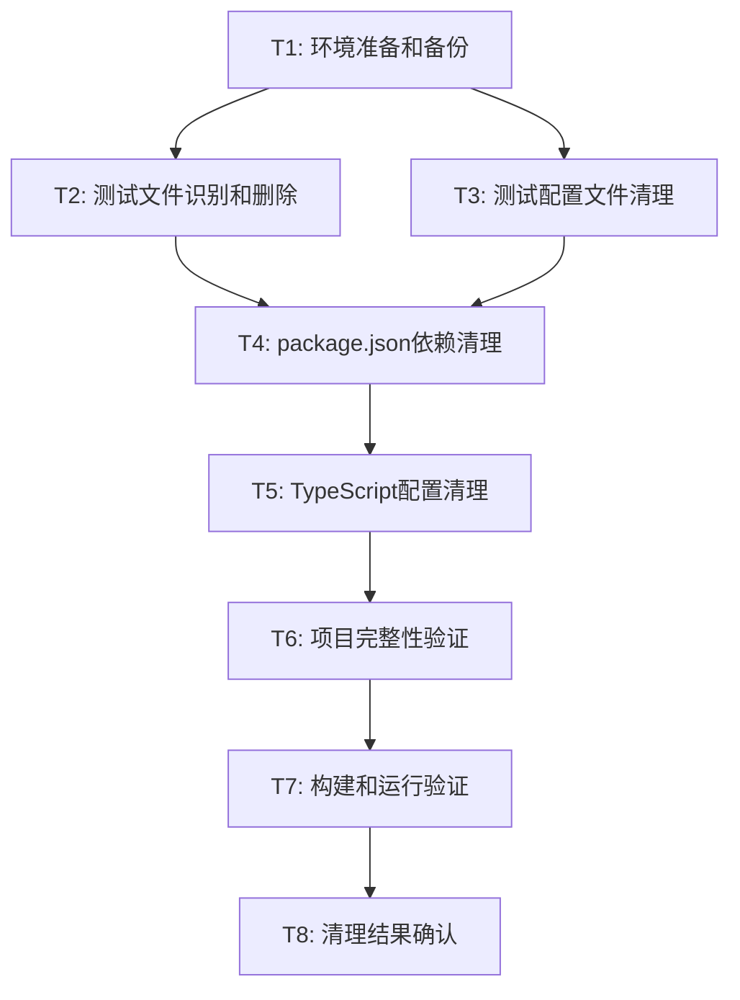

# TASK_文件清理.md

## 原子任务拆分

### 任务依赖图

---

## T1: 环境准备和备份

### 输入契约
- **前置依赖**: 无
- **输入数据**: 项目根路径 `/Users/changhao/Desktop/网站测试/frontend`
- **环境依赖**: 文件系统读写权限

### 输出契约
- **输出数据**: 备份文件路径清单
- **交付物**: 
  - `package.json.backup`
  - `jest.config.js.backup`
  - `setupTests.ts.backup`
  - `tsconfig.test.json.backup` (如存在)
- **验收标准**: 所有关键配置文件已备份

### 实现约束
- **技术栈**: Node.js文件系统操作
- **接口规范**: 使用绝对路径
- **质量要求**: 备份文件完整性校验

### 依赖关系
- **后置任务**: T2, T3
- **并行任务**: 无

---

## T2: 测试文件识别和删除

### 输入契约
- **前置依赖**: T1完成
- **输入数据**: 测试文件路径清单
- **环境依赖**: 文件删除权限

### 输出契约
- **输出数据**: 已删除文件清单
- **交付物**: 
  - 删除 `OptimizedInfoManagementContainer.test.tsx`
  - 删除 `CardGridMainContent.test.tsx`
  - 删除 `InlineEditor.test.tsx`
  - 删除 `LayoutContainer.test.tsx`
  - 删除 `performanceOptimization.test.ts`
  - 删除 `DataCard.test.tsx`
  - 删除 `OptimizedSidebarLayout.test.tsx`
- **验收标准**: 所有.test.tsx/.spec.tsx文件已删除

### 实现约束
- **技术栈**: 文件系统操作
- **接口规范**: 安全删除，避免误删
- **质量要求**: 删除前确认文件存在

### 依赖关系
- **后置任务**: T4
- **并行任务**: T3

---

## T3: 测试配置文件清理

### 输入契约
- **前置依赖**: T1完成
- **输入数据**: 配置文件路径
- **环境依赖**: 文件删除权限

### 输出契约
- **输出数据**: 已删除配置文件清单
- **交付物**: 
  - 删除 `jest.config.js`
  - 删除 `setupTests.ts`
  - 删除 `tsconfig.test.json` (如存在)
- **验收标准**: 所有测试配置文件已删除

### 实现约束
- **技术栈**: 文件系统操作
- **接口规范**: 确认文件路径正确
- **质量要求**: 删除前验证文件类型

### 依赖关系
- **后置任务**: T4
- **并行任务**: T2

---

## T4: package.json依赖清理

### 输入契约
- **前置依赖**: T2, T3完成
- **输入数据**: package.json文件路径
- **环境依赖**: JSON文件读写权限

### 输出契约
- **输出数据**: 更新后的package.json
- **交付物**: 
  - 移除测试相关devDependencies:
    - `@testing-library/dom`
    - `@testing-library/jest-dom`
    - `@testing-library/react`
    - `@testing-library/user-event`
    - `@types/jest`
    - `jest`
    - `jest-environment-jsdom`
    - `ts-jest`
  - 移除测试相关scripts:
    - `"test": "jest"`
    - `"test:watch": "jest --watch"`
    - `"test:coverage": "jest --coverage"`
- **验收标准**: package.json格式正确，无测试相关依赖

### 实现约束
- **技术栈**: JSON解析和序列化
- **接口规范**: 保持JSON格式化
- **质量要求**: 语法验证，依赖完整性检查

### 依赖关系
- **后置任务**: T5
- **并行任务**: 无

---

## T5: TypeScript配置清理

### 输入契约
- **前置依赖**: T4完成
- **输入数据**: TypeScript配置文件路径
- **环境依赖**: 配置文件读写权限

### 输出契约
- **输出数据**: 清理后的TypeScript配置
- **交付物**: 
  - 检查并清理 `tsconfig.json` 中的测试相关引用
  - 检查并清理 `vite.config.ts` 中的测试相关配置
- **验收标准**: TypeScript配置无测试相关引用

### 实现约束
- **技术栈**: JSON/TypeScript配置解析
- **接口规范**: 保持配置文件格式
- **质量要求**: 配置语法正确性验证

### 依赖关系
- **后置任务**: T6
- **并行任务**: 无

---

## T6: 项目完整性验证

### 输入契约
- **前置依赖**: T5完成
- **输入数据**: 清理后的项目状态
- **环境依赖**: Node.js运行环境

### 输出契约
- **输出数据**: 完整性检查报告
- **交付物**: 
  - 文件结构完整性报告
  - 依赖关系检查报告
  - 配置一致性报告
- **验收标准**: 所有检查项通过

### 实现约束
- **技术栈**: 静态分析工具
- **接口规范**: 标准化报告格式
- **质量要求**: 全面覆盖关键检查点

### 依赖关系
- **后置任务**: T7
- **并行任务**: 无

---

## T7: 构建和运行验证

### 输入契约
- **前置依赖**: T6完成
- **输入数据**: 项目完整性确认
- **环境依赖**: Node.js, npm环境

### 输出契约
- **输出数据**: 构建和运行结果
- **交付物**: 
  - `npm run build` 执行成功
  - `npm run dev` 启动成功
  - 应用功能正常访问
- **验收标准**: 构建无错误，运行无异常

### 实现约束
- **技术栈**: npm scripts, Vite构建工具
- **接口规范**: 标准npm命令
- **质量要求**: 零错误零警告

### 依赖关系
- **后置任务**: T8
- **并行任务**: 无

---

## T8: 清理结果确认

### 输入契约
- **前置依赖**: T7完成
- **输入数据**: 所有验证结果
- **环境依赖**: 文档生成环境

### 输出契约
- **输出数据**: 最终清理报告
- **交付物**: 
  - `ACCEPTANCE_文件清理.md` 文档
  - `FINAL_文件清理.md` 总结报告
  - `TODO_文件清理.md` 后续事项
- **验收标准**: 文档完整，结果准确

### 实现约束
- **技术栈**: Markdown文档生成
- **接口规范**: 标准化文档格式
- **质量要求**: 信息准确，格式规范

### 依赖关系
- **后置任务**: 无
- **并行任务**: 无

---

## 任务执行策略

### 执行顺序
1. **串行执行**: T1 → T4 → T5 → T6 → T7 → T8
2. **并行执行**: T2 || T3 (在T1完成后)

### 错误处理
- **任务失败**: 立即停止后续任务
- **部分失败**: 记录错误，继续可执行任务
- **回滚策略**: 使用备份文件恢复

### 进度跟踪
- **实时状态**: 每个任务开始/完成时更新
- **错误记录**: 详细记录失败原因
- **成功统计**: 统计完成任务数量

### 质量保证
- **前置检查**: 每个任务执行前验证输入
- **后置验证**: 每个任务完成后验证输出
- **整体验证**: 所有任务完成后全面检查