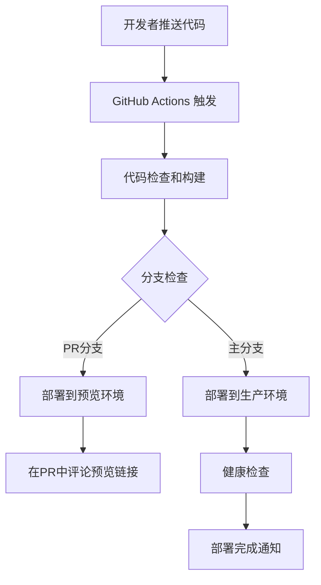

# 自动部署配置指南

## 概述

本项目使用 GitHub Actions + Vercel 实现自动化部署流程。当代码推送到主分支时，会自动触发构建和部署。

## 部署架构



## 配置步骤

### 1. Vercel 项目设置

#### 1.1 创建 Vercel 项目

1. 访问 [Vercel Dashboard](https://vercel.com/dashboard)
2. 点击 "New Project"
3. 选择 GitHub 仓库
4. 配置项目设置：
   - **Framework Preset**: Vite
   - **Root Directory**: `frontend`
   - **Build Command**: `npm run build`
   - **Output Directory**: `dist`

#### 1.2 获取 Vercel 配置信息

```bash
# 安装 Vercel CLI
npm i -g vercel

# 登录 Vercel
vercel login

# 在项目目录中链接项目
cd frontend
vercel link

# 获取项目信息
vercel project ls
```

记录以下信息：
- **VERCEL_ORG_ID**: 组织ID
- **VERCEL_PROJECT_ID**: 项目ID
- **VERCEL_TOKEN**: API Token

### 2. GitHub Secrets 配置

在 GitHub 仓库中设置以下 Secrets：

1. 进入仓库 **Settings** → **Secrets and variables** → **Actions**
2. 添加以下 Repository secrets：

| Secret Name | 描述 | 获取方式 |
|-------------|------|----------|
| `VERCEL_TOKEN` | Vercel API Token | [Vercel Settings](https://vercel.com/account/tokens) |
| `VERCEL_ORG_ID` | Vercel 组织ID | `vercel project ls` 或项目设置 |
| `VERCEL_PROJECT_ID` | Vercel 项目ID | `vercel project ls` 或项目设置 |

#### 2.1 获取 VERCEL_TOKEN

1. 访问 [Vercel Tokens](https://vercel.com/account/tokens)
2. 点击 "Create Token"
3. 设置 Token 名称（如：`github-actions`）
4. 选择适当的权限范围
5. 复制生成的 Token

#### 2.2 获取 VERCEL_ORG_ID 和 VERCEL_PROJECT_ID

```bash
# 方法1: 使用 Vercel CLI
vercel project ls

# 方法2: 查看 .vercel/project.json
cat .vercel/project.json
```

### 3. GitHub Actions 工作流

工作流文件位于 `.github/workflows/deploy.yml`，包含以下作业：

#### 3.1 构建和测试 (build-and-test)

- 代码检查 (ESLint)
- 类型检查 (TypeScript)
- 项目构建
- 构建产物上传

#### 3.2 预览部署 (deploy-preview)

- 触发条件：Pull Request
- 部署到 Vercel 预览环境
- 在 PR 中评论预览链接

#### 3.3 生产部署 (deploy-production)

- 触发条件：推送到 main/master 分支
- 部署到 Vercel 生产环境
- 创建部署状态

#### 3.4 健康检查 (health-check)

- 部署后验证
- 发送成功通知

## 部署流程

### 开发流程

1. **功能开发**
   ```bash
   git checkout -b feature/new-feature
   # 开发代码
   git add .
   git commit -m "Add new feature"
   git push origin feature/new-feature
   ```

2. **创建 Pull Request**
   - GitHub Actions 自动运行测试
   - 部署到预览环境
   - 在 PR 中显示预览链接

3. **代码审查和合并**
   ```bash
   git checkout main
   git merge feature/new-feature
   git push origin main
   ```

4. **自动生产部署**
   - GitHub Actions 自动部署到生产环境
   - 健康检查验证
   - 部署完成通知

### 手动部署

如需手动部署，可以使用 Vercel CLI：

```bash
# 部署到预览环境
vercel

# 部署到生产环境
vercel --prod
```

## 环境配置

### 预览环境

- **URL**: `https://project-name-git-branch-username.vercel.app`
- **用途**: PR 预览、功能测试
- **环境变量**: 使用开发环境配置

### 生产环境

- **URL**: `https://project-name.vercel.app`
- **用途**: 正式环境
- **环境变量**: 使用生产环境配置

## 监控和日志

### GitHub Actions 日志

1. 进入仓库 **Actions** 标签
2. 选择对应的工作流运行
3. 查看详细日志

### Vercel 部署日志

1. 访问 [Vercel Dashboard](https://vercel.com/dashboard)
2. 选择项目
3. 查看 **Deployments** 和 **Functions** 日志

### 部署状态检查

```bash
# 检查最新部署状态
vercel ls

# 查看部署详情
vercel inspect <deployment-url>

# 查看构建日志
vercel logs <deployment-url>
```

## 故障排除

### 常见问题

1. **构建失败**
   - 检查 package.json 依赖
   - 查看 GitHub Actions 日志
   - 验证 TypeScript 类型

2. **部署失败**
   - 检查 Vercel Secrets 配置
   - 验证环境变量
   - 查看 Vercel 部署日志

3. **环境变量问题**
   - 确认变量名以 `VITE_` 开头
   - 检查 Vercel 项目设置
   - 验证 vercel.json 配置

### 调试命令

```bash
# 本地构建测试
cd frontend
npm run build
npm run preview

# 检查 Vercel 配置
vercel env ls
vercel project ls

# 查看部署历史
vercel ls --scope=team-name
```

## 安全最佳实践

1. **Secrets 管理**
   - 定期轮换 API Token
   - 使用最小权限原则
   - 不在代码中硬编码敏感信息

2. **分支保护**
   - 启用分支保护规则
   - 要求 PR 审查
   - 要求状态检查通过

3. **部署验证**
   - 实施健康检查
   - 监控部署状态
   - 设置告警通知

## 性能优化

1. **构建优化**
   - 使用缓存加速构建
   - 并行执行作业
   - 优化依赖安装

2. **部署优化**
   - 使用预构建模式
   - 启用增量部署
   - 配置 CDN 缓存

## 扩展配置

### 多环境部署

可以配置多个环境（开发、测试、生产）：

```yaml
# .github/workflows/deploy-staging.yml
name: Deploy to Staging

on:
  push:
    branches:
      - develop

# 类似的配置，但部署到测试环境
```

### 自定义域名

在 Vercel 项目设置中配置自定义域名：

1. 进入项目 **Settings** → **Domains**
2. 添加自定义域名
3. 配置 DNS 记录
4. 启用 HTTPS

### 通知集成

可以集成 Slack、Discord 等通知服务：

```yaml
- name: Notify Slack
  uses: 8398a7/action-slack@v3
  with:
    status: ${{ job.status }}
    webhook_url: ${{ secrets.SLACK_WEBHOOK }}
```