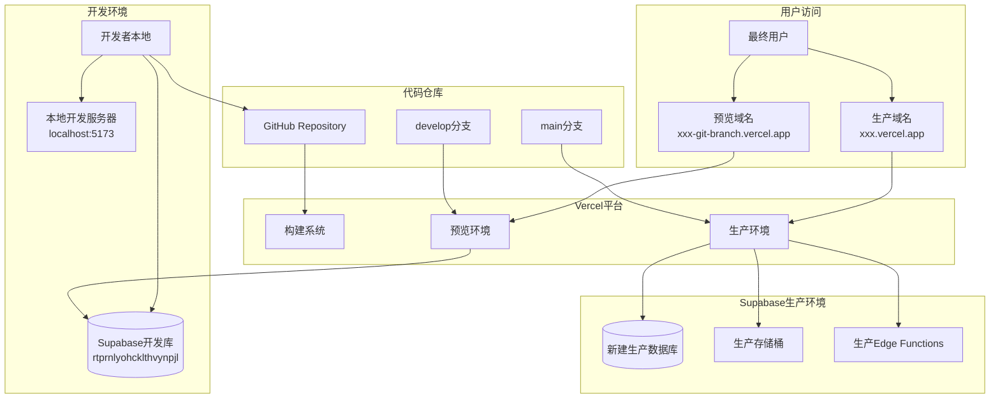
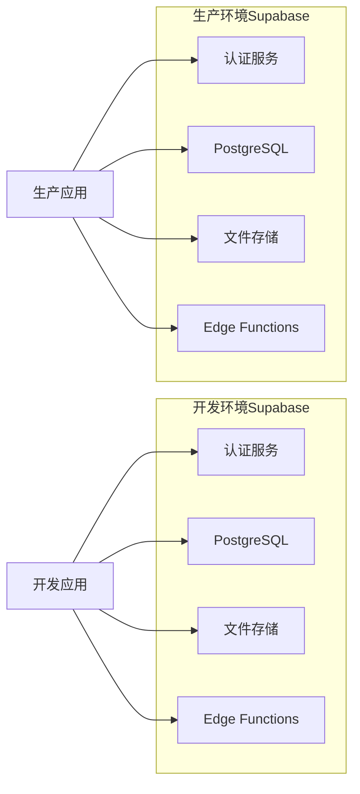
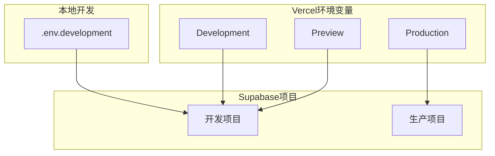
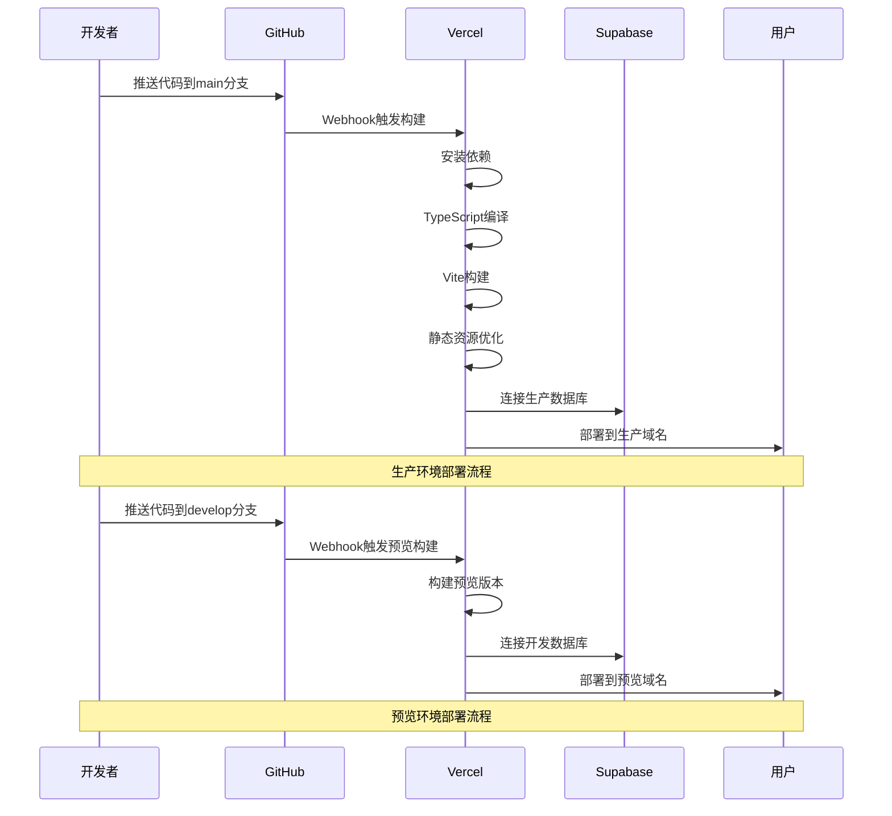

# 网站部署架构设计文档

## 整体架构图



## 分层设计

### 1. 代码管理层

#### GitHub仓库结构
```
网站测试/
├── .github/
│   └── workflows/
│       ├── deploy-production.yml
│       └── deploy-preview.yml
├── frontend/
│   ├── .env.example
│   ├── .env.development
│   ├── .env.production
│   └── vercel.json
└── docs/
```

#### 分支策略
- **main分支**: 生产环境部署源
- **develop分支**: 开发环境和预览部署源
- **feature分支**: 功能开发分支

### 2. 构建部署层

#### Vercel配置架构
```json
{
  "builds": [
    {
      "src": "frontend/package.json",
      "use": "@vercel/node"
    }
  ],
  "routes": [
    {
      "src": "/(.*)",
      "dest": "/frontend/$1"
    }
  ],
  "env": {
    "NODE_ENV": "production"
  }
}
```

#### 构建流程
1. **代码推送** → GitHub Webhook
2. **触发构建** → Vercel构建系统
3. **环境检测** → 根据分支选择环境变量
4. **依赖安装** → npm install
5. **TypeScript编译** → tsc -b
6. **Vite构建** → vite build
7. **静态资源优化** → 压缩、CDN分发
8. **部署发布** → 域名绑定

### 3. 数据服务层

#### Supabase架构设计



#### 数据库迁移策略
1. **结构迁移**: 复制表结构和索引
2. **策略迁移**: 复制RLS策略
3. **函数迁移**: 复制存储过程和触发器
4. **权限配置**: 设置访问权限

### 4. 环境配置层

#### 环境变量管理



## 核心组件设计

### 1. 环境检测组件

```typescript
// src/config/environment.ts
export const getEnvironmentConfig = () => {
  const env = import.meta.env.VITE_APP_ENV || 'development';
  
  return {
    isDevelopment: env === 'development',
    isProduction: env === 'production',
    supabaseUrl: import.meta.env.VITE_SUPABASE_URL,
    supabaseAnonKey: import.meta.env.VITE_SUPABASE_ANON_KEY,
    appTitle: import.meta.env.VITE_APP_TITLE,
    appDescription: import.meta.env.VITE_APP_DESCRIPTION
  };
};
```

### 2. 构建配置组件

```typescript
// vite.config.ts 环境适配
export default defineConfig(({ mode }) => {
  const env = loadEnv(mode, process.cwd(), '');
  
  return {
    // 根据环境调整构建配置
    build: {
      sourcemap: mode === 'development',
      minify: mode === 'production' ? 'esbuild' : false,
    },
    define: {
      __APP_ENV__: JSON.stringify(mode)
    }
  };
});
```

### 3. 部署验证组件

```typescript
// src/utils/deploymentCheck.ts
export const verifyDeployment = async () => {
  const checks = [
    checkSupabaseConnection(),
    checkEnvironmentVariables(),
    checkAPIEndpoints(),
    checkStaticAssets()
  ];
  
  const results = await Promise.allSettled(checks);
  return results.every(result => result.status === 'fulfilled');
};
```

## 接口契约定义

### 1. 环境配置接口

```typescript
interface EnvironmentConfig {
  supabaseUrl: string;
  supabaseAnonKey: string;
  appEnv: 'development' | 'production';
  appTitle: string;
  appDescription: string;
}

interface DeploymentConfig {
  buildCommand: string;
  outputDirectory: string;
  nodeVersion: string;
  environmentVariables: Record<string, string>;
}
```

### 2. 部署状态接口

```typescript
interface DeploymentStatus {
  environment: 'development' | 'preview' | 'production';
  status: 'building' | 'ready' | 'error';
  url: string;
  buildTime: number;
  lastDeployed: Date;
}

interface HealthCheck {
  database: boolean;
  storage: boolean;
  functions: boolean;
  frontend: boolean;
}
```

## 数据流向图



## 异常处理策略

### 1. 构建失败处理
- **依赖安装失败**: 清除缓存重试
- **TypeScript编译错误**: 停止构建，返回错误信息
- **Vite构建失败**: 检查配置，提供修复建议

### 2. 部署失败处理
- **环境变量缺失**: 提示配置缺失的变量
- **数据库连接失败**: 检查Supabase配置
- **静态资源加载失败**: 回滚到上一个稳定版本

### 3. 运行时错误处理
- **API请求失败**: 实现重试机制
- **数据库查询错误**: 提供友好错误提示
- **认证失败**: 重定向到登录页面

## 性能优化策略

### 1. 构建优化
- **代码分割**: 按路由和组件分割
- **Tree Shaking**: 移除未使用代码
- **资源压缩**: Gzip/Brotli压缩
- **缓存策略**: 构建缓存和CDN缓存

### 2. 运行时优化
- **懒加载**: 路由和组件懒加载
- **预加载**: 关键资源预加载
- **缓存策略**: API响应缓存
- **图片优化**: WebP格式和响应式图片

### 3. 数据库优化
- **连接池**: 配置合适的连接池大小
- **查询优化**: 使用索引和查询优化
- **缓存策略**: Redis缓存热点数据

## 安全策略

### 1. 环境变量安全
- 敏感信息使用Vercel环境变量
- 不在代码中硬编码密钥
- 定期轮换API密钥

### 2. 数据库安全
- 启用行级安全(RLS)
- 配置适当的访问策略
- 定期备份数据

### 3. 网络安全
- 强制HTTPS访问
- 配置CORS策略
- 实现请求限流

---

**设计状态**: ✅ 已完成
**创建时间**: 2024年1月
**文档版本**: v1.0
**下一阶段**: 任务原子化