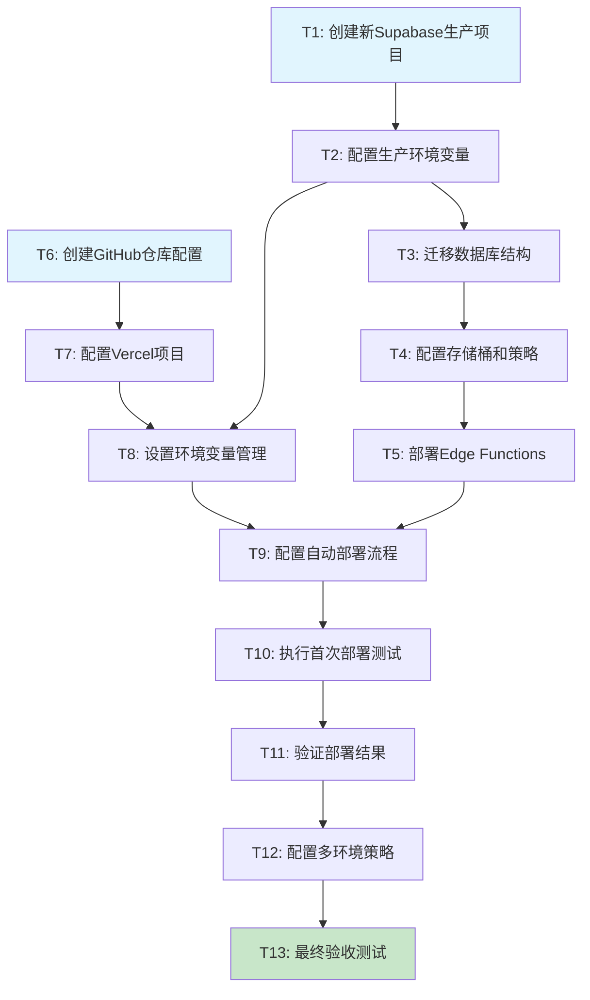

# 网站部署任务拆分文档

## 任务依赖图

## 原子任务详细定义

### T1: 创建新Supabase生产项目

#### 输入契约
- **前置依赖**: 无
- **输入数据**: Supabase账户访问权限
- **环境依赖**: 网络连接，Supabase CLI

#### 输出契约
- **输出数据**: 
  - 新项目URL
  - 新项目API密钥
  - 项目ID
- **交付物**: 
  - Supabase项目配置文档
  - 项目访问凭证
- **验收标准**: 
  - 项目创建成功
  - 可以通过API访问
  - 项目仪表板可访问

#### 实现约束
- **技术栈**: Supabase Web Console或CLI
- **接口规范**: Supabase Management API
- **质量要求**: 项目配置正确，权限设置合理

#### 依赖关系
- **后置任务**: T2, T3, T4, T5
- **并行任务**: T6

---

### T2: 配置生产环境变量

#### 输入契约
- **前置依赖**: T1完成
- **输入数据**: 
  - 新Supabase项目URL和密钥
  - 应用配置信息
- **环境依赖**: 项目文件系统访问

#### 输出契约
- **输出数据**: 
  - `.env.production`文件
  - 环境变量配置清单
- **交付物**: 
  - 生产环境配置文件
  - 环境变量文档
- **验收标准**: 
  - 所有必需变量已配置
  - 变量值格式正确
  - 安全性检查通过

#### 实现约束
- **技术栈**: 文件系统操作
- **接口规范**: 环境变量命名规范
- **质量要求**: 敏感信息不泄露，配置完整

#### 依赖关系
- **前置任务**: T1
- **后置任务**: T3, T8
- **并行任务**: 无

---

### T3: 迁移数据库结构

#### 输入契约
- **前置依赖**: T1, T2完成
- **输入数据**: 
  - 现有数据库结构
  - 迁移脚本
  - 生产项目连接信息
- **环境依赖**: Supabase CLI，数据库访问权限

#### 输出契约
- **输出数据**: 
  - 迁移执行日志
  - 数据库结构对比报告
- **交付物**: 
  - 完整的生产数据库结构
  - 迁移执行记录
- **验收标准**: 
  - 所有表结构正确创建
  - 索引和约束正确设置
  - RLS策略正确配置

#### 实现约束
- **技术栈**: Supabase CLI, PostgreSQL
- **接口规范**: SQL DDL标准
- **质量要求**: 数据完整性，性能优化

#### 依赖关系
- **前置任务**: T1, T2
- **后置任务**: T4
- **并行任务**: 无

---

### T4: 配置存储桶和策略

#### 输入契约
- **前置依赖**: T3完成
- **输入数据**: 
  - 存储桶配置需求
  - 访问策略定义
- **环境依赖**: Supabase项目管理权限

#### 输出契约
- **输出数据**: 
  - 存储桶配置状态
  - 策略配置清单
- **交付物**: 
  - 配置完成的存储桶
  - 访问策略文档
- **验收标准**: 
  - 存储桶创建成功
  - 上传下载功能正常
  - 访问权限正确设置

#### 实现约束
- **技术栈**: Supabase Storage API
- **接口规范**: Supabase Storage策略语法
- **质量要求**: 安全性，可用性

#### 依赖关系
- **前置任务**: T3
- **后置任务**: T5
- **并行任务**: 无

---

### T5: 部署Edge Functions

#### 输入契约
- **前置依赖**: T4完成
- **输入数据**: 
  - Edge Functions源代码
  - 函数配置文件
- **环境依赖**: Supabase CLI，Deno运行时

#### 输出契约
- **输出数据**: 
  - 函数部署状态
  - 函数调用端点
- **交付物**: 
  - 部署完成的Edge Functions
  - 函数调用文档
- **验收标准**: 
  - 函数部署成功
  - 函数调用正常
  - 错误处理正确

#### 实现约束
- **技术栈**: Deno, TypeScript
- **接口规范**: Supabase Edge Functions API
- **质量要求**: 性能优化，错误处理

#### 依赖关系
- **前置任务**: T4
- **后置任务**: T9
- **并行任务**: T6, T7, T8

---

### T6: 创建GitHub仓库配置

#### 输入契约
- **前置依赖**: 无
- **输入数据**: 
  - 项目源代码
  - 部署配置需求
- **环境依赖**: GitHub账户，Git工具

#### 输出契约
- **输出数据**: 
  - GitHub仓库URL
  - 分支结构
- **交付物**: 
  - 配置完成的GitHub仓库
  - 分支保护规则
- **验收标准**: 
  - 代码推送成功
  - 分支策略正确
  - Webhook配置就绪

#### 实现约束
- **技术栈**: Git, GitHub API
- **接口规范**: GitHub REST API
- **质量要求**: 代码安全，版本控制

#### 依赖关系
- **前置任务**: 无
- **后置任务**: T7
- **并行任务**: T1, T2, T3, T4, T5

---

### T7: 配置Vercel项目

#### 输入契约
- **前置依赖**: T6完成
- **输入数据**: 
  - GitHub仓库信息
  - 构建配置
- **环境依赖**: Vercel账户，CLI工具

#### 输出契约
- **输出数据**: 
  - Vercel项目ID
  - 项目配置信息
- **交付物**: 
  - 配置完成的Vercel项目
  - 构建配置文件
- **验收标准**: 
  - 项目创建成功
  - GitHub集成正常
  - 构建配置正确

#### 实现约束
- **技术栈**: Vercel CLI, Node.js
- **接口规范**: Vercel API
- **质量要求**: 构建效率，部署稳定性

#### 依赖关系
- **前置任务**: T6
- **后置任务**: T8
- **并行任务**: T1, T2, T3, T4, T5

---

### T8: 设置环境变量管理

#### 输入契约
- **前置依赖**: T2, T7完成
- **输入数据**: 
  - 生产环境变量
  - 开发环境变量
  - Vercel项目配置
- **环境依赖**: Vercel CLI，项目管理权限

#### 输出契约
- **输出数据**: 
  - 环境变量配置状态
  - 变量映射关系
- **交付物**: 
  - 完整的环境变量配置
  - 环境隔离策略
- **验收标准**: 
  - 所有环境变量正确设置
  - 环境隔离有效
  - 敏感信息安全存储

#### 实现约束
- **技术栈**: Vercel CLI
- **接口规范**: Vercel环境变量API
- **质量要求**: 安全性，可维护性

#### 依赖关系
- **前置任务**: T2, T7
- **后置任务**: T9
- **并行任务**: T5

---

### T9: 配置自动部署流程

#### 输入契约
- **前置依赖**: T5, T8完成
- **输入数据**: 
  - GitHub仓库配置
  - Vercel项目配置
  - 部署策略定义
- **环境依赖**: GitHub Actions，Vercel集成

#### 输出契约
- **输出数据**: 
  - 部署流程配置
  - Webhook配置状态
- **交付物**: 
  - 自动部署工作流
  - 部署通知配置
- **验收标准**: 
  - 推送触发部署正常
  - 构建流程无错误
  - 部署状态通知正常

#### 实现约束
- **技术栈**: GitHub Actions, Vercel CLI
- **接口规范**: GitHub Actions语法
- **质量要求**: 自动化程度，错误处理

#### 依赖关系
- **前置任务**: T5, T8
- **后置任务**: T10
- **并行任务**: 无

---

### T10: 执行首次部署测试

#### 输入契约
- **前置依赖**: T9完成
- **输入数据**: 
  - 完整的部署配置
  - 测试用例清单
- **环境依赖**: 网络连接，测试环境

#### 输出契约
- **输出数据**: 
  - 部署测试结果
  - 性能测试报告
- **交付物**: 
  - 部署成功的应用
  - 测试执行报告
- **验收标准**: 
  - 部署过程无错误
  - 应用功能正常
  - 性能指标达标

#### 实现约束
- **技术栈**: 自动化测试工具
- **接口规范**: HTTP/HTTPS协议
- **质量要求**: 全面性，准确性

#### 依赖关系
- **前置任务**: T9
- **后置任务**: T11
- **并行任务**: 无

---

### T11: 验证部署结果

#### 输入契约
- **前置依赖**: T10完成
- **输入数据**: 
  - 部署后的应用
  - 验证检查清单
- **环境依赖**: 浏览器，测试工具

#### 输出契约
- **输出数据**: 
  - 功能验证报告
  - 问题清单
- **交付物**: 
  - 验证通过的应用
  - 问题修复记录
- **验收标准**: 
  - 所有核心功能正常
  - 用户体验良好
  - 安全检查通过

#### 实现约束
- **技术栈**: 浏览器测试，API测试
- **接口规范**: Web标准
- **质量要求**: 用户体验，功能完整性

#### 依赖关系
- **前置任务**: T10
- **后置任务**: T12
- **并行任务**: 无

---

### T12: 配置多环境策略

#### 输入契约
- **前置依赖**: T11完成
- **输入数据**: 
  - 验证通过的配置
  - 环境策略需求
- **环境依赖**: 管理员权限

#### 输出契约
- **输出数据**: 
  - 环境策略配置
  - 切换流程文档
- **交付物**: 
  - 多环境管理系统
  - 操作手册
- **验收标准**: 
  - 环境切换正常
  - 数据隔离有效
  - 权限控制正确

#### 实现约束
- **技术栈**: 环境管理工具
- **接口规范**: 环境配置标准
- **质量要求**: 稳定性，安全性

#### 依赖关系
- **前置任务**: T11
- **后置任务**: T13
- **并行任务**: 无

---

### T13: 最终验收测试

#### 输入契约
- **前置依赖**: T12完成
- **输入数据**: 
  - 完整的部署系统
  - 验收测试用例
- **环境依赖**: 完整的测试环境

#### 输出契约
- **输出数据**: 
  - 最终验收报告
  - 部署交付清单
- **交付物**: 
  - 生产就绪的应用
  - 完整的部署文档
- **验收标准**: 
  - 所有功能验收通过
  - 性能指标达标
  - 安全检查通过
  - 文档完整准确

#### 实现约束
- **技术栈**: 综合测试工具
- **接口规范**: 验收测试标准
- **质量要求**: 生产级别质量

#### 依赖关系
- **前置任务**: T12
- **后置任务**: 无
- **并行任务**: 无

## 复杂度评估

| 任务ID | 复杂度 | 预估时间 | 风险等级 | 关键程度 |
|--------|--------|----------|----------|----------|
| T1     | 低     | 30分钟   | 低       | 高       |
| T2     | 低     | 20分钟   | 低       | 高       |
| T3     | 中     | 45分钟   | 中       | 高       |
| T4     | 中     | 30分钟   | 中       | 中       |
| T5     | 中     | 40分钟   | 中       | 中       |
| T6     | 低     | 25分钟   | 低       | 高       |
| T7     | 低     | 30分钟   | 低       | 高       |
| T8     | 中     | 35分钟   | 中       | 高       |
| T9     | 高     | 60分钟   | 高       | 高       |
| T10    | 中     | 40分钟   | 中       | 高       |
| T11    | 中     | 50分钟   | 中       | 高       |
| T12    | 中     | 35分钟   | 中       | 中       |
| T13    | 高     | 45分钟   | 低       | 高       |

**总预估时间**: 约6-7小时
**关键路径**: T1→T2→T3→T4→T5→T9→T10→T11→T12→T13

---

**任务状态**: ✅ 已拆分
**创建时间**: 2024年1月
**文档版本**: v1.0
**下一阶段**: 审批确认