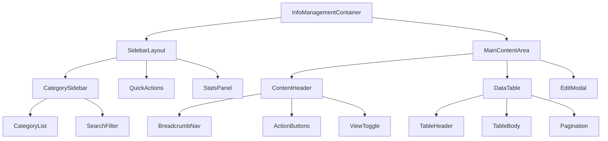
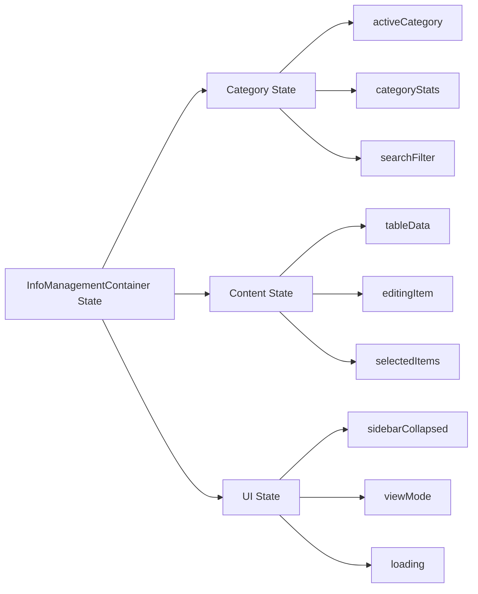
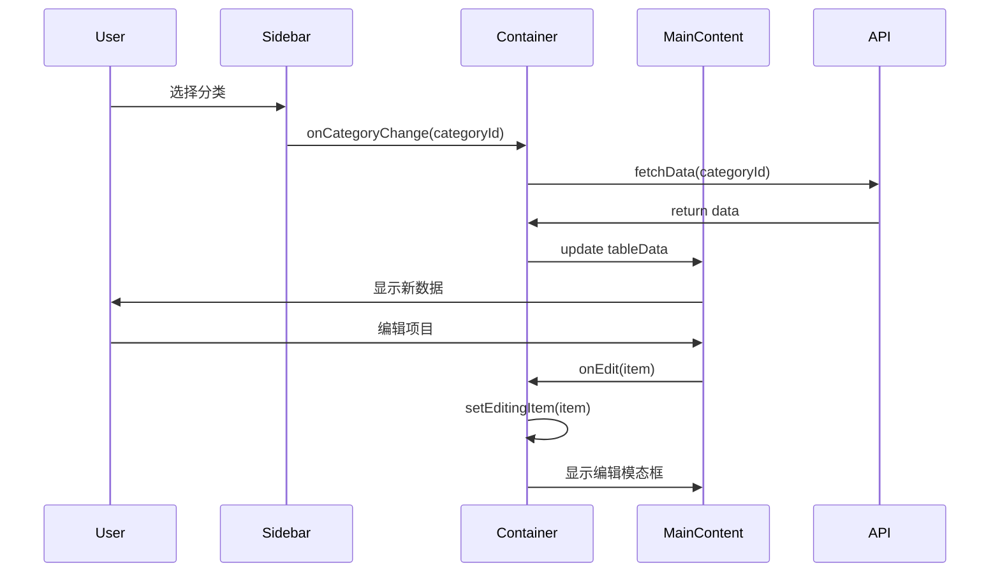

# DESIGN_信息管理布局优化

## 整体架构设计

### 1. 架构概览



### 2. 组件分层架构

#### 2.1 容器层 (Container Layer)
- **InfoManagementContainer**: 主容器组件，负责状态管理和数据流
- **SidebarLayout**: 侧边栏布局容器
- **MainContentArea**: 主内容区域容器

#### 2.2 功能层 (Feature Layer)
- **CategorySidebar**: 分类侧边栏组件
- **ContentHeader**: 内容头部组件
- **DataTable**: 数据表格组件
- **EditModal**: 编辑模态框组件

#### 2.3 UI层 (UI Layer)
- **CategoryList**: 分类列表
- **SearchFilter**: 搜索过滤器
- **QuickActions**: 快速操作按钮
- **StatsPanel**: 统计面板
- **BreadcrumbNav**: 面包屑导航
- **ActionButtons**: 操作按钮组
- **ViewToggle**: 视图切换器

## 核心组件设计

### 1. SidebarLayout 组件

```typescript
interface SidebarLayoutProps {
  categories: CategoryItem[];
  activeCategory: string;
  onCategoryChange: (category: string) => void;
  stats: CategoryStats;
  quickActions: QuickAction[];
  isCollapsed?: boolean;
  onToggleCollapse?: () => void;
}

interface CategoryItem {
  id: string;
  name: string;
  icon: string;
  count: number;
  color?: string;
}

interface CategoryStats {
  total: number;
  active: number;
  draft: number;
  archived: number;
}

interface QuickAction {
  id: string;
  label: string;
  icon: string;
  action: () => void;
  variant?: 'primary' | 'secondary' | 'danger';
}
```

### 2. MainContentArea 组件

```typescript
interface MainContentAreaProps {
  title: string;
  breadcrumbs: BreadcrumbItem[];
  actions: ActionButton[];
  viewMode: 'table' | 'grid' | 'list';
  onViewModeChange: (mode: ViewMode) => void;
  children: React.ReactNode;
}

interface BreadcrumbItem {
  label: string;
  href?: string;
  active?: boolean;
}

interface ActionButton {
  id: string;
  label: string;
  icon?: string;
  variant: 'primary' | 'secondary' | 'outline';
  onClick: () => void;
  disabled?: boolean;
}
```

### 3. CategorySidebar 组件

```typescript
interface CategorySidebarProps {
  categories: CategoryItem[];
  activeCategory: string;
  onCategorySelect: (categoryId: string) => void;
  searchValue: string;
  onSearchChange: (value: string) => void;
  isCollapsed: boolean;
}
```

## 数据流设计

### 1. 状态管理架构



### 2. 数据流向



## 响应式设计

### 1. 断点设计

```typescript
const breakpoints = {
  mobile: '768px',
  tablet: '1024px',
  desktop: '1280px',
  wide: '1536px'
};
```

### 2. 布局适配策略

#### 桌面端 (≥1024px)
- 侧边栏固定宽度: 280px
- 主内容区域: calc(100% - 280px)
- 侧边栏可折叠至 64px

#### 平板端 (768px - 1023px)
- 侧边栏覆盖模式
- 主内容区域: 100%
- 侧边栏宽度: 280px

#### 移动端 (<768px)
- 侧边栏抽屉模式
- 主内容区域: 100%
- 侧边栏全屏覆盖

## 性能优化策略

### 1. 组件优化
- 使用 React.memo 包装纯组件
- 使用 useMemo 缓存计算结果
- 使用 useCallback 缓存事件处理函数
- 虚拟滚动处理大数据列表

### 2. 数据优化
- 分页加载数据
- 搜索防抖处理
- 缓存分类统计数据
- 懒加载非关键组件

### 3. 渲染优化
- 条件渲染减少DOM节点
- CSS-in-JS按需加载样式
- 图标使用SVG sprite
- 骨架屏提升感知性能

## 接口契约定义

### 1. 组件接口

```typescript
// 主容器组件接口
interface InfoManagementContainerProps {
  initialCategory?: string;
  onCategoryChange?: (category: string) => void;
  customActions?: CustomAction[];
}

// 侧边栏组件接口
interface SidebarProps {
  categories: CategoryItem[];
  stats: CategoryStats;
  activeCategory: string;
  onCategoryChange: (category: string) => void;
  isCollapsed: boolean;
  onToggleCollapse: () => void;
}

// 主内容区组件接口
interface MainContentProps {
  category: string;
  data: TableData[];
  loading: boolean;
  onEdit: (item: TableData) => void;
  onDelete: (ids: string[]) => void;
  onAdd: () => void;
}
```

### 2. 数据接口

```typescript
// 分类数据接口
interface CategoryData {
  id: string;
  name: string;
  icon: string;
  description?: string;
  count: number;
  lastUpdated: string;
}

// 表格数据接口
interface TableData {
  id: string;
  title: string;
  status: 'active' | 'draft' | 'archived';
  category: string;
  createdAt: string;
  updatedAt: string;
  author?: string;
}

// API响应接口
interface ApiResponse<T> {
  data: T;
  total: number;
  page: number;
  pageSize: number;
  success: boolean;
  message?: string;
}
```

## 异常处理策略

### 1. 错误边界
- 组件级错误边界
- 全局错误处理
- 错误日志记录
- 用户友好的错误提示

### 2. 加载状态
- 骨架屏加载
- 按钮加载状态
- 数据加载指示器
- 网络错误重试机制

### 3. 数据验证
- 前端表单验证
- API数据格式验证
- 类型安全检查
- 边界条件处理

## 集成方案

### 1. 现有系统集成
- 复用现有的 useInfoManagement Hook
- 保持现有的 API 接口不变
- 兼容现有的数据格式
- 渐进式迁移策略

### 2. 样式集成
- 使用项目现有的 Tailwind CSS
- 保持现有的设计系统
- 复用现有的组件库
- 统一的主题配置

### 3. 路由集成
- 保持现有的路由结构
- 支持深度链接
- 浏览器历史记录管理
- URL状态同步

## 技术约束确认

### 1. 技术栈约束
- React 18+ with TypeScript
- Tailwind CSS for styling
- 现有的组件库和工具
- Supabase 数据库集成

### 2. 性能约束
- 首屏加载时间 < 2s
- 交互响应时间 < 100ms
- 内存使用优化
- 移动端性能优化

### 3. 兼容性约束
- 现代浏览器支持
- 移动端响应式
- 无障碍访问支持
- SEO友好

## 验收标准

### 1. 功能验收
- [ ] 侧边栏分类切换正常
- [ ] 主内容区数据显示正确
- [ ] 搜索过滤功能正常
- [ ] 编辑添加功能完整
- [ ] 批量操作功能正常

### 2. 性能验收
- [ ] 首屏加载时间达标
- [ ] 交互响应时间达标
- [ ] 内存使用合理
- [ ] 移动端性能良好

### 3. 用户体验验收
- [ ] 界面布局合理
- [ ] 操作流程顺畅
- [ ] 错误处理友好
- [ ] 响应式设计完善

### 4. 代码质量验收
- [ ] TypeScript类型完整
- [ ] 组件结构清晰
- [ ] 代码复用性好
- [ ] 测试覆盖充分

---

**文档版本**: 1.0  
**创建时间**: 2024-12-18  
**最后更新**: 2024-12-18  
**负责人**: AI Assistant