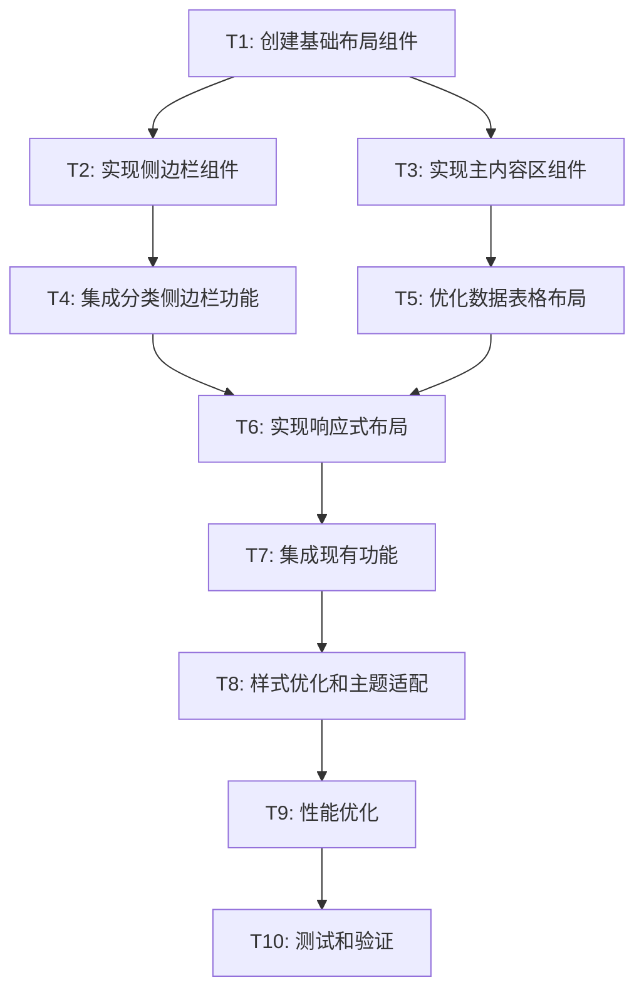

# TASK_信息管理布局优化

## 任务拆分概览

基于DESIGN文档，将信息管理布局优化拆分为以下原子任务，按依赖关系排序执行。

## 任务依赖关系图

## 原子任务详细定义

### T1: 创建基础布局组件

**任务描述**: 创建新的布局容器组件，建立侧边栏+主内容区的基础架构

**输入契约**:
- 前置依赖: 无
- 输入数据: DESIGN文档中的组件架构设计
- 环境依赖: React + TypeScript + Tailwind CSS

**输出契约**:
- 输出数据: 
  - `SidebarLayout.tsx` - 侧边栏布局容器
  - `MainContentArea.tsx` - 主内容区容器
  - `LayoutContainer.tsx` - 整体布局容器
- 交付物: 基础布局组件文件
- 验收标准: 
  - 组件可正常渲染
  - TypeScript类型定义完整
  - 基础样式应用正确
  - 响应式断点预留

**实现约束**:
- 技术栈: React 18+ + TypeScript + Tailwind CSS
- 接口规范: 遵循DESIGN文档中的接口定义
- 质量要求: 组件纯函数化，支持props传递

**依赖关系**:
- 后置任务: T2, T3
- 并行任务: 无

---

### T2: 实现侧边栏组件

**任务描述**: 实现分类侧边栏，包括分类列表、搜索过滤、统计面板和快速操作

**输入契约**:
- 前置依赖: T1完成
- 输入数据: 
  - SidebarLayout组件
  - 现有的分类数据结构
  - 统计数据接口
- 环境依赖: 现有的useInfoManagement Hook

**输出契约**:
- 输出数据:
  - `CategorySidebar.tsx` - 分类侧边栏主组件
  - `CategoryList.tsx` - 分类列表组件
  - `SearchFilter.tsx` - 搜索过滤组件
  - `StatsPanel.tsx` - 统计面板组件
  - `QuickActions.tsx` - 快速操作组件
- 交付物: 侧边栏功能组件
- 验收标准:
  - 分类切换功能正常
  - 搜索过滤实时响应
  - 统计数据正确显示
  - 快速操作按钮可用
  - 折叠/展开功能正常

**实现约束**:
- 技术栈: 复用现有的数据获取逻辑
- 接口规范: 保持与现有API的兼容性
- 质量要求: 搜索防抖处理，状态管理清晰

**依赖关系**:
- 前置任务: T1
- 后置任务: T4, T6
- 并行任务: T3

---

### T3: 实现主内容区组件

**任务描述**: 重构主内容区域，优化头部导航和内容展示区域

**输入契约**:
- 前置依赖: T1完成
- 输入数据:
  - MainContentArea组件
  - 现有的DataTable组件
  - 面包屑导航需求
- 环境依赖: 现有的表格数据和编辑功能

**输出契约**:
- 输出数据:
  - `ContentHeader.tsx` - 内容头部组件
  - `BreadcrumbNav.tsx` - 面包屑导航
  - `ActionButtons.tsx` - 操作按钮组
  - `ViewToggle.tsx` - 视图切换器
- 交付物: 主内容区功能组件
- 验收标准:
  - 面包屑导航正确显示当前位置
  - 操作按钮功能完整
  - 视图切换功能预留
  - 与现有DataTable集成良好

**实现约束**:
- 技术栈: 保持现有组件的API不变
- 接口规范: 兼容现有的事件处理函数
- 质量要求: 组件解耦，易于扩展

**依赖关系**:
- 前置任务: T1
- 后置任务: T5, T6
- 并行任务: T2

---

### T4: 集成分类侧边栏功能

**任务描述**: 将侧边栏组件与现有的数据管理逻辑集成

**输入契约**:
- 前置依赖: T2完成
- 输入数据:
  - 完成的侧边栏组件
  - 现有的useInfoManagement Hook
  - 分类数据和统计逻辑
- 环境依赖: Supabase数据库连接

**输出契约**:
- 输出数据:
  - 集成后的侧边栏功能
  - 分类切换的数据流
  - 统计数据的实时更新
- 交付物: 功能完整的侧边栏
- 验收标准:
  - 分类切换触发数据重新加载
  - 统计数据实时更新
  - 搜索功能正常工作
  - 快速操作功能完整

**实现约束**:
- 技术栈: 使用现有的数据获取和状态管理
- 接口规范: 保持API调用的一致性
- 质量要求: 错误处理完善，加载状态清晰

**依赖关系**:
- 前置任务: T2
- 后置任务: T6, T7
- 并行任务: T5

---

### T5: 优化数据表格布局

**任务描述**: 优化现有DataTable组件，适配新的主内容区布局

**输入契约**:
- 前置依赖: T3完成
- 输入数据:
  - 现有的DataTable组件
  - 新的主内容区布局
  - 表格数据和操作逻辑
- 环境依赖: 现有的表格功能和样式

**输出契约**:
- 输出数据:
  - 优化后的DataTable组件
  - 改进的表格头部
  - 优化的分页组件
- 交付物: 适配新布局的表格组件
- 验收标准:
  - 表格在新布局中显示正常
  - 所有现有功能保持不变
  - 响应式表现良好
  - 性能无明显下降

**实现约束**:
- 技术栈: 保持现有的表格逻辑不变
- 接口规范: 维持现有的props接口
- 质量要求: 向后兼容，渐进式改进

**依赖关系**:
- 前置任务: T3
- 后置任务: T6, T7
- 并行任务: T4

---

### T6: 实现响应式布局

**任务描述**: 实现完整的响应式设计，支持桌面、平板、移动端

**输入契约**:
- 前置依赖: T4, T5完成
- 输入数据:
  - 完成的侧边栏和主内容区组件
  - DESIGN文档中的响应式规范
  - 断点设计要求
- 环境依赖: Tailwind CSS响应式工具类

**输出契约**:
- 输出数据:
  - 响应式布局样式
  - 移动端侧边栏抽屉
  - 平板端覆盖模式
  - 桌面端固定布局
- 交付物: 全设备适配的布局
- 验收标准:
  - 桌面端侧边栏可折叠
  - 平板端侧边栏覆盖模式
  - 移动端抽屉式侧边栏
  - 所有断点下功能正常

**实现约束**:
- 技术栈: Tailwind CSS响应式类
- 接口规范: 保持组件API的一致性
- 质量要求: 流畅的动画过渡，性能优化

**依赖关系**:
- 前置任务: T4, T5
- 后置任务: T7, T8
- 并行任务: 无

---

### T7: 集成现有功能

**任务描述**: 将新布局与现有的所有功能进行集成测试和调整

**输入契约**:
- 前置依赖: T6完成
- 输入数据:
  - 完整的新布局组件
  - 现有的所有功能模块
  - 编辑、删除、添加等操作
- 环境依赖: 完整的开发环境和数据

**输出契约**:
- 输出数据:
  - 完全集成的信息管理系统
  - 所有功能在新布局中正常工作
  - 数据流和状态管理优化
- 交付物: 功能完整的新版本
- 验收标准:
  - 所有CRUD操作正常
  - 批量操作功能完整
  - 搜索和过滤正常
  - 分页和排序正常
  - 模态框和确认对话框正常

**实现约束**:
- 技术栈: 保持现有技术栈不变
- 接口规范: 确保API调用的正确性
- 质量要求: 全面的功能测试，错误处理

**依赖关系**:
- 前置任务: T6
- 后置任务: T8, T9
- 并行任务: 无

---

### T8: 样式优化和主题适配

**任务描述**: 优化整体视觉效果，确保与现有设计系统一致

**输入契约**:
- 前置依赖: T7完成
- 输入数据:
  - 集成完成的布局系统
  - 现有的设计系统和主题
  - 品牌色彩和字体规范
- 环境依赖: Tailwind CSS配置和自定义样式

**输出契约**:
- 输出数据:
  - 优化的视觉样式
  - 统一的设计语言
  - 改进的用户体验
- 交付物: 视觉完善的布局系统
- 验收标准:
  - 视觉风格与现有系统一致
  - 色彩搭配和谐
  - 字体和间距规范
  - 交互反馈清晰
  - 无障碍访问支持

**实现约束**:
- 技术栈: Tailwind CSS + 现有样式系统
- 接口规范: 保持组件的样式API
- 质量要求: 设计一致性，用户体验优化

**依赖关系**:
- 前置任务: T7
- 后置任务: T9, T10
- 并行任务: 无

---

### T9: 性能优化

**任务描述**: 对新布局进行性能优化，确保加载速度和交互响应

**输入契约**:
- 前置依赖: T8完成
- 输入数据:
  - 完整的布局系统
  - 性能基准数据
  - 优化目标指标
- 环境依赖: 性能分析工具和测试环境

**输出契约**:
- 输出数据:
  - 性能优化的组件
  - 代码分割和懒加载
  - 缓存策略优化
- 交付物: 高性能的布局系统
- 验收标准:
  - 首屏加载时间 < 2s
  - 交互响应时间 < 100ms
  - 内存使用合理
  - 移动端性能良好
  - Bundle大小控制

**实现约束**:
- 技术栈: React性能优化技术
- 接口规范: 保持功能完整性
- 质量要求: 性能指标达标，用户体验流畅

**依赖关系**:
- 前置任务: T8
- 后置任务: T10
- 并行任务: 无

---

### T10: 测试和验证

**任务描述**: 全面测试新布局系统，确保质量和稳定性

**输入契约**:
- 前置依赖: T9完成
- 输入数据:
  - 完整的布局系统
  - 测试用例和验收标准
  - 各种设备和浏览器环境
- 环境依赖: 测试环境和真实数据

**输出契约**:
- 输出数据:
  - 测试报告
  - 问题修复记录
  - 验收确认文档
- 交付物: 经过验证的生产就绪系统
- 验收标准:
  - 所有功能测试通过
  - 响应式测试通过
  - 性能测试达标
  - 兼容性测试通过
  - 用户体验测试满意

**实现约束**:
- 技术栈: 现有的测试工具和方法
- 接口规范: 确保所有接口正常工作
- 质量要求: 零缺陷发布，文档完整

**依赖关系**:
- 前置任务: T9
- 后置任务: 无
- 并行任务: 无

## 实施计划

### 阶段1: 基础架构 (T1-T3)
- 预计时间: 2-3小时
- 关键里程碑: 基础布局组件完成
- 风险点: 组件架构设计的合理性

### 阶段2: 功能集成 (T4-T5)
- 预计时间: 2-3小时
- 关键里程碑: 侧边栏和表格功能完整
- 风险点: 数据流集成的复杂性

### 阶段3: 响应式和集成 (T6-T7)
- 预计时间: 2-3小时
- 关键里程碑: 全功能响应式布局
- 风险点: 响应式适配的兼容性

### 阶段4: 优化和验证 (T8-T10)
- 预计时间: 2-3小时
- 关键里程碑: 生产就绪的系统
- 风险点: 性能优化的效果

## 风险评估

### 高风险任务
- T6 (响应式布局): 多设备适配复杂性
- T7 (功能集成): 现有功能兼容性
- T9 (性能优化): 优化效果不确定性

### 缓解策略
- 分阶段测试和验证
- 保持现有功能的向后兼容
- 渐进式优化和回滚机制

## 质量保证

### 代码质量
- TypeScript类型安全
- ESLint代码规范检查
- 组件单元测试
- 代码审查流程

### 功能质量
- 功能测试用例
- 回归测试
- 用户验收测试
- 性能基准测试

---

**文档版本**: 1.0  
**创建时间**: 2024-12-18  
**最后更新**: 2024-12-18  
**负责人**: AI Assistant