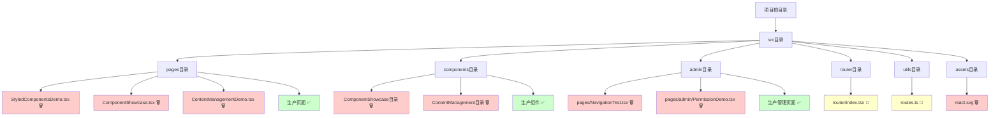
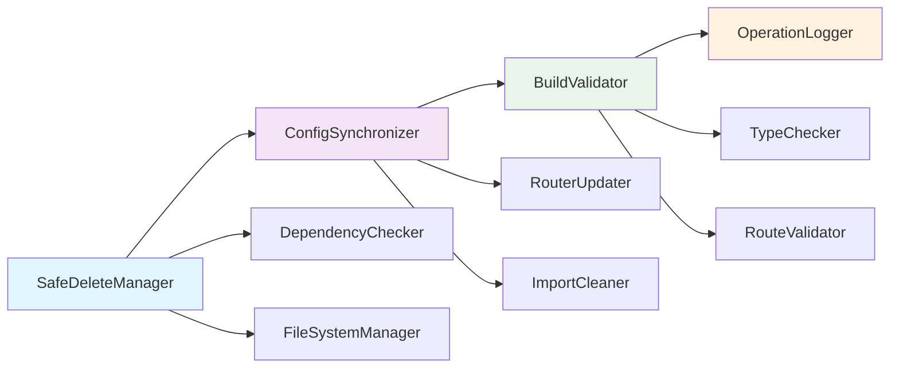
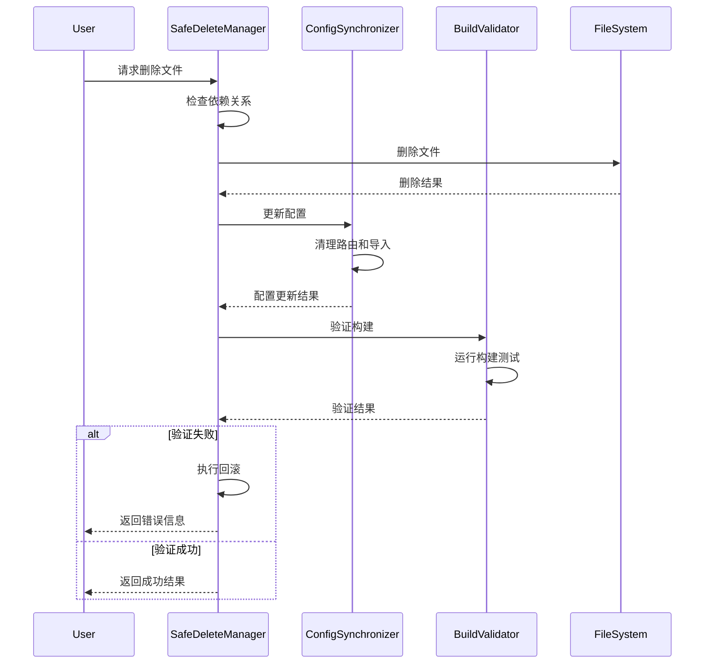

# 删除多余文件和代码 - 架构设计文档

## 整体架构图



**图例**:
- 🗑️ 需要删除的文件
- 🔄 需要修改的文件
- ✅ 保留的文件

## 分层设计

### 第一层: 文件删除层
**职责**: 安全删除演示和测试文件

**组件**:
- 演示页面删除器
- 测试页面删除器
- 资源文件清理器
- 空目录清理器

**原则**:
- 删除前验证依赖关系
- 分步执行，逐一验证
- 保持构建系统稳定

### 第二层: 配置更新层
**职责**: 同步更新相关配置文件

**组件**:
- 路由配置更新器
- 导入语句清理器
- 类型定义清理器

**原则**:
- 保持配置一致性
- 避免死链和死代码
- 维护类型安全

### 第三层: 验证测试层
**职责**: 确保删除操作不影响生产功能

**组件**:
- 构建验证器
- 功能完整性检查器
- 路由可达性验证器

**原则**:
- 每步操作后立即验证
- 全面的回归测试
- 快速问题定位

## 核心组件设计

### 1. 安全删除管理器
```typescript
interface SafeDeleteManager {
  // 检查文件依赖关系
  checkDependencies(filePath: string): Promise<string[]>;
  
  // 安全删除文件
  safeDelete(filePath: string): Promise<boolean>;
  
  // 批量删除文件
  batchDelete(filePaths: string[]): Promise<DeleteResult[]>;
  
  // 回滚删除操作
  rollback(operationId: string): Promise<boolean>;
}
```

### 2. 配置同步器
```typescript
interface ConfigSynchronizer {
  // 更新路由配置
  updateRouterConfig(removedRoutes: string[]): Promise<void>;
  
  // 清理导入语句
  cleanImports(filePath: string, removedModules: string[]): Promise<void>;
  
  // 验证配置一致性
  validateConfig(): Promise<ValidationResult>;
}
```

### 3. 构建验证器
```typescript
interface BuildValidator {
  // 运行构建测试
  runBuild(): Promise<BuildResult>;
  
  // 检查类型错误
  checkTypes(): Promise<TypeCheckResult>;
  
  // 验证路由可达性
  validateRoutes(): Promise<RouteValidationResult>;
}
```

## 模块依赖关系图



## 接口契约定义

### 删除操作接口
```typescript
interface DeleteOperation {
  id: string;
  type: 'file' | 'directory' | 'route' | 'import';
  target: string;
  dependencies: string[];
  riskLevel: 'low' | 'medium' | 'high';
  rollbackData?: any;
}

interface DeleteResult {
  success: boolean;
  operationId: string;
  message: string;
  affectedFiles: string[];
  warnings: string[];
}
```

### 验证结果接口
```typescript
interface ValidationResult {
  passed: boolean;
  errors: ValidationError[];
  warnings: ValidationWarning[];
  suggestions: string[];
}

interface BuildResult {
  success: boolean;
  exitCode: number;
  output: string;
  errors: string[];
  duration: number;
}
```

## 数据流向图



## 异常处理策略

### 异常分类
1. **依赖关系异常**: 文件被其他模块引用
2. **构建失败异常**: 删除后构建失败
3. **路由配置异常**: 路由更新失败
4. **文件系统异常**: 文件删除失败

### 处理策略
```typescript
class ExceptionHandler {
  // 依赖关系异常处理
  handleDependencyError(error: DependencyError): RecoveryAction {
    // 分析依赖关系，提供解决方案
    return {
      action: 'skip' | 'force' | 'resolve',
      message: string,
      suggestions: string[]
    };
  }
  
  // 构建失败异常处理
  handleBuildError(error: BuildError): RecoveryAction {
    // 自动回滚到上一个稳定状态
    return {
      action: 'rollback',
      targetState: string,
      message: string
    };
  }
}
```

## 安全删除策略

### 风险评估矩阵
| 文件类型 | 依赖风险 | 功能影响 | 删除优先级 | 验证要求 |
|---------|---------|---------|-----------|----------|
| 演示页面 | 低 | 无 | 高 | 基础验证 |
| 测试页面 | 低 | 无 | 高 | 基础验证 |
| 组件文件 | 中 | 低 | 中 | 完整验证 |
| 配置文件 | 高 | 高 | 低 | 严格验证 |
| 资源文件 | 低 | 无 | 中 | 基础验证 |

### 删除顺序策略
1. **第一阶段**: 删除独立的演示页面
2. **第二阶段**: 删除测试相关文件
3. **第三阶段**: 清理组件和资源文件
4. **第四阶段**: 更新配置文件
5. **第五阶段**: 最终验证和清理

### 回滚机制
```typescript
interface RollbackManager {
  // 创建检查点
  createCheckpoint(description: string): string;
  
  // 回滚到检查点
  rollbackToCheckpoint(checkpointId: string): Promise<boolean>;
  
  // 列出所有检查点
  listCheckpoints(): CheckpointInfo[];
  
  // 清理旧检查点
  cleanupCheckpoints(olderThan: Date): Promise<void>;
}
```

## 备份方案

### 备份策略
1. **Git提交备份**: 每个删除步骤单独提交
2. **文件系统备份**: 临时保存删除的文件
3. **配置备份**: 保存原始配置文件

### 备份实现
```typescript
class BackupManager {
  // 创建文件备份
  async backupFile(filePath: string): Promise<string> {
    const backupPath = `./backups/${Date.now()}_${path.basename(filePath)}`;
    await fs.copyFile(filePath, backupPath);
    return backupPath;
  }
  
  // 恢复文件
  async restoreFile(backupPath: string, originalPath: string): Promise<void> {
    await fs.copyFile(backupPath, originalPath);
  }
  
  // 清理备份
  async cleanupBackups(olderThan: Date): Promise<void> {
    // 清理过期备份文件
  }
}
```

## 监控和日志

### 操作日志
```typescript
interface OperationLog {
  timestamp: Date;
  operation: string;
  target: string;
  result: 'success' | 'failure' | 'warning';
  details: string;
  duration: number;
}
```

### 监控指标
- 删除操作成功率
- 构建验证通过率
- 回滚操作频率
- 操作执行时间

## 质量保证

### 验证检查点
1. **删除前检查**: 依赖关系分析
2. **删除后检查**: 构建状态验证
3. **配置更新检查**: 配置一致性验证
4. **最终检查**: 功能完整性验证

### 自动化测试
```typescript
class AutomatedTester {
  // 运行构建测试
  async runBuildTest(): Promise<TestResult> {
    // 执行 npm run build
  }
  
  // 运行类型检查
  async runTypeCheck(): Promise<TestResult> {
    // 执行 TypeScript 编译检查
  }
  
  // 运行路由测试
  async runRouteTest(): Promise<TestResult> {
    // 验证所有路由可达性
  }
}
```

## 性能优化

### 并行处理
- 独立文件可并行删除
- 配置更新可批量处理
- 验证测试可并行执行

### 缓存策略
- 依赖关系分析结果缓存
- 构建结果缓存
- 文件系统操作缓存

## 总结

本设计文档提供了一个完整的、安全的文件删除架构方案，包括：

1. **分层架构**: 清晰的职责分离
2. **安全机制**: 完整的风险控制和回滚策略
3. **自动化**: 减少人工干预，提高效率
4. **监控**: 全程监控和日志记录
5. **质量保证**: 多层次的验证和测试

该架构确保删除操作的安全性、可靠性和可恢复性，为项目清理提供了坚实的技术基础。