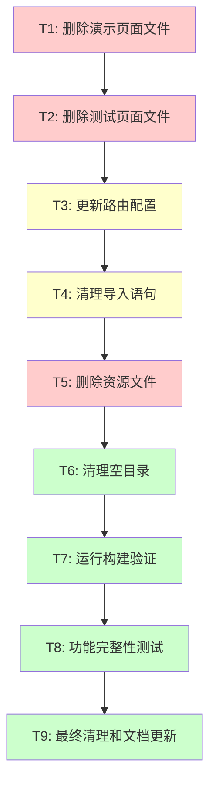

# 删除多余文件和代码 - 任务拆分文档

## 任务依赖图



## 原子任务详细定义

### T1: 删除演示页面文件

**输入契约**:
- 前置依赖: 无
- 输入数据: 演示页面文件列表
- 环境依赖: 文件系统访问权限

**输出契约**:
- 输出数据: 删除操作结果列表
- 交付物: 已删除的演示页面文件
- 验收标准: 所有指定的演示页面文件已被删除

**实现约束**:
- 技术栈: Node.js文件系统操作
- 接口规范: 使用标准文件删除API
- 质量要求: 删除前验证文件存在性

**依赖关系**:
- 后置任务: T2 (删除测试页面文件)
- 并行任务: 无

**具体文件列表**:
```
/src/pages/StyledComponentsDemo.tsx
/src/pages/ComponentShowcase.tsx
/src/pages/ContentManagementDemo.tsx
/src/components/ComponentShowcase/ExtendedComponentShowcase.tsx
/src/components/ContentManagement/ContentManagementDemo.tsx
```

**风险评估**: 低风险 - 这些文件独立存在，无生产依赖

---

### T2: 删除测试页面文件

**输入契约**:
- 前置依赖: T1完成
- 输入数据: 测试页面文件列表
- 环境依赖: 文件系统访问权限

**输出契约**:
- 输出数据: 删除操作结果列表
- 交付物: 已删除的测试页面文件
- 验收标准: 所有指定的测试页面文件已被删除

**实现约束**:
- 技术栈: Node.js文件系统操作
- 接口规范: 使用标准文件删除API
- 质量要求: 删除前验证文件存在性

**依赖关系**:
- 后置任务: T3 (更新路由配置)
- 并行任务: 无

**具体文件列表**:
```
/src/pages/admin/PermissionDemo.tsx
/src/admin/pages/NavigationTest.tsx
```

**风险评估**: 低风险 - 仅用于开发调试，无生产依赖

---

### T3: 更新路由配置

**输入契约**:
- 前置依赖: T1, T2完成
- 输入数据: 已删除页面的路由信息
- 环境依赖: TypeScript编译环境

**输出契约**:
- 输出数据: 更新后的路由配置文件
- 交付物: 清理后的路由配置
- 验收标准: 路由配置中不包含已删除页面的引用

**实现约束**:
- 技术栈: TypeScript, React Router
- 接口规范: 保持现有路由结构
- 质量要求: 确保TypeScript编译通过

**依赖关系**:
- 后置任务: T4 (清理导入语句)
- 并行任务: 无

**具体修改内容**:
1. **文件**: `/src/router/index.tsx`
   - 删除导入语句:
     ```typescript
     const StyledComponentsDemo = createLazyComponent(() => import('../pages/StyledComponentsDemo'));
     const PermissionDemo = createLazyComponent(() => import('../pages/admin/PermissionDemo'));
     const NavigationTest = createLazyComponent(() => import('../admin/pages/NavigationTest'));
     ```
   - 删除路由配置:
     ```typescript
     // 删除 /styled-components-demo 路由
     // 删除 /admin/permission-demo 路由
     // 删除 /admin/navigation-test 路由
     ```

2. **文件**: `/src/utils/routes.ts`
   - 删除路由常量:
     ```typescript
     PERMISSION_DEMO: '/admin/permission-demo',
     ```

**风险评估**: 中等风险 - 需要确保路由配置正确性

---

### T4: 清理导入语句

**输入契约**:
- 前置依赖: T3完成
- 输入数据: 已删除文件的导入引用列表
- 环境依赖: TypeScript编译环境

**输出契约**:
- 输出数据: 清理后的源代码文件
- 交付物: 无死代码的源文件
- 验收标准: 无未使用的导入语句，TypeScript编译无警告

**实现约束**:
- 技术栈: TypeScript, ESLint
- 接口规范: 保持代码风格一致
- 质量要求: 通过ESLint检查

**依赖关系**:
- 后置任务: T5 (删除资源文件)
- 并行任务: 无

**具体清理内容**:
1. 检查所有源文件中对已删除文件的导入
2. 移除未使用的导入语句
3. 清理相关的类型引用
4. 更新导出语句

**风险评估**: 低风险 - 主要是代码清理工作

---

### T5: 删除资源文件

**输入契约**:
- 前置依赖: T4完成
- 输入数据: 未使用的资源文件列表
- 环境依赖: 文件系统访问权限

**输出契约**:
- 输出数据: 删除操作结果
- 交付物: 清理后的资源目录
- 验收标准: 未使用的资源文件已被删除

**实现约束**:
- 技术栈: 文件系统操作
- 接口规范: 保持资源目录结构
- 质量要求: 不删除生产环境使用的资源

**依赖关系**:
- 后置任务: T6 (清理空目录)
- 并行任务: 无

**具体文件列表**:
```
/src/assets/react.svg
```

**风险评估**: 低风险 - 仅删除默认示例文件

---

### T6: 清理空目录

**输入契约**:
- 前置依赖: T5完成
- 输入数据: 可能为空的目录列表
- 环境依赖: 文件系统访问权限

**输出契约**:
- 输出数据: 清理操作结果
- 交付物: 整洁的目录结构
- 验收标准: 无空目录存在

**实现约束**:
- 技术栈: 文件系统操作
- 接口规范: 保持必要的目录结构
- 质量要求: 不删除包含隐藏文件的目录

**依赖关系**:
- 后置任务: T7 (运行构建验证)
- 并行任务: 无

**具体清理目录**:
```
/src/components/ComponentShowcase/ (如果为空)
/src/components/ContentManagement/ (如果为空)
```

**风险评估**: 低风险 - 仅清理空目录

---

### T7: 运行构建验证

**输入契约**:
- 前置依赖: T1-T6完成
- 输入数据: 修改后的项目代码
- 环境依赖: Node.js, npm, TypeScript编译器

**输出契约**:
- 输出数据: 构建结果报告
- 交付物: 构建成功的项目
- 验收标准: `npm run build` 成功执行，无错误

**实现约束**:
- 技术栈: Vite, TypeScript, npm
- 接口规范: 使用项目现有构建配置
- 质量要求: 构建时间不显著增加

**依赖关系**:
- 后置任务: T8 (功能完整性测试)
- 并行任务: 无

**验证步骤**:
1. 运行 `npm run build`
2. 检查构建输出
3. 验证无TypeScript错误
4. 确认构建产物完整

**风险评估**: 中等风险 - 构建失败需要回滚

---

### T8: 功能完整性测试

**输入契约**:
- 前置依赖: T7完成
- 输入数据: 构建成功的项目
- 环境依赖: 开发服务器环境

**输出契约**:
- 输出数据: 功能测试报告
- 交付物: 功能完整的应用
- 验收标准: 所有生产功能正常工作

**实现约束**:
- 技术栈: React, 浏览器环境
- 接口规范: 保持现有功能接口
- 质量要求: 无功能回归

**依赖关系**:
- 后置任务: T9 (最终清理和文档更新)
- 并行任务: 无

**测试内容**:
1. 主要页面路由可访问
2. 管理后台功能正常
3. 用户认证流程正常
4. 数据加载和显示正常
5. 无控制台错误

**风险评估**: 中等风险 - 可能发现功能问题

---

### T9: 最终清理和文档更新

**输入契约**:
- 前置依赖: T8完成
- 输入数据: 测试通过的项目
- 环境依赖: 文档编辑环境

**输出契约**:
- 输出数据: 更新后的项目文档
- 交付物: 完整的清理项目
- 验收标准: 文档与实际代码一致

**实现约束**:
- 技术栈: Markdown, Git
- 接口规范: 保持文档格式一致
- 质量要求: 文档准确性和完整性

**依赖关系**:
- 后置任务: 无
- 并行任务: 无

**清理内容**:
1. 更新README.md
2. 清理临时文档
3. 更新项目结构说明
4. 提交Git变更

**风险评估**: 低风险 - 主要是文档工作

## 任务执行策略

### 执行顺序
1. **串行执行**: 所有任务按依赖关系串行执行
2. **检查点**: 每个任务完成后设置检查点
3. **验证**: 关键任务后立即验证
4. **回滚**: 失败时回滚到上一个检查点

### 风险控制
1. **低风险任务**: 直接执行
2. **中等风险任务**: 执行前备份，执行后验证
3. **高风险任务**: 分步执行，每步验证

### 质量保证
1. **代码质量**: 每次修改后运行ESLint
2. **类型安全**: 每次修改后运行TypeScript检查
3. **构建验证**: 关键修改后运行构建测试
4. **功能验证**: 最终运行完整功能测试

## 复杂度评估

| 任务 | 技术复杂度 | 风险级别 | 预估时间 | 验证要求 |
|------|-----------|---------|----------|----------|
| T1 | 低 | 低 | 5分钟 | 基础 |
| T2 | 低 | 低 | 3分钟 | 基础 |
| T3 | 中 | 中 | 10分钟 | 完整 |
| T4 | 低 | 低 | 5分钟 | 基础 |
| T5 | 低 | 低 | 2分钟 | 基础 |
| T6 | 低 | 低 | 2分钟 | 基础 |
| T7 | 中 | 中 | 5分钟 | 完整 |
| T8 | 中 | 中 | 10分钟 | 完整 |
| T9 | 低 | 低 | 5分钟 | 基础 |

**总预估时间**: 47分钟
**关键路径**: T1 → T2 → T3 → T7 → T8

## 成功标准

### 技术标准
- ✅ 所有演示和测试文件已删除
- ✅ 路由配置已正确更新
- ✅ 无死代码和未使用导入
- ✅ 构建成功无错误
- ✅ TypeScript编译通过
- ✅ 所有生产功能正常

### 质量标准
- ✅ 代码风格保持一致
- ✅ 无ESLint警告
- ✅ 文档与代码同步
- ✅ Git提交历史清晰

### 业务标准
- ✅ 用户功能无影响
- ✅ 管理后台功能正常
- ✅ 性能无显著下降
- ✅ 安全性无降低

## 应急预案

### 构建失败
1. 立即停止执行
2. 分析错误日志
3. 回滚到上一个检查点
4. 修复问题后重新执行

### 功能回归
1. 记录问题详情
2. 回滚相关修改
3. 重新分析依赖关系
4. 调整删除策略

### 文件恢复
1. 从Git历史恢复
2. 从备份文件恢复
3. 重新配置相关设置
4. 验证恢复结果

## 总结

本任务拆分文档将删除多余文件的复杂任务分解为9个原子任务，每个任务都有明确的输入输出契约和验收标准。通过合理的依赖关系设计和风险控制措施，确保删除操作的安全性和可靠性。