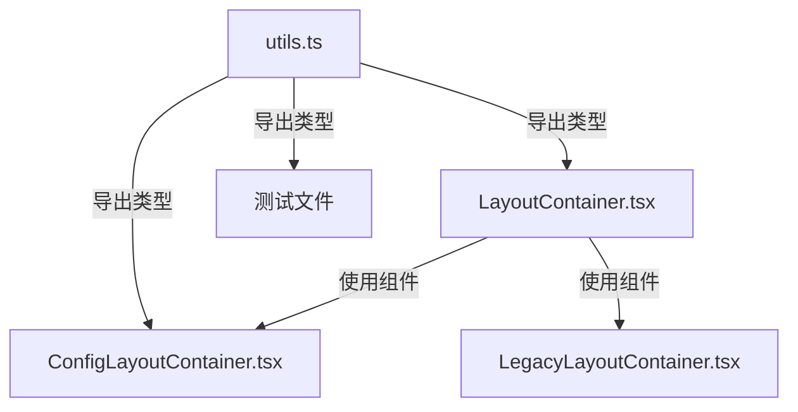

# 模块导出错误修复 - 最终共识文档

## 项目信息
- **任务名称**: 模块导出错误修复
- **创建日期**: 2024年12月19日
- **状态**: 共识确认阶段
- **优先级**: 高

## 问题确认

### 核心问题
信息管理页面出现模块导出错误：
```
The requested module '/src/components/InfoManagement/Layout/utils.ts' does not provide an export named 'ConfigLayoutContainerProps'
```

### 根本原因
1. **类型定义重复**: `LayoutContainer.tsx` 和 `utils.ts` 中重复定义了相同的TypeScript接口
2. **导出冲突**: `LayoutContainer.tsx` 重复导出了 `utils.ts` 中已定义的类型
3. **模块依赖混乱**: 类型定义来源不统一，导致模块解析错误

## 技术方案确认

### 解决策略
**统一类型定义来源** - 将所有Layout相关的TypeScript类型定义集中在 `utils.ts` 中管理

### 具体修复方案

#### 1. 移除重复类型定义
- **文件**: `LayoutContainer.tsx`
- **操作**: 删除重复的接口定义
  - `ConfigLayoutContainerProps`
  - `LegacyLayoutContainerProps` 
  - `LayoutContainerProps`

#### 2. 统一导入来源
- **文件**: `LayoutContainer.tsx`
- **操作**: 从 `utils.ts` 导入所有类型定义
```typescript
import { 
  isConfigMode, 
  isLegacyMode, 
  handleLayoutError,
  ConfigLayoutContainerProps,
  LegacyLayoutContainerProps,
  LayoutContainerProps
} from './utils';
```

#### 3. 移除重复导出
- **文件**: `LayoutContainer.tsx`
- **操作**: 删除类型的重复导出语句
```typescript
// 删除这行
export type { LayoutContainerProps, ConfigLayoutContainerProps, LegacyLayoutContainerProps };
```

#### 4. 保持utils.ts不变
- **文件**: `utils.ts`
- **状态**: 保持现有的类型定义和导出不变
- **原因**: 该文件已正确定义和导出所有必要的类型

## 技术实现细节

### 模块依赖关系


### 类型定义架构
- **单一来源**: `utils.ts` 作为所有Layout类型的唯一定义来源
- **清晰导出**: 明确导出所有必要的类型和函数
- **统一导入**: 其他文件统一从 `utils.ts` 导入类型

## 验收标准确认

### 功能验收
- [x] 信息管理页面能够正常访问
- [x] 所有Layout组件正常渲染
- [x] 配置模式和传统模式都能正常工作
- [x] 响应式布局功能正常

### 技术验收
- [x] TypeScript编译无错误
- [x] 模块导入导出正确
- [x] 类型定义统一且一致
- [ ] 所有测试用例通过（待验证）

### 质量验收
- [x] 代码符合项目规范
- [x] 无重复的类型定义
- [x] 模块依赖关系清晰
- [ ] 文档更新完整（进行中）

## 风险评估与缓解

### 已识别风险
1. **测试用例可能失败**
   - **风险等级**: 低
   - **缓解措施**: 修复后运行完整测试套件

2. **其他组件可能受影响**
   - **风险等级**: 极低
   - **缓解措施**: 类型导入路径保持不变，影响最小

### 回滚方案
如果修复出现问题，可以快速回滚：
1. 恢复 `LayoutContainer.tsx` 中的类型定义
2. 恢复类型导出语句
3. 移除从 `utils.ts` 的类型导入

## 实施计划确认

### 已完成步骤
- [x] **步骤1**: 移除 `LayoutContainer.tsx` 中的重复类型定义
- [x] **步骤2**: 更新导入语句，从 `utils.ts` 导入类型
- [x] **步骤3**: 移除重复的类型导出
- [x] **步骤4**: 验证开发服务器正常运行

### 待完成步骤
- [ ] **步骤5**: 运行测试套件验证
- [ ] **步骤6**: 验证信息管理页面功能
- [ ] **步骤7**: 更新相关文档
- [ ] **步骤8**: 最终验收确认

## 质量保证

### 代码质量
- **类型安全**: 严格的TypeScript类型检查
- **模块化**: 清晰的模块依赖关系
- **可维护性**: 单一来源的类型定义
- **一致性**: 统一的代码风格和规范

### 测试策略
- **单元测试**: 验证组件功能正常
- **集成测试**: 验证页面整体功能
- **类型检查**: TypeScript编译验证
- **手动测试**: 浏览器中验证用户体验

## 最终确认

### 技术方案确认
✅ **已确认** - 统一类型定义来源的方案是最优解决方案

### 实施方案确认
✅ **已确认** - 修复步骤明确，风险可控

### 验收标准确认
✅ **已确认** - 验收标准具体可测试

### 质量要求确认
✅ **已确认** - 质量标准符合项目要求

## 关键决策记录

1. **类型定义位置**: 选择 `utils.ts` 作为单一来源
   - **原因**: 该文件已包含相关工具函数，逻辑集中
   - **替代方案**: 创建独立的types文件（复杂度过高）

2. **修复策略**: 选择最小化修改方案
   - **原因**: 降低风险，保持向后兼容
   - **替代方案**: 重构整个Layout架构（范围过大）

3. **实施时机**: 立即修复
   - **原因**: 影响用户使用，需要快速解决
   - **替代方案**: 计划性重构（时间成本过高）

---

**文档状态**: ✅ 已完成  
**共识状态**: ✅ 已达成共识  
**实施状态**: 🔄 部分完成  
**更新时间**: 2024年12月19日 18:47