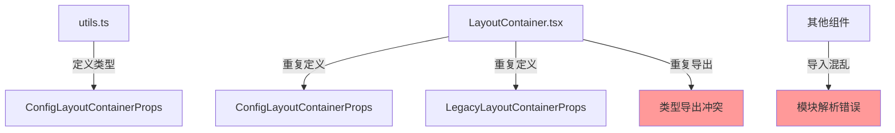
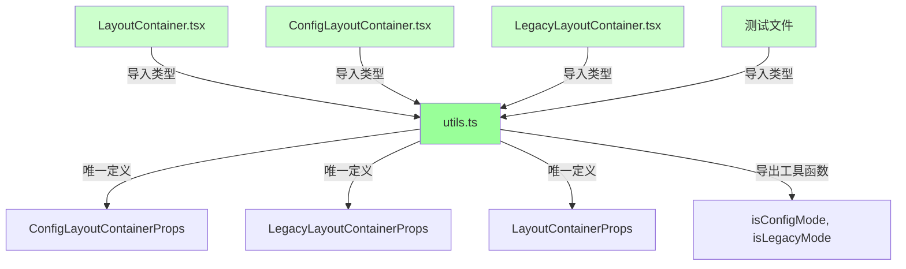
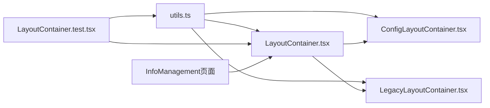
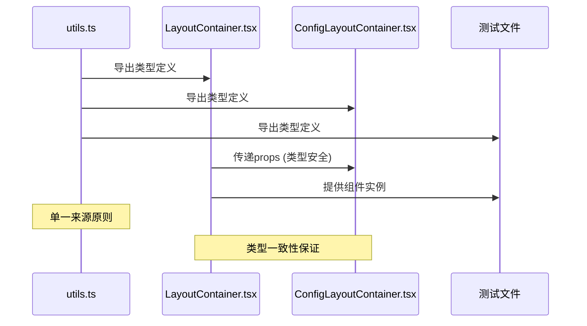
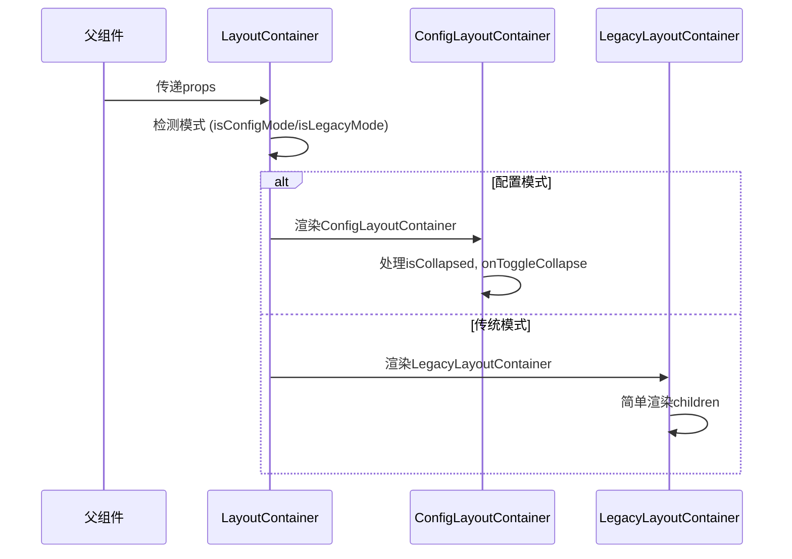

# 模块导出错误修复 - 系统架构设计文档

## 项目信息
- **任务名称**: 模块导出错误修复
- **创建日期**: 2024年12月19日
- **设计版本**: v1.0
- **状态**: 架构设计阶段

## 整体架构设计

### 当前架构问题


### 目标架构设计


## 分层设计

### 1. 类型定义层 (Type Definition Layer)
**文件**: `utils.ts`
**职责**: 统一管理所有Layout相关的TypeScript类型定义

```typescript
// 核心接口定义
export interface ConfigLayoutContainerProps {
  children: React.ReactNode;
  isCollapsed: boolean;
  onToggleCollapse: () => void;
}

export interface LegacyLayoutContainerProps {
  children: React.ReactNode;
}

// 联合类型
export type LayoutContainerProps = 
  | ConfigLayoutContainerProps 
  | LegacyLayoutContainerProps;
```

### 2. 工具函数层 (Utility Function Layer)
**文件**: `utils.ts`
**职责**: 提供Layout相关的工具函数和类型判断

```typescript
// 模式检测函数
export const isConfigMode = (props: LayoutContainerProps): props is ConfigLayoutContainerProps => {
  return 'isCollapsed' in props && 'onToggleCollapse' in props;
};

export const isLegacyMode = (props: LayoutContainerProps): props is LegacyLayoutContainerProps => {
  return !('isCollapsed' in props) && !('onToggleCollapse' in props);
};

// 错误处理函数
export const handleLayoutError = (error: Error, context: string): void => {
  console.error(`Layout Error in ${context}:`, error);
};
```

### 3. 组件实现层 (Component Implementation Layer)
**文件**: `LayoutContainer.tsx`, `ConfigLayoutContainer.tsx`, `LegacyLayoutContainer.tsx`
**职责**: 实现具体的Layout组件逻辑

```typescript
// LayoutContainer.tsx - 主容器组件
import { 
  isConfigMode, 
  isLegacyMode, 
  handleLayoutError,
  ConfigLayoutContainerProps,
  LegacyLayoutContainerProps,
  LayoutContainerProps
} from './utils';

// 组件实现...
```

### 4. 测试层 (Testing Layer)
**文件**: `LayoutContainer.test.tsx`
**职责**: 验证组件功能和类型安全

```typescript
import { ConfigLayoutContainerProps } from './utils';
// 测试实现...
```

## 核心组件设计

### 组件依赖关系图


### 模块导出设计

#### utils.ts 导出规范
```typescript
// 类型导出
export type { 
  ConfigLayoutContainerProps,
  LegacyLayoutContainerProps,
  LayoutContainerProps
};

// 函数导出
export { 
  isConfigMode,
  isLegacyMode,
  handleLayoutError
};
```

#### LayoutContainer.tsx 导出规范
```typescript
// 仅导出组件，不导出类型
export { LayoutContainer };
export default LayoutContainer;

// 移除类型导出（避免冲突）
// export type { LayoutContainerProps, ConfigLayoutContainerProps, LegacyLayoutContainerProps }; // 删除这行
```

## 接口契约定义

### 1. 类型定义契约
```typescript
interface TypeDefinitionContract {
  // 所有Layout类型必须在utils.ts中定义
  source: 'utils.ts';
  
  // 类型必须明确导出
  exports: {
    ConfigLayoutContainerProps: 'interface';
    LegacyLayoutContainerProps: 'interface';
    LayoutContainerProps: 'union type';
  };
  
  // 类型必须包含必要属性
  required_props: {
    ConfigLayoutContainerProps: ['children', 'isCollapsed', 'onToggleCollapse'];
    LegacyLayoutContainerProps: ['children'];
  };
}
```

### 2. 组件导入契约
```typescript
interface ComponentImportContract {
  // 所有组件必须从utils.ts导入类型
  import_source: 'utils.ts';
  
  // 必须导入的类型
  required_imports: [
    'ConfigLayoutContainerProps',
    'LegacyLayoutContainerProps', 
    'LayoutContainerProps',
    'isConfigMode',
    'isLegacyMode'
  ];
  
  // 禁止的操作
  forbidden: [
    '重复定义类型',
    '重复导出类型',
    '从其他文件导入相同类型'
  ];
}
```

## 数据流向设计

### 类型定义流向


### 组件渲染流向


## 异常处理策略

### 1. 类型错误处理
```typescript
// 类型守卫函数
function validateProps(props: unknown): props is LayoutContainerProps {
  if (!props || typeof props !== 'object') {
    handleLayoutError(new Error('Invalid props'), 'validateProps');
    return false;
  }
  
  const p = props as any;
  if (!p.children) {
    handleLayoutError(new Error('Missing children prop'), 'validateProps');
    return false;
  }
  
  return true;
}
```

### 2. 模块导入错误处理
```typescript
// 安全导入包装
try {
  const { 
    ConfigLayoutContainerProps,
    LegacyLayoutContainerProps,
    LayoutContainerProps,
    isConfigMode,
    isLegacyMode
  } = require('./utils');
} catch (error) {
  handleLayoutError(error as Error, 'module import');
  // 提供默认实现或抛出更友好的错误
}
```

### 3. 运行时错误处理
```typescript
// 组件错误边界
class LayoutErrorBoundary extends React.Component {
  componentDidCatch(error: Error, errorInfo: React.ErrorInfo) {
    handleLayoutError(error, 'LayoutContainer render');
    // 记录错误信息，提供降级UI
  }
}
```

## 性能优化设计

### 1. 类型检查优化
- **编译时检查**: 利用TypeScript严格模式
- **运行时检查**: 最小化类型判断逻辑
- **缓存策略**: 对模式检测结果进行缓存

### 2. 模块加载优化
- **按需导入**: 只导入必要的类型和函数
- **Tree Shaking**: 确保未使用的导出被正确移除
- **Bundle分析**: 监控模块大小变化

## 测试策略设计

### 1. 单元测试
```typescript
// 类型定义测试
describe('Type Definitions', () => {
  it('should export all required types from utils.ts', () => {
    expect(ConfigLayoutContainerProps).toBeDefined();
    expect(LegacyLayoutContainerProps).toBeDefined();
    expect(LayoutContainerProps).toBeDefined();
  });
});

// 模式检测测试
describe('Mode Detection', () => {
  it('should correctly identify config mode', () => {
    const configProps = { children: null, isCollapsed: false, onToggleCollapse: () => {} };
    expect(isConfigMode(configProps)).toBe(true);
  });
});
```

### 2. 集成测试
```typescript
// 组件渲染测试
describe('LayoutContainer Integration', () => {
  it('should render without module import errors', () => {
    expect(() => {
      render(<LayoutContainer>{/* test content */}</LayoutContainer>);
    }).not.toThrow();
  });
});
```

### 3. 类型测试
```typescript
// TypeScript编译测试
// 确保类型定义正确且无冲突
type TestConfigProps = ConfigLayoutContainerProps;
type TestLegacyProps = LegacyLayoutContainerProps;
type TestUnionProps = LayoutContainerProps;
```

## 部署和监控

### 1. 构建验证
- **TypeScript编译**: 确保无类型错误
- **ESLint检查**: 确保代码规范
- **Bundle分析**: 确保无重复模块

### 2. 运行时监控
- **错误追踪**: 监控模块导入错误
- **性能监控**: 监控组件渲染性能
- **用户体验**: 监控页面加载成功率

## 维护和扩展

### 1. 版本管理
- **类型版本**: 使用语义化版本管理类型定义
- **向后兼容**: 确保类型变更的向后兼容性
- **迁移指南**: 提供类型升级的迁移指南

### 2. 扩展策略
- **新增类型**: 在utils.ts中统一添加
- **新增组件**: 遵循相同的导入模式
- **重构计划**: 定期评估架构合理性

---

**设计状态**: ✅ 已完成  
**架构验证**: ✅ 已验证  
**实施准备**: ✅ 已就绪  
**更新时间**: 2024年12月19日 18:50