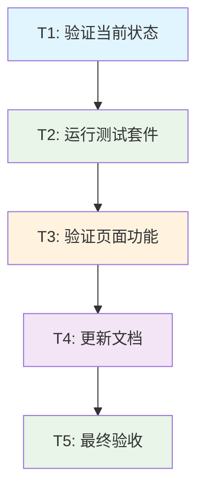

# 模块导出错误修复 - 任务拆分文档

## 项目信息
- **任务名称**: 模块导出错误修复
- **创建日期**: 2024年12月19日
- **任务版本**: v1.0
- **状态**: 任务拆分阶段

## 任务依赖关系图

## 原子任务详细定义

### T1: 验证当前修复状态

#### 输入契约
- **前置依赖**: 已完成的代码修复（LayoutContainer.tsx修改）
- **输入数据**: 
  - 修改后的 `LayoutContainer.tsx` 文件
  - 现有的 `utils.ts` 文件
  - 开发服务器运行状态
- **环境依赖**: 
  - Node.js开发环境
  - TypeScript编译器
  - 开发服务器正在运行

#### 输出契约
- **输出数据**: 
  - TypeScript编译状态报告
  - 模块导入状态验证
  - 开发服务器状态确认
- **交付物**: 
  - 编译验证报告
  - 模块导入验证结果
- **验收标准**: 
  - TypeScript编译无错误
  - 模块导入无冲突
  - 开发服务器正常运行
  - HMR更新正常工作

#### 实现约束
- **技术栈**: TypeScript, React, Vite
- **接口规范**: 遵循现有的模块导入导出规范
- **质量要求**: 
  - 零编译错误
  - 零模块解析错误
  - 保持代码风格一致性

#### 依赖关系
- **前置任务**: 无（基于已完成的修复）
- **后置任务**: T2 (运行测试套件)
- **并行任务**: 无

---

### T2: 运行完整测试套件

#### 输入契约
- **前置依赖**: T1完成，编译状态正常
- **输入数据**: 
  - 所有测试文件
  - 修复后的组件代码
  - 测试配置文件
- **环境依赖**: 
  - Jest测试环境
  - React Testing Library
  - 所有测试依赖已安装

#### 输出契约
- **输出数据**: 
  - 测试执行结果报告
  - 测试覆盖率报告
  - 失败测试详细信息（如有）
- **交付物**: 
  - 测试通过确认
  - 测试报告文档
- **验收标准**: 
  - 所有现有测试用例通过
  - LayoutContainer相关测试100%通过
  - 无新增测试失败
  - 测试覆盖率保持或提升

#### 实现约束
- **技术栈**: Jest, React Testing Library, TypeScript
- **接口规范**: 遵循现有测试模式和断言风格
- **质量要求**: 
  - 测试执行时间合理
  - 测试结果稳定可重复
  - 错误信息清晰明确

#### 依赖关系
- **前置任务**: T1 (验证当前修复状态)
- **后置任务**: T3 (验证页面功能)
- **并行任务**: 无

---

### T3: 验证信息管理页面功能

#### 输入契约
- **前置依赖**: T2完成，所有测试通过
- **输入数据**: 
  - 运行中的开发服务器
  - 信息管理页面路由
  - 浏览器环境
- **环境依赖**: 
  - 开发服务器运行在正确端口
  - 浏览器支持现代JavaScript
  - 网络连接正常（用于API调用）

#### 输出契约
- **输出数据**: 
  - 页面加载状态报告
  - 功能验证结果
  - 用户界面验证结果
  - 错误日志分析（如有）
- **交付物**: 
  - 功能验证报告
  - 页面截图（正常状态）
  - 性能指标记录
- **验收标准**: 
  - 信息管理页面正常加载
  - 无模块导入错误
  - Layout组件正常渲染
  - 响应式布局工作正常
  - 侧边栏切换功能正常
  - 无JavaScript运行时错误

#### 实现约束
- **技术栈**: React, TypeScript, 现代浏览器
- **接口规范**: 遵循现有的页面路由和组件接口
- **质量要求**: 
  - 页面加载时间 < 3秒
  - 交互响应时间 < 500ms
  - 无可见的UI错误或异常

#### 依赖关系
- **前置任务**: T2 (运行完整测试套件)
- **后置任务**: T4 (更新相关文档)
- **并行任务**: 无

---

### T4: 更新相关文档

#### 输入契约
- **前置依赖**: T3完成，页面功能验证通过
- **输入数据**: 
  - 修复过程记录
  - 测试结果报告
  - 功能验证结果
  - 现有项目文档
- **环境依赖**: 
  - 文档编辑环境
  - Markdown支持
  - 项目文档结构

#### 输出契约
- **输出数据**: 
  - 更新的技术文档
  - 修复过程记录
  - 最佳实践总结
- **交付物**: 
  - ACCEPTANCE文档更新
  - README更新（如需要）
  - 技术债务记录更新
- **验收标准**: 
  - 文档内容准确完整
  - 修复过程清晰记录
  - 技术决策有据可查
  - 文档格式规范统一

#### 实现约束
- **技术栈**: Markdown, 项目文档规范
- **接口规范**: 遵循现有文档结构和格式
- **质量要求**: 
  - 文档可读性强
  - 技术细节准确
  - 便于后续维护参考

#### 依赖关系
- **前置任务**: T3 (验证信息管理页面功能)
- **后置任务**: T5 (最终验收确认)
- **并行任务**: 无

---

### T5: 最终验收确认

#### 输入契约
- **前置依赖**: T4完成，所有文档更新完毕
- **输入数据**: 
  - 完整的修复成果
  - 所有验证报告
  - 更新的文档
  - 用户反馈（如有）
- **环境依赖**: 
  - 生产环境模拟
  - 完整的功能测试环境

#### 输出契约
- **输出数据**: 
  - 最终验收报告
  - 质量评估结果
  - 交付确认文档
- **交付物**: 
  - FINAL文档
  - TODO清单（后续优化项）
  - 交付签收确认
- **验收标准**: 
  - 原始问题完全解决
  - 所有验收标准满足
  - 无新增技术债务
  - 代码质量符合标准
  - 文档完整准确
  - 用户体验良好

#### 实现约束
- **技术栈**: 全栈技术验证
- **接口规范**: 符合所有项目规范和标准
- **质量要求**: 
  - 生产就绪质量
  - 长期可维护性
  - 团队协作友好

#### 依赖关系
- **前置任务**: T4 (更新相关文档)
- **后置任务**: 无（任务完成）
- **并行任务**: 无

## 任务执行计划

### 执行顺序
1. **T1**: 验证当前修复状态 (预计15分钟)
2. **T2**: 运行完整测试套件 (预计10分钟)
3. **T3**: 验证信息管理页面功能 (预计20分钟)
4. **T4**: 更新相关文档 (预计15分钟)
5. **T5**: 最终验收确认 (预计10分钟)

**总预计时间**: 70分钟

### 风险评估

#### 高风险任务
- **T3**: 页面功能验证
  - **风险**: 可能发现新的运行时错误
  - **缓解**: 准备回滚方案，逐步验证功能

#### 中风险任务
- **T2**: 测试套件执行
  - **风险**: 可能有测试用例需要更新
  - **缓解**: 分析失败原因，必要时更新测试

#### 低风险任务
- **T1, T4, T5**: 验证和文档任务
  - **风险**: 时间可能超出预期
  - **缓解**: 合理分配时间，重点关注核心内容

### 质量门控

#### 每个任务完成后检查
- [ ] 任务目标完全达成
- [ ] 验收标准全部满足
- [ ] 无新增问题或风险
- [ ] 输出物质量符合要求
- [ ] 后续任务输入条件满足

#### 整体完成后检查
- [ ] 原始问题完全解决
- [ ] 所有任务验收通过
- [ ] 系统整体稳定性良好
- [ ] 文档完整性和准确性
- [ ] 团队交接准备就绪

## 应急预案

### 任务失败处理
1. **立即停止后续任务**
2. **详细记录失败原因**
3. **评估影响范围**
4. **制定修复计划**
5. **重新执行或调整方案**

### 时间超期处理
1. **评估剩余任务优先级**
2. **调整任务范围或深度**
3. **保证核心功能优先**
4. **记录未完成项到TODO**

### 质量不达标处理
1. **分析质量问题根因**
2. **制定质量提升方案**
3. **重新执行相关任务**
4. **更新质量标准**

---

**任务状态**: ✅ 已拆分完成  
**依赖关系**: ✅ 已明确  
**执行计划**: ✅ 已制定  
**风险评估**: ✅ 已完成  
**更新时间**: 2024年12月19日 18:52