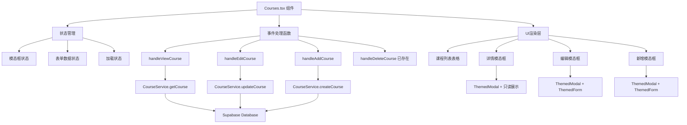
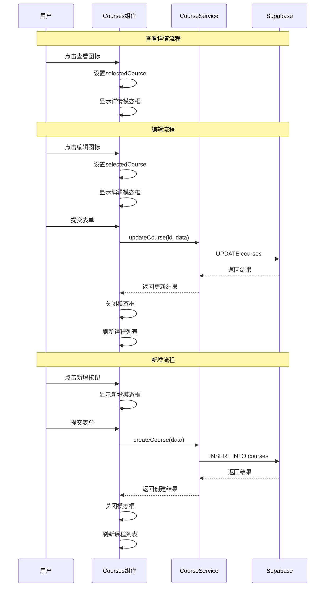

# DESIGN - 课程管理SVG按钮功能实现

## 系统架构设计

### 整体架构图



### 组件分层设计

#### 1. 数据层 (Data Layer)
- **CourseService**: 已存在的服务层，提供CRUD操作
- **Supabase Client**: 数据库连接和操作

#### 2. 业务逻辑层 (Business Logic Layer)
- **事件处理函数**: 处理用户交互和业务逻辑
- **状态管理**: 管理组件内部状态
- **数据验证**: 表单数据验证和错误处理

#### 3. 表现层 (Presentation Layer)
- **Courses组件**: 主要的课程管理组件
- **ThemedModal**: 模态框组件
- **ThemedForm**: 表单组件
- **SVG图标按钮**: 操作按钮

## 核心组件设计

### 1. 状态管理设计

```typescript
interface CourseModalState {
  // 模态框显示状态
  showDetailModal: boolean;
  showEditModal: boolean;
  showCreateModal: boolean;
  
  // 当前选中的课程
  selectedCourse: Course | null;
  
  // 加载状态
  formLoading: boolean;
  detailLoading: boolean;
  
  // 错误状态
  formError: string | null;
}
```

### 2. 表单字段配置

```typescript
const courseFormFields: FormField[] = [
  {
    name: 'name',
    label: '课程名称',
    type: 'text',
    required: true,
    rules: [
      { required: true, message: '请输入课程名称' },
      { maxLength: 100, message: '课程名称不能超过100个字符' }
    ]
  },
  {
    name: 'description',
    label: '课程描述',
    type: 'textarea',
    required: false,
    rules: [
      { maxLength: 500, message: '课程描述不能超过500个字符' }
    ]
  },
  {
    name: 'category',
    label: '课程分类',
    type: 'select',
    required: true,
    options: [
      { value: 'math', label: '数学' },
      { value: 'english', label: '英语' },
      { value: 'politics', label: '政治' },
      { value: 'science', label: '科学' },
      { value: 'history', label: '历史' },
      { value: 'art', label: '艺术' }
    ],
    rules: [
      { required: true, message: '请选择课程分类' }
    ]
  },
  {
    name: 'image_url',
    label: '课程图片URL',
    type: 'url',
    required: false,
    placeholder: 'https://example.com/image.jpg',
    rules: [
      { pattern: /^https?:\/\/.+/, message: '请输入有效的图片URL' }
    ]
  },
  {
    name: 'is_active',
    label: '是否启用',
    type: 'checkbox',
    defaultValue: true
  },
  {
    name: 'sort_order',
    label: '排序',
    type: 'number',
    required: false,
    defaultValue: 0,
    rules: [
      { min: 0, message: '排序值不能小于0' },
      { max: 9999, message: '排序值不能大于9999' }
    ]
  }
];
```

### 3. 事件处理函数设计

#### handleViewCourse 设计
```typescript
const handleViewCourse = async (course: Course) => {
  try {
    setDetailLoading(true);
    setSelectedCourse(course);
    setShowDetailModal(true);
  } catch (error) {
    console.error('查看课程详情失败:', error);
    // 显示错误提示
  } finally {
    setDetailLoading(false);
  }
};
```

#### handleEditCourse 设计
```typescript
const handleEditCourse = async (course: Course) => {
  try {
    setSelectedCourse(course);
    setShowEditModal(true);
  } catch (error) {
    console.error('打开编辑表单失败:', error);
  }
};
```

#### handleAddCourse 设计
```typescript
const handleAddCourse = () => {
  setSelectedCourse(null);
  setShowCreateModal(true);
};
```

### 4. 表单提交处理设计

#### 编辑表单提交
```typescript
const handleEditSubmit = async (formData: FormSubmitData) => {
  if (!selectedCourse || !formData.isValid) return;
  
  try {
    setFormLoading(true);
    setFormError(null);
    
    await CourseService.updateCourse(selectedCourse.id, formData.values);
    
    // 关闭模态框
    setShowEditModal(false);
    setSelectedCourse(null);
    
    // 刷新列表
    await loadCourses();
    
    // 显示成功提示
    showSuccessMessage('课程更新成功');
  } catch (error) {
    console.error('更新课程失败:', error);
    setFormError('更新课程失败，请重试');
  } finally {
    setFormLoading(false);
  }
};
```

#### 新增表单提交
```typescript
const handleCreateSubmit = async (formData: FormSubmitData) => {
  if (!formData.isValid) return;
  
  try {
    setFormLoading(true);
    setFormError(null);
    
    await CourseService.createCourse(formData.values);
    
    // 关闭模态框
    setShowCreateModal(false);
    
    // 刷新列表
    await loadCourses();
    
    // 显示成功提示
    showSuccessMessage('课程创建成功');
  } catch (error) {
    console.error('创建课程失败:', error);
    setFormError('创建课程失败，请重试');
  } finally {
    setFormLoading(false);
  }
};
```

## 模态框设计规范

### 1. 详情模态框
- **尺寸**: `md`
- **标题**: "课程详情"
- **内容**: 只读的课程信息展示
- **按钮**: 仅关闭按钮

### 2. 编辑模态框
- **尺寸**: `lg`
- **标题**: "编辑课程"
- **内容**: 预填充数据的表单
- **按钮**: 保存、取消

### 3. 新增模态框
- **尺寸**: `lg`
- **标题**: "新增课程"
- **内容**: 空白表单
- **按钮**: 创建、取消

## 数据流向图



## 异常处理策略

### 1. 网络错误处理
- 显示用户友好的错误信息
- 保持模态框打开状态，允许用户重试
- 记录详细错误日志用于调试

### 2. 数据验证错误
- 实时表单验证
- 字段级错误提示
- 阻止无效数据提交

### 3. 权限错误处理
- 检查用户权限
- 显示权限不足提示
- 禁用相关操作按钮

## 性能优化策略

### 1. 组件优化
- 使用React.memo优化不必要的重渲染
- 合理使用useCallback和useMemo

### 2. 数据加载优化
- 详情数据按需加载
- 实现加载状态指示

### 3. 用户体验优化
- 模态框动画流畅
- 表单提交时显示加载状态
- 操作成功后及时反馈

## 接口契约定义

### CourseService接口
```typescript
interface CourseService {
  getCourse(id: string): Promise<Course>;
  createCourse(data: Partial<Course>): Promise<Course>;
  updateCourse(id: string, data: Partial<Course>): Promise<Course>;
  deleteCourse(id: string): Promise<void>;
}
```

### Course数据模型
```typescript
interface Course {
  id: string;
  name: string;
  description?: string;
  category: string;
  image_url?: string;
  is_active: boolean;
  sort_order: number;
  created_at: string;
  updated_at: string;
}
```

## 质量保证

### 1. 代码质量
- TypeScript类型安全
- ESLint规则检查
- 代码注释完整

### 2. 用户体验
- 响应式设计
- 无障碍访问支持
- 加载状态明确

### 3. 错误处理
- 完善的错误边界
- 用户友好的错误提示
- 详细的错误日志

这个设计文档为实现提供了清晰的技术路线图和详细的实现规范。