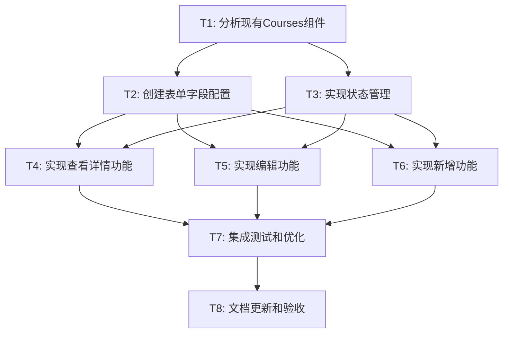

# TASK - 课程管理SVG按钮功能实现

## 任务拆分概览

基于DESIGN文档，将课程管理SVG按钮功能实现拆分为以下原子任务：

### 任务依赖关系图

## 详细任务定义

### T1: 分析现有Courses组件

**输入契约:**
- 前置依赖: 无
- 输入数据: 现有Courses.tsx文件
- 环境依赖: 项目开发环境

**输出契约:**
- 输出数据: 组件结构分析报告
- 交付物: 现有代码理解和修改点识别
- 验收标准: 
  - 明确现有组件的结构和状态管理方式
  - 识别需要添加的状态变量
  - 确定SVG按钮的位置和事件绑定方式

**实现约束:**
- 技术栈: React, TypeScript
- 接口规范: 保持现有组件接口不变
- 质量要求: 不破坏现有功能

**依赖关系:**
- 后置任务: T2, T3
- 并行任务: 无

---

### T2: 创建表单字段配置

**输入契约:**
- 前置依赖: T1完成
- 输入数据: Course数据模型定义
- 环境依赖: formUtils.ts工具库

**输出契约:**
- 输出数据: courseFormFields配置数组
- 交付物: 完整的表单字段配置文件
- 验收标准:
  - 包含所有必要的课程字段
  - 验证规则完整且正确
  - 字段类型与数据模型匹配
  - 支持新增和编辑两种模式

**实现约束:**
- 技术栈: TypeScript, formUtils
- 接口规范: 遵循FormField接口定义
- 质量要求: 类型安全，验证规则完备

**依赖关系:**
- 前置任务: T1
- 后置任务: T4, T5, T6
- 并行任务: T3

---

### T3: 实现状态管理

**输入契约:**
- 前置依赖: T1完成
- 输入数据: 现有组件状态结构
- 环境依赖: React Hooks

**输出契约:**
- 输出数据: 新增的状态变量和setter函数
- 交付物: 完整的状态管理代码
- 验收标准:
  - 模态框显示状态管理正确
  - 选中课程状态管理正确
  - 加载和错误状态管理完善
  - 状态更新不影响现有功能

**实现约束:**
- 技术栈: React useState Hook
- 接口规范: 遵循React状态管理最佳实践
- 质量要求: 状态更新性能优化，避免不必要的重渲染

**依赖关系:**
- 前置任务: T1
- 后置任务: T4, T5, T6
- 并行任务: T2

---

### T4: 实现查看详情功能

**输入契约:**
- 前置依赖: T2, T3完成
- 输入数据: 表单字段配置，状态管理函数
- 环境依赖: ThemedModal组件

**输出契约:**
- 输出数据: handleViewCourse函数和详情模态框
- 交付物: 完整的查看详情功能
- 验收标准:
  - 点击查看图标正确打开模态框
  - 模态框显示完整的课程信息
  - 信息以只读形式展示
  - 关闭模态框功能正常

**实现约束:**
- 技术栈: React, TypeScript, ThemedModal
- 接口规范: 复用现有模态框组件
- 质量要求: 用户体验流畅，数据展示清晰

**依赖关系:**
- 前置任务: T2, T3
- 后置任务: T7
- 并行任务: T5, T6

---

### T5: 实现编辑功能

**输入契约:**
- 前置依赖: T2, T3完成
- 输入数据: 表单字段配置，状态管理函数
- 环境依赖: ThemedModal, ThemedForm, CourseService

**输出契约:**
- 输出数据: handleEditCourse函数和编辑模态框
- 交付物: 完整的编辑功能
- 验收标准:
  - 点击编辑图标正确打开编辑表单
  - 表单预填充当前课程数据
  - 表单验证功能正常
  - 提交后正确更新数据库
  - 更新后刷新列表显示
  - 错误处理和用户反馈完善

**实现约束:**
- 技术栈: React, TypeScript, ThemedForm, CourseService
- 接口规范: 遵循现有服务层接口
- 质量要求: 数据一致性，错误处理完善

**依赖关系:**
- 前置任务: T2, T3
- 后置任务: T7
- 并行任务: T4, T6

---

### T6: 实现新增功能

**输入契约:**
- 前置依赖: T2, T3完成
- 输入数据: 表单字段配置，状态管理函数
- 环境依赖: ThemedModal, ThemedForm, CourseService

**输出契约:**
- 输出数据: handleAddCourse函数和新增模态框
- 交付物: 完整的新增功能
- 验收标准:
  - 点击新增按钮正确打开新增表单
  - 表单字段为空白状态
  - 表单验证功能正常
  - 提交后正确创建新课程
  - 创建后刷新列表显示
  - 错误处理和用户反馈完善

**实现约束:**
- 技术栈: React, TypeScript, ThemedForm, CourseService
- 接口规范: 遵循现有服务层接口
- 质量要求: 数据一致性，错误处理完善

**依赖关系:**
- 前置任务: T2, T3
- 后置任务: T7
- 并行任务: T4, T5

---

### T7: 集成测试和优化

**输入契约:**
- 前置依赖: T4, T5, T6完成
- 输入数据: 完整的功能实现
- 环境依赖: 开发服务器，测试数据

**输出契约:**
- 输出数据: 测试报告和性能优化建议
- 交付物: 经过测试和优化的完整功能
- 验收标准:
  - 所有功能正常工作
  - 无TypeScript编译错误
  - 无控制台错误或警告
  - 用户体验流畅
  - 数据同步正确
  - 错误处理完善

**实现约束:**
- 技术栈: 完整的技术栈
- 接口规范: 所有接口正常工作
- 质量要求: 生产环境质量标准

**依赖关系:**
- 前置任务: T4, T5, T6
- 后置任务: T8
- 并行任务: 无

---

### T8: 文档更新和验收

**输入契约:**
- 前置依赖: T7完成
- 输入数据: 完整的实现和测试结果
- 环境依赖: 文档系统

**输出契约:**
- 输出数据: 更新的文档和验收报告
- 交付物: ACCEPTANCE文档，使用说明
- 验收标准:
  - 所有需求已实现
  - 验收标准全部满足
  - 文档更新完整
  - 代码注释完善

**实现约束:**
- 技术栈: Markdown文档
- 接口规范: 文档格式规范
- 质量要求: 文档清晰准确

**依赖关系:**
- 前置任务: T7
- 后置任务: 无
- 并行任务: 无

## 任务执行计划

### 第一阶段：分析和准备 (T1, T2, T3)
- **预计时间**: 1-2小时
- **关键里程碑**: 完成现有代码分析，建立表单配置和状态管理基础
- **风险点**: 现有代码结构可能需要调整

### 第二阶段：功能实现 (T4, T5, T6)
- **预计时间**: 3-4小时
- **关键里程碑**: 三个核心功能全部实现
- **风险点**: 数据库操作和错误处理的复杂性

### 第三阶段：测试和交付 (T7, T8)
- **预计时间**: 1-2小时
- **关键里程碑**: 功能验证完成，文档更新
- **风险点**: 集成测试可能发现的问题

## 质量保证措施

### 代码质量
- 每个任务完成后进行代码审查
- TypeScript类型检查通过
- ESLint规则检查通过
- 代码注释完整

### 功能质量
- 每个功能独立测试
- 集成测试覆盖主要用例
- 错误场景测试
- 用户体验验证

### 数据质量
- 数据库操作事务性
- 数据验证完整
- 数据同步一致性
- 错误回滚机制

## 风险评估

### 高风险项
1. **现有代码结构调整**: 可能需要重构部分现有代码
2. **数据库操作复杂性**: 需要确保数据一致性和错误处理

### 中风险项
1. **表单验证复杂性**: 需要处理多种验证场景
2. **用户体验优化**: 需要平衡功能和性能

### 低风险项
1. **组件复用**: 现有组件库支持良好
2. **状态管理**: React Hooks使用成熟

## 成功标准

### 功能标准
- [ ] 查看详情功能正常工作
- [ ] 编辑功能正常工作
- [ ] 新增功能正常工作
- [ ] 数据同步到Supabase正确
- [ ] 前端显示更新及时

### 技术标准
- [ ] TypeScript编译无错误
- [ ] 代码符合项目规范
- [ ] 性能无明显下降
- [ ] 错误处理完善

### 用户体验标准
- [ ] 操作流程直观
- [ ] 反馈信息及时
- [ ] 加载状态明确
- [ ] 错误提示友好

这个任务拆分确保了每个子任务都是原子性的、可独立验证的，并且有明确的输入输出契约。